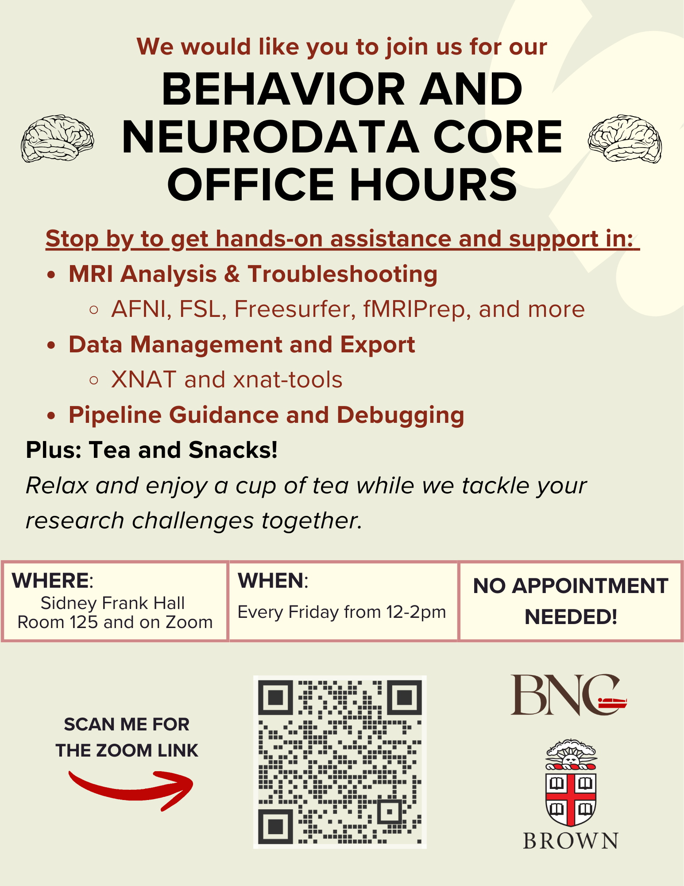

# About

Welcome to the User Guide to different services, software, and analysis pipelines supported by the Behavior and Neurodata Core at Brown University.

## Contact us

* **Support email:** cobre-bnc@brown.edu, bnc-it@brown.edu
* **Neuroimaging conversation on slack:** [Neuroimaging channel on ccv-share.slack.com](https://ccv-share.slack.com/app_redirect?channel=neuroimaging) **-** XNAT, BIDS and more
* **Issues or suggestions about this documentation:** Submit an issue in [our github repository](https://github.com/brown-bnc/bnc-user-manual).

## Office Hours

The BNC hosts office hours every Friday from 12-2pm. They are held both in person (125 Sidney Frank Hall) and on zoom.

Zoom link: [https://brown.zoom.us/j/97871421039?jst=2](https://brown.zoom.us/j/97871421039?jst=2)

<figure><figcaption></figcaption></figure>

## Additional Resources

* [Brown University's Clinical Neuroimaging Research Core](https://sites.brown.edu/cnrc-)
* [Brown University's MRI Research Facility](https://carney.brown.edu/facilities/mri-research-facility)

## Funding

The Behavior and Neurodata Core is supported by NIGMS COBRE grant # 5P30GM149405
