# Brown University MRS Data Collection and Preprocessing Protocol

## PRESS Data Collection on Siemens XA30 System

### Placing the Reference and Metabolite Voxels

* After collecting your MPRAGE, drag the small gray head icon on the MPRAGE box to the viewing windows. All three planes should show up automatically. If not, go to the MR View & GO tab and drag over the axial and coronal images.

<figure>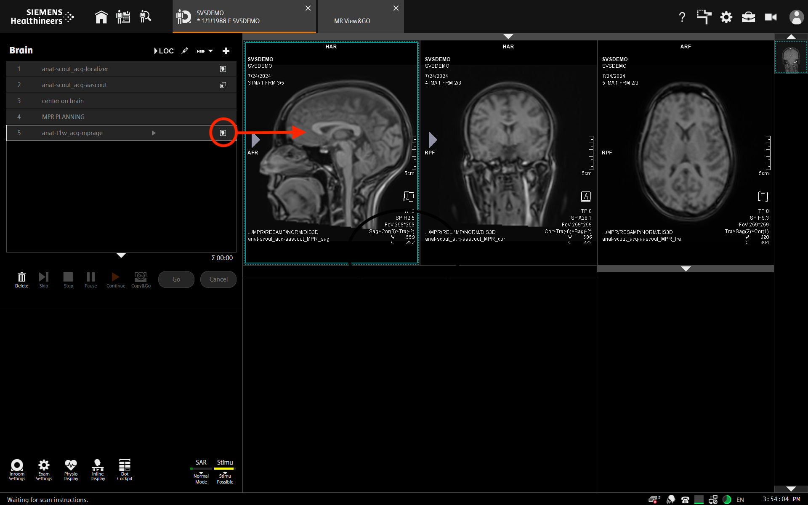<figcaption><p>Drag the MPRAGE into the left viewing window. Watch to see if the middle and right windows autofill with the reconstructed axial and coronal MPRAGE images. </p></figcaption></figure>

<figure><figcaption><p>If the axial and coronal reconstructions do not autofill, go to the MR View &#x26; Go tab and find the images on the right panel. Drag the coronal reconstruction from the right panel up to the Patient Window (The other open tab). That will open that window and you can then drag the run to the middle viewing window. The, repeat those steps to drag the axial (Tra) reconstruction to the right window. </p></figcaption></figure>

* Drag over the water reference scan to be executed by the scanner and open the sequence.
* A red dot will appear on your sagittal image. This dot is NOT your voxel (it is used to convert the images to non-distortion-corrected images). Place it in the general area your voxel will be placed on the sagittal image. Then click “convert images.”

<figure><figcaption><p>In this example, we placed the voxel in the ACC. Because of that, we placed the red dot in the same area, then selected "Convert Images" </p></figcaption></figure>

* You will now be able to move the voxel into the appropriate space. You can check your parameters under the “routine” tab.
* This system does NOT use the “scroll nearest” function. It simultaneously updates the position in the other two planes as you move it in one plane.
  * The dotted lines on your voxel mean it is not in view.
  * You will need to manually move the crosshairs on the screen to ensure your voxel is placed correctly. To see the crosshairs, press the “H” key.
  * By doing a right click with the mouse you can scroll through your slices.

<figure>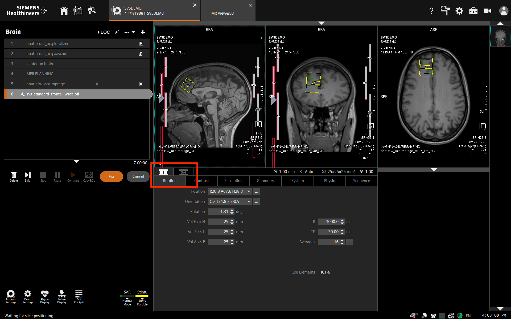<figcaption><p>Voxel placement in the ACC. The red box highlights the routine tab (where to find the parameters)</p></figcaption></figure>

* Once you are satisfied with the placement, click the orange “Go” button.
* The full width half maximum (FWHM) measurement will pop up after the scanner shims.

<figure>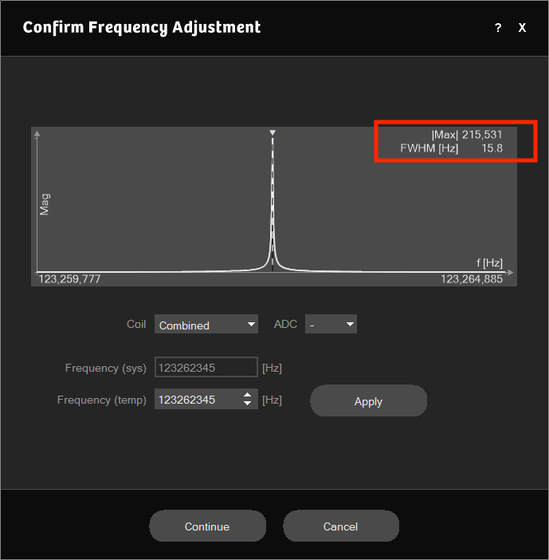<figcaption><p>The FWHM can be found in the upper right of the pop up window, depicted here in the red box. Since the FWHM is below 20, the window can be closed by hitting "Continue"</p></figcaption></figure>

* Like the old system, drag over the metabolite scan to be executed by the scanner and open the sequence. Right click on the water reference scan and click “copy parameters” and then select “measurement parameters” and then click “apply.” Your voxel should be in the same position as that of the reference scan. Press the orange “Go” button to initiate the sequence.

<figure>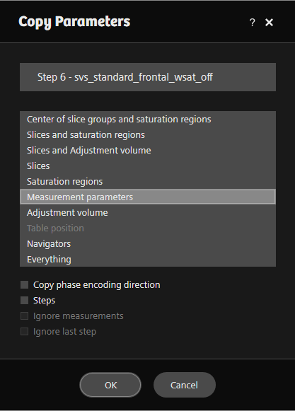<figcaption></figcaption></figure>

* Drag and drop over the “Auto Start MR Spectro” sequence after collecting your metabolite data. Be sure to press the “Go” button. This step is necessary for extracting your rda files! Only do it after ALL spectroscopy sequences are run.

<figure>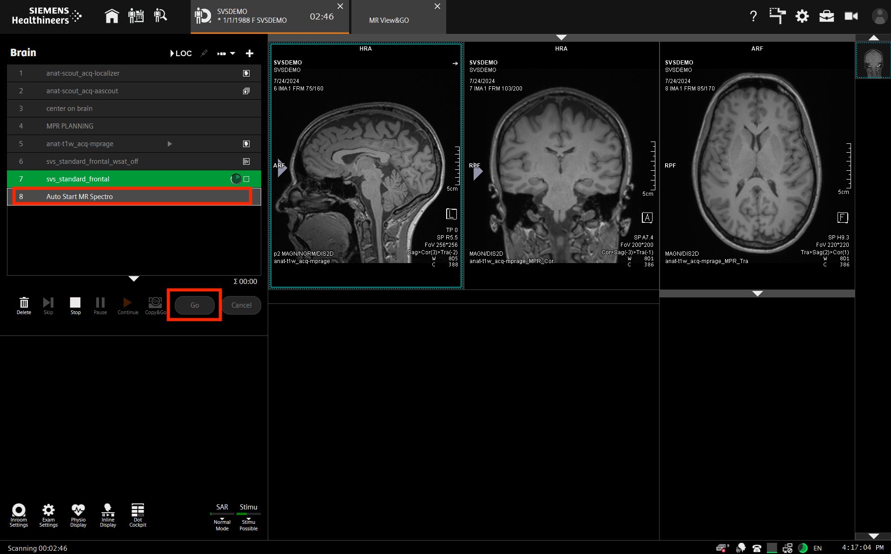<figcaption></figcaption></figure>

### Manually Adjusting the FWHM

* If you are unhappy with the FWHM value (>20) during your water reference scan, you can manually adjust it by clicking “cancel” rather than “continue” on the pop-up screen.

<figure>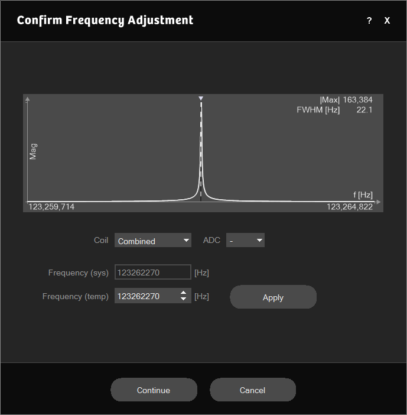<figcaption><p>A high FWHM, measured here at 22.1. Rather than clicking 'Continue", select "Cancel" and complete the following steps. </p></figcaption></figure>

* Double click the water reference sequence to open it and go into the “Details View” tab.
* Click “System,” “Adjustments,” and then click “Manual Adjustments”.

<figure>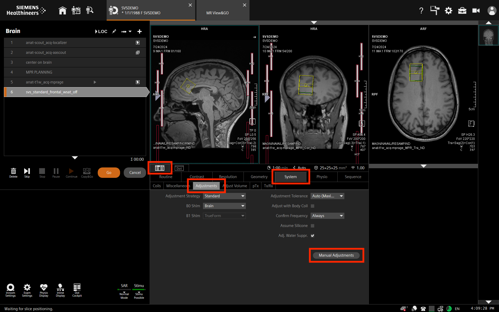<figcaption></figcaption></figure>

* Go to the left hand side and click “Interactive Shim” then follow the same process as the one used on the prior version of the scanner.
  * For this system, A11 is X, B11 is Y, and A10 is Z. When you have adjusted the system to a FWHM you like, click “stop”, "load best", and then “apply.”
  * It is important to remember that the FWHM number presented on the screen won’t update after you do this step, so be sure to write it down once you get your value.

<figure>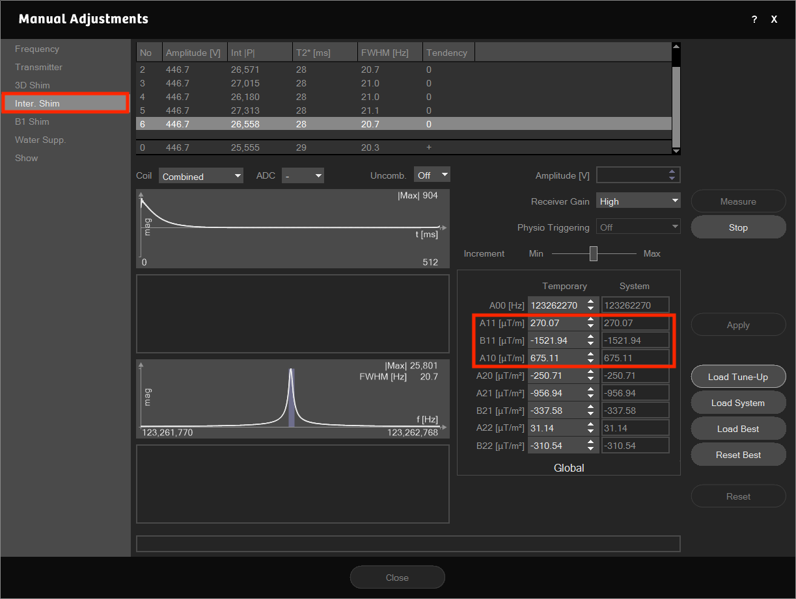<figcaption><p>The Interactive Shim page. </p></figcaption></figure>

### Exporting the Data (rda and twix files)

* To export the rda files, go into the files tab and select both the water reference file and metabolite file. Right click on them and select the “MR Spectro” option.

<figure>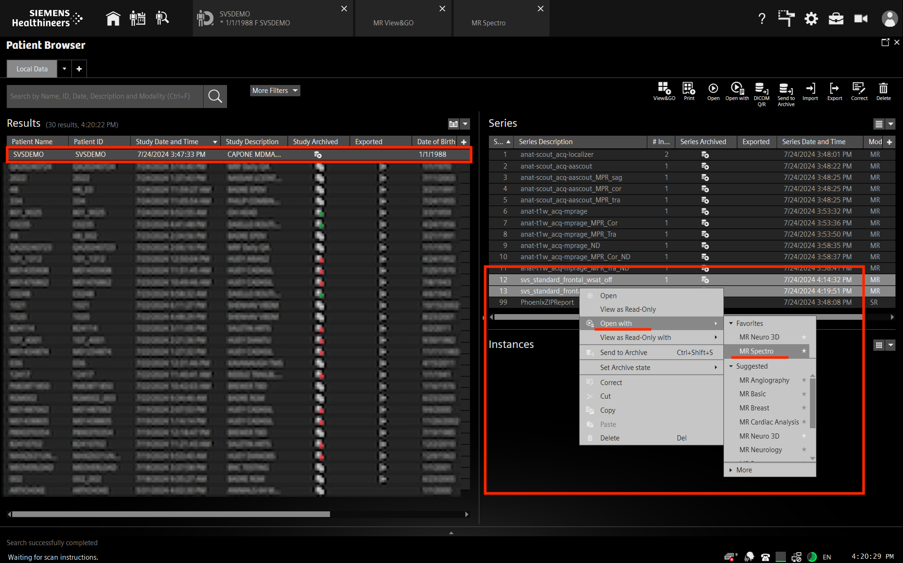<figcaption></figcaption></figure>

* Go under the MR Spectro Analysis gray box on the lefthand side of the screen and click “Export Selected Raw” and click “Export All.”
* Select your drive (typically :E) and both files will be saved there.
  * The system makes the rda files itself and you can no longer name the files.

<figure>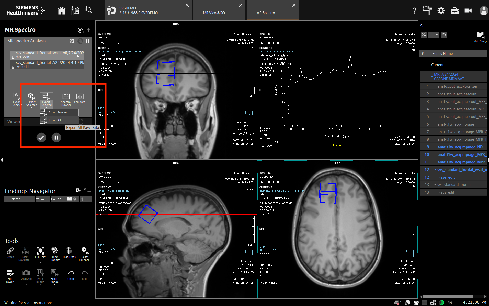<figcaption></figcaption></figure>

* To export the twix files, you need to be in Med Admin mode. Click Med Admin in the upper righthand corner and enter in the username and password.
* Now, press the “Windows” key on the keyboard for the start menu. If the Windows key doesn’t work, press “tab,” “delete,” and "\[->".
* Go to the command prompt option on the start menu and type in “twix”.

<figure>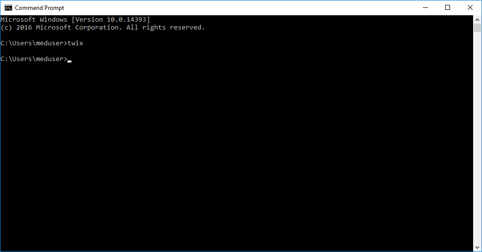<figcaption><p>This terminal can be found by pressing the Windows key, and selecting "Command Prompt". The twix command will open a popup and allow you to select your files. </p></figcaption></figure>

* Select your water reference and metabolite files and right click to export them to your drive.
* IMPORTANT: XNAT does NOT transfer your rda or twix files! You need to manually put them on an external drive and upload them to Oscar.

<figure>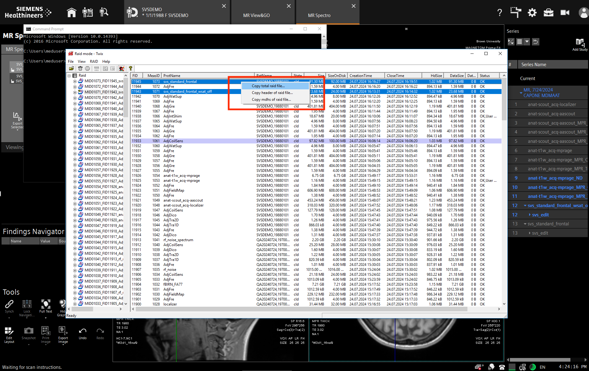<figcaption><p>Select the files, right click, and export to drive via "Copy total raid file". </p></figcaption></figure>

## Getting Started with Preprocessing

### Necessary MRS files and folders

* Ensure you have BOTH the metabolite and water reference files in twix format (.dat), rda format (.rda), and dicom (.dcm).
  * You will ONLY use the .rda files, but it is necessary to have the twix and dicom files as backups.
* Convert T1-weighted dicom files to nifti format with your tool of choice (i.e. [dcm2niix](https://github.com/rordenlab/dcm2niix?tab=readme-ov-file), [xnat2bids](../xnat-to-bids-intro/xnat2bids-software/), or [Heudiconv](https://sites.brown.edu/cnrc-core/files/2023/05/heudiconv.pptx)).
* Make sure your anatomy and spectroscopy files are organized in accordance with the BIDS formatting in a “project” folder. See [this link](https://schorschinho.github.io/osprey/getting-started.html#how-to-organize-your-raw-data) for a helpful example of appropriate file structure.
  * Also, in accordance with BIDS, save the subject data in a folder called “rawdata”.
  * Be sure to also make two folders in the same directory as “rawdata” called “code” and “derivatives”.
  * In your “derivatives” folder, make a new folder for your subject called “sub-XXX” (you will save your Osprey outputs here).

### Setting Up Osprey on Oscar

* To extract your metabolite data, you will need to launch a new interactive session on Oscar.
* Download SPM12 from [SPM website](https://www.fil.ion.ucl.ac.uk/spm/software/download/) and unzip the file.

```
unzip spm12.zip
```

* Save SPM12 to your home directory (i.e.,/oscar/home/username).
* Download Osprey from Github by opening a new terminal and enter the following command:

```
git clone https://github.com/schorschinho/osprey.git 
```

* Save Osprey to your home directory (i.e.,/oscar/home/username).
* Download the rda conversion files from Github by entering the following command:&#x20;

```
clone https://github.com/meggon/BrownRDA.git
```

* Save the conversion files to your “code” folder (i.e.,/oscar/home/username/project/code).
* To use Osprey, you need to open Matlab:

```
module load matlab/R2023a-xd6f7ph
matlab-threaded
```

* Osprey requires three additional packages that need to be installed in Matlab:
  * In the top right-hand corner of the screen click the “Add-Ons” button and select “GetAdd-Ons”.
  * Once the Add-On Explorer pops up, sign into your Brown MathWorks account.
  * Search and install the three following toolboxes:
    * GUI Layout Toolbox
    * Widgets Toolbox
    * Widgets Toolbox - Compatibility Support
* Once the Matlab interface pops up, you will want to add SPM12, Osprey, and your project folder to your path. Make sure that Osprey and SPM12 are in the same directory. Do NOT add SPM12 subfolders to your Matlab path, this will cause Osprey to fail. Add only the top-level SPM12 directory.

```
addpath(‘/oscar/home/username/spm12’)
addpath(genpath(‘/oscar/home/username/osprey’))
addpath(genpath(‘/oscar/home/username/project’))
```

<figure>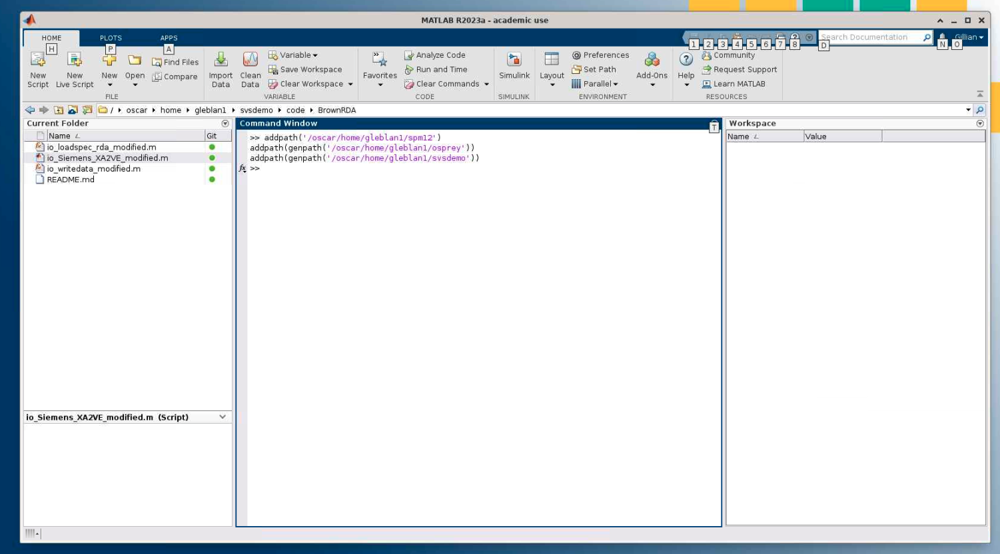<figcaption></figcaption></figure>

### Make your rda files compatible with Osprey&#x20;

* In Matlab, go to your “code” folder and open the .m file titled “io\_Siemens\_XA2VE\_modified.m”.
* Uncomment the section called “UNCOMMENT SECTION...” and fill in the folder and file information with your data. Enter your metabolite rda file and the folder it is located in.
* Run the script by pressing the green “Run” button at the top of the Editor window.

<figure>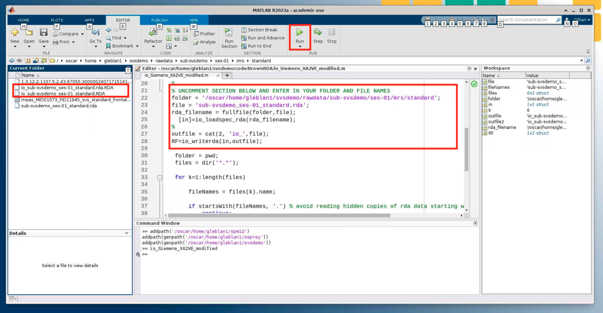<figcaption><p>In the editor window of MATLAB, uncomment the "io_Siemens_XA2VE_modified.m" script and edit it to include the path and name for your standard/metabolite rda file. Then to run the script, press the run button highlighted in red at the top of the screen. It is important that you run the script from the folder which contains the rda file, not the code folder where you opened the matlab script. Following the completion, two new files will be created which you can view in the panel to the left. </p></figcaption></figure>

*   The script will output two files: “io\_YOURSUBJECT\_GLX.RDA” and

    “io\_YOURSUBJECT\_GLX.rda.RDA”- do NOT use the one with the two rda extensions! Delete this extra file. Your metabolite folder should now contain (1) the twix file, (2) the dicom file, (3) the original rda file from the scanner, and (4) modified rda file that starts with “io\_” and has one rda extension.

    * The modified rda file is what you will be inputting into Osprey.
* Repeat this process with your reference/water rda file and the folder it is in by modifying the script. You will need BOTH (metabolite and reference) modified rda files for Osprey to work.

<figure>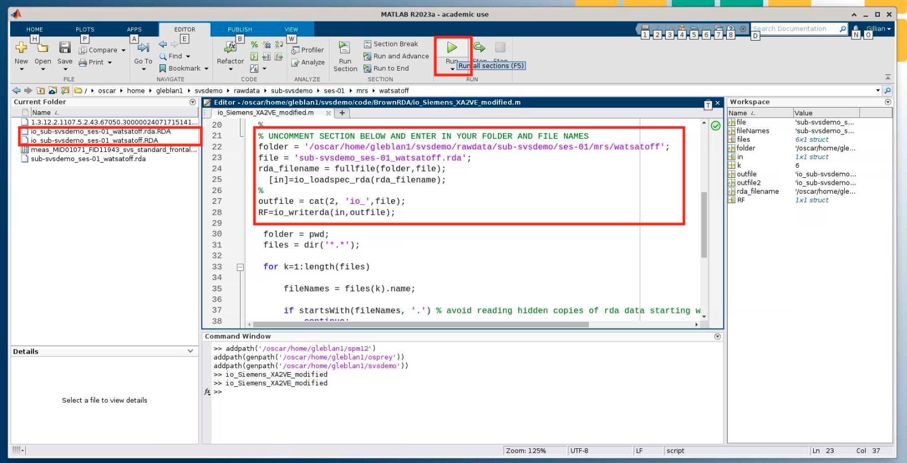<figcaption><p>Do the same steps again, but rename your path/files to lead to your watsatoff data. Run the script, but again, ensure it is being run from the directory that contains the watsatoff files. </p></figcaption></figure>

* If you want to ensure that your rda files now have the correct geometry information in their headers, go to your Matlab Command Window and type the following (remember the filenames are case sensitive).

```
glxsubID = io_loadspec_rda(‘io_YOURSUBJECT_GLX.RDA’);
watsubID = io_loadspec_rda(‘io_YOURSUBJECT_WAT.RDA’)
```

* In the Workspace area, double click the variables “glxsubID” and “watsubID” and open the “geometry” fields and ensure all values are filled out. You can easily check by double clicking “size” and looking at your voxel dimensions.
* Both files should have the SAME geometry information because the voxel placements should be identical.

## Using Osprey to Preprocess your Data

### Creating a New Job in Osprey and Inputting your Data

• Launch the Osprey GUI from the Matlab command line (code is case sensitive).

```
Osprey
```

* Click “Create job” and the “Interactive Osprey job file generator” will pop up on your screen.

<figure>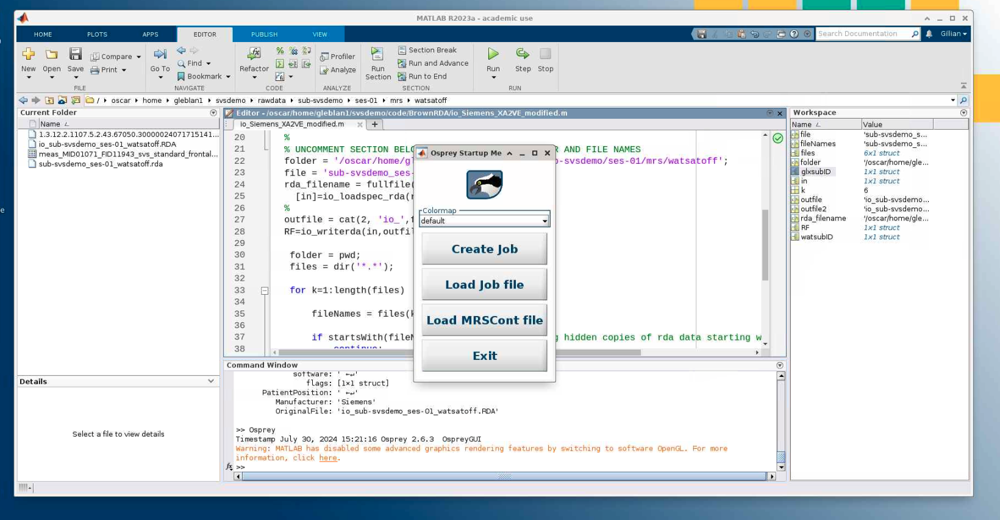<figcaption><p>Type 'Osprey' into the command window of MATLAB to open the Osprey Startup window. Then press "Create Job" to open the jobfile generator. </p></figcaption></figure>

* Important note: if you are using the Oscar Desktop Viewer on your laptop, the top of the job file generator may be cut off. To avoid this issue, use the Desktop Viewer on a desktop computer.&#x20;
* How you specify information in the jobfile generator will depend on your sequence type and what files you want to extract. The examples I am providing will walk you through an unedited PRESS acquisition.
  * In section 1, "Specify Sequence Information,” do not change any of the input values.
  * In section 2, “Specify Data Handling and Modeling Options,” keep all input values the same. Check off the “Save PDF” box. Click “basis set folder” and select the appropriate basis set folder from the Osprey package: /oscar/home/username/osprey/fit/basissets/3T/siemens/unedited/press/30
    * Now, click “basis set file” and select the appropriate basis set file (.mat) from this folder: /oscar/home/username/osprey/fit/basissets/3T/siemens/unedited/press/30/basis\_siemen s\_press30.mat
    * Note: Do not use the basis set provided by LCModel- the file type (.basisset) is not compatible with Osprey, as Osprey requires a matlab file input (.m).
  * In section 3, “Specify MRS and Anatomical Imaging Files,” click “MRS data” and select the modified metabolite rda file you created: /oscar/home/username/project/rawdata/sub-XXX/ses-01/mrs/sub-XXX\_press\_act/io\_YOURSUBJECT\_GLX.RDA
    * Now click “H2O Reference” and selected the modified water reference rda file you created: /oscar/home/username/project/rawdata/sub-XXX/ses-01/mrs/sub- XXX\_press\_wat/io\_YOURSUBJECT\_WAT.RDA
      * &#x20;Click “T1 Data (nifti \*.nii)” and select your T1-weighted image that has been converted to nifti: /oscar/home/username/project/rawdata/sub-XXX/ses-01/anat/sub-XXX\_ses-1\_T1W.nii
      * Do not input data for “H2O Short TE” or “Metabolite-Nulled” or select the “DICOM T1 data (GE only)” button.
  * In section 4, “Specify Output Folder,” click “Output Folder” and select the subject folder in the “derivatives” folder of your project: /oscar/home/username/project/derivatives/sub-XXX
    * Change the “Job Name” to your subject ID and the date: “subXXX022724”.
    * You do not have to input anything for the “Stat csv File”.
  * Click the “CREATE JOB” button at the bottom.
    * It will take a few seconds to load, but the Osprey window should then pop up.

<figure>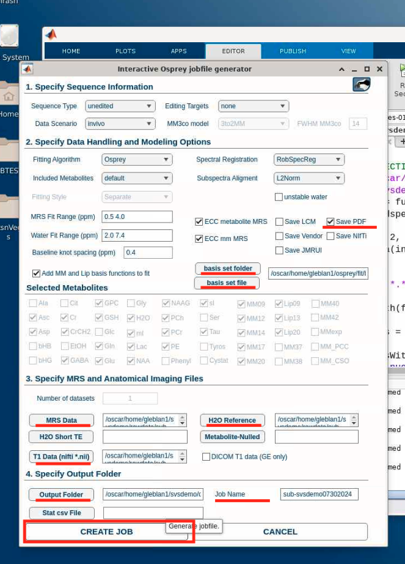<figcaption><p>The jobfile generator, with necessary fields underlined in red. After filling in each field with your specific folders/file information, press the "Create Job" button on the bottom left. </p></figcaption></figure>

* On the left hand side of the screen, click “Save MRS Cont,” this allows you to save the container (or project) so you don’t have to re-do the GUI inputs if you want to open this participant in Osprey again. It will save as a matlab script file (.m) under the subject folder in the derivatives folder with the name specified in the "Job Name" field: /oscar/home/username/project/derivatives/sub-XXX/subXXX022724.m
  * Exit Osprey, go to the MATLAB command window and type "Osprey" to reopen the start up menu. From the menu, click “Load MRSCont File” and input the .m file.&#x20;

### Walking through the Osprey Preprocessing Pipeline&#x20;

* First, click the “Load data” button in the top lefthand corner. This will load in your modified rda file.
  * This will output the subspectra from your rda file. Because the data in the rda file is already coil combined, there will only be one mean subspectrum that has already been preprocessed.
  * This output can be seen under the “Raw” tab at the top at any point when Osprey is running your container.

<figure>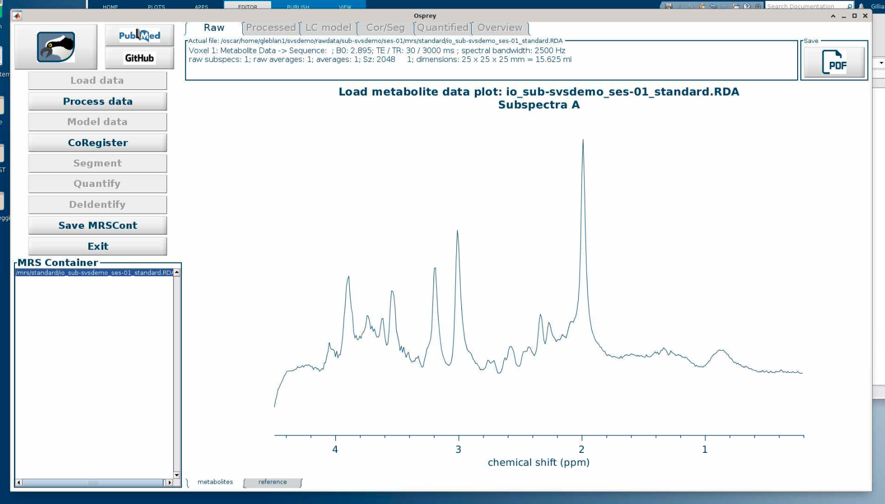<figcaption><p>Output of the 'Load Data' Step can be viewed in the "Raw" tab. </p></figcaption></figure>

* Click the “Process data” button (which should now be in blue letters rather than gray because the Load data step ran correctly). This step is meant to show you how the data are preprocessed via alignment, averaging, and accounting for chemical shift drift.&#x20;
  * Again, because our data is already coil combined, you will only see one averaged spectrum under “Pre-alignment,” “Post-alignment,” and “Aligned and averaged”- they will all be the same original spectrum you saw on the “Raw” tab.
  * This output can be seen under the “Processed” tab at the top.

<figure>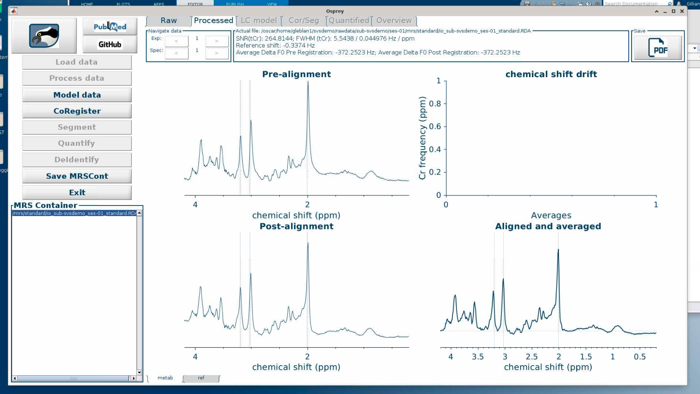<figcaption><p>Output of the "Process Data" step, viewed in the "Processed" tab. </p></figcaption></figure>

* Click the “Model data” button. This step fits your metabolite data to the basis set provided by Osprey.
  * This provides a metabolite fit plot separated by each metabolite of interest. The “Raw Water Ratio” values on the lefthand side are NOT your final usable values! They have not been corrected for water, CSF, or tissue values. This is like the output you would get from LCModel.
  * This data exists under the “LCmodel” tab at the top of the screen.
  * If you want to check that your water reference file looks correct, go to the bottom left hand corner and click the “ref” tab to see.

<figure><figcaption><p>Out of the 'Model Data" step, viewed in the "LC Model" Tab. </p></figcaption></figure>

<figure>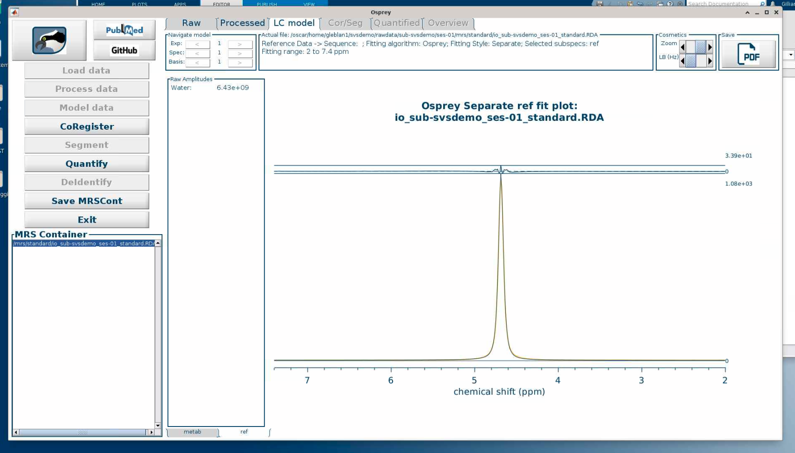<figcaption><p>The "LC Model" ref tab, access via the bottom left of the graph. </p></figcaption></figure>

* Next, click the “CoRegister” button in the lefthand corner. This step allows you to coregister or see where your voxel was placed on the T1-weighted image in the coronal, axial, and horizontal planes when collecting your MRS data.&#x20;
  * Important Note: if you did not run the rda conversion script or did not select the correct rda files (beginning with “io\_”), this step will NOT work. The Siemens XA30 upgrade does not input the voxel geometry in the header of the rda file correctly making it so the voxel cannot be coregistered onto the T1-weighted image.

<figure>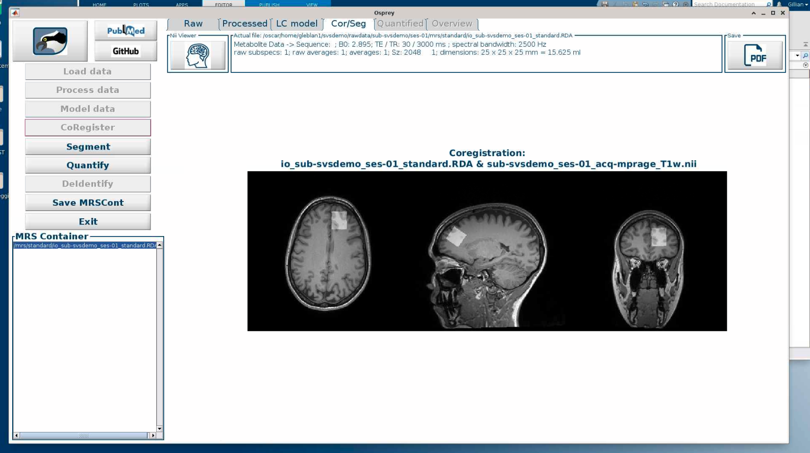<figcaption><p>Output of the "Coregister" step, accessed via the "Cor/Seg" tab. Here you can view the MRS voxel placement over the T1w scan. </p></figcaption></figure>

* Click the “Segment” button. This step may take a few minutes so do not be alarmed if you don’t get an output right away. This step “segments” the tissue types within your voxel, providing a percentage of gray matter, white matter, and cerebrospinal fluid (CSF). These percentages are necessary for properly quantifying your metabolite levels, as you want to remove any CSF effects and only focus on metabolite levels in the gray matter.
  * Now the coregistration image and segmentation image will both appear on the screen.
  * This data will exist under the “Cor/Seg” tab at the top of the GUI.

<figure>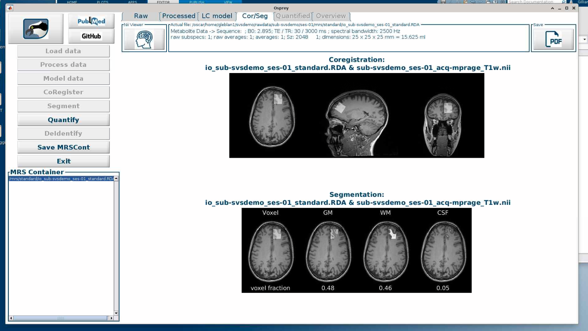<figcaption><p>Output of the "Segment" step. Again, this can be viewed in the same "Cor/Seg" tab as the previous step. </p></figcaption></figure>

* Finally, click the “Quantify” button. This step provides your final metabolite values that are corrected for water, T1 & T2 relaxation constants, and CSF.
  * Under the “Quantified” tab, you will see a table of your metabolite values with tCr referencing, raw water scaling, CSF and water scaling, and tissue correction and water scaling using the Gasparovic method. To choose which type of corrected metabolite values are best for you, see the Osprey paper by Oeltzschner et al. (2020). These results are in individual tsv files in the “Quantify Results” folder in /derivatives/sub-XXX

<figure>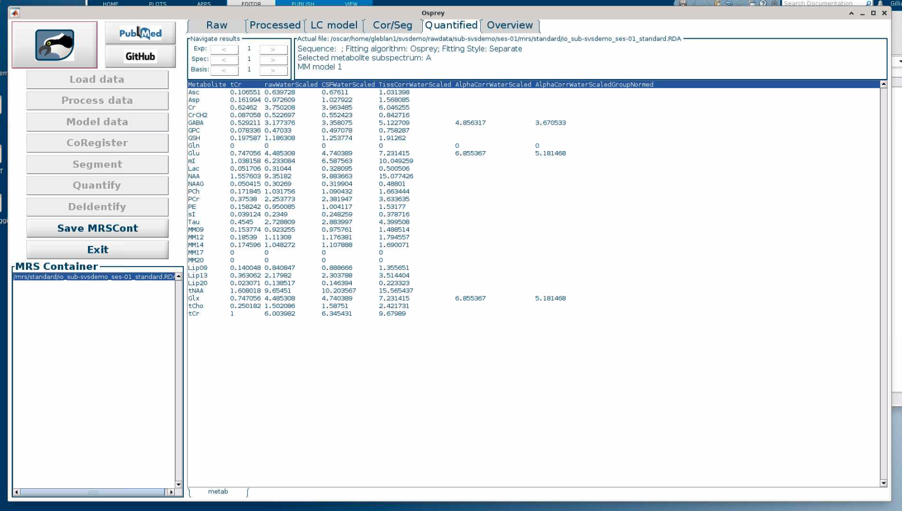<figcaption><p>Output of the "Quantified" step, viewed in the "Quantified" tab. </p></figcaption></figure>

* Finally, in the “Overview” tab at the top you can view the mean spectra across all datasets (if you have multiple rda files) and individual quantification tables.
* Save your MRS container by clicking “Save MRSCont” before you exit out of Osprey.
* If you did not select “Save PDF” in step 2 of the “Interactive Osprey jobfile generator,” and would like the images of your spectrum and your coregistered voxel, you can click the “Save PDF” button in the upper righthand corner to export it and it will be in the “Figures” folder under your subject’s folder in “derivatives”.
* Further tutorials of the GUI can be found on the Osprey website.
