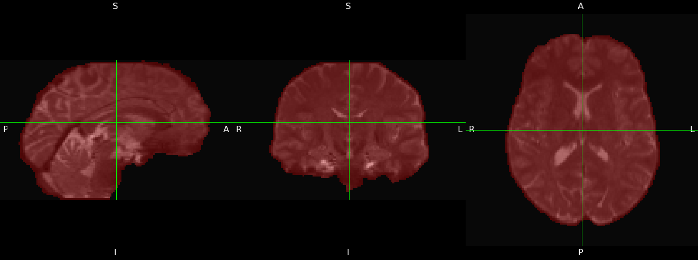

# FSL topup and eddy

## topup: Correcting for Susceptibility Distortion

### 1: Create the --imain file

`topup` requires at least one volume in each of the two opposite phase encoding (PE) directions. `topup` _can_ work if the PE directions are different but not opposite (for example, A->P and R->L), but the distortion correction may not be as high quality as using two opposing acquisitions. For diffusion imaging, you may use one b0 image per PE direction, or you may merge multiple b0 images before inputting to `topup`.&#x20;

To follow this tutorial using the DWI runs acquired in demodat2, please download the data from subject 101 session 1. More details on how to do this can be found [here](../../demo-dataset/how-to-access-it.md). In this tutorial, scans 18 and 23 were exported using [xnat2bids](../../xnat-to-bids-intro/xnat2bids-software/), which converts them to NIFTI and names them according to the BIDS format. If you choose not to use xnat2bids and instead download the DICOMs directly, please use dcm2niix to convert the DICOM images to NIFTI.&#x20;

The first 8 volumes of each demodat DWI run are b0 images. We will extract the first volume of both runs using the command fslroi, and merge them over time using fslmerge. The result of these transformations is one image named AP\_PA\_b0, which contains 2 b0 volumes: one in each PE direction.

```
fslroi sub-101_ses-01_acq-b1500_dir-ap_dwi.nii.gz AP_b0.nii.gz 0 1 \
fslroi sub-101_ses-01_acq-b1500_dir-pa_dwi.nii.gz PA_b0.nii.gz 0 1 \
fslmerge  -t  AP_PA_b0 AP_b0.nii.gz PA_b0.nii.gz
```


Extracting only the first b0 image (per phase encoding direction) is often adequate for susceptibility distortion correction using `topup`. However, if you would like to include more measurements in your `topup` command, there are multiple ways to do that. You can extract the first 8 frames of each run, merge them, and add a row for each of those additional b0s in your acqparams.txt file (described below). Additionally, there are 5 more b0 images interspersed throughout the diffusion run. You can extract these as well! The frame number of each b0 is found by opening the \*.bval file which is automatically created and placed into your `dwi`directory when using xnat2bids. As you add more b0 images to your `topup` input, please inspect the images by opening the AP\_PA\_b0 file in fsleyes or any other mri image viewer. They should all look very similar to each other- If you see any with different contrast and/or dropout, you may have included one of the b750 or b1500 images by mistake.&#x20;


### 2: Create the parameters file

The parameters file is a simple text file, with one line for each volume in the --imain file. Since we just merged the first b0 files for each PE dir, there will be 2 lines. &#x20;

For each line, the first three values describe the phase encoding direction vector, in the x, y, and z planes respectively. The fourth column of this file describes the total readout time, which can be found in the .json file corresponding to each run. This number is typically the same for each row in the column and does not change with differing PE directions unless otherwise specified in your sequence protocol.&#x20;

Name this file acqparams.txt. Its contents should look like this:

```
0 -1 0 0.0903501
0 1 0 0.0903501
```

A -1 in the second column means that k-space was traversed Anterior→Posterior and a 1 means that it was traversed Posterior→Anterior.&#x20;

### 3: Run topup

```
topup --imain=AP_PA_b0 \
--datain=acqparams.txt \
--config=b02b0.cnf \
--out=topup_AP_PA_b0 \
--iout=topup_AP_PA_b0_iout \
--fout=topup_AP_PA_b0_fout \
--verbose 
```


Remember: `topup`produces an --iout file, which contains as many volumes as are in the --imain file (in this example, 2 volumes), corrected for susceptibility distortion. _**This is not the full corrected dataset.**_ If you would like a susceptibility distortion corrected dataset, you must use the command `applytopup` and provide a full dwi acquisition. Documentation on `applytopup` can be found here: [https://fsl.fmrib.ox.ac.uk/fsl/fslwiki/topup/ExampleTopupFollowedByApplytopup](https://fsl.fmrib.ox.ac.uk/fsl/fslwiki/topup/ExampleTopupFollowedByApplytopup). &#x20;

If you would like both susceptibility and eddy current distortion correction, you can move directly to `eddy` without using `applytopup` first.&#x20;


## eddy: Correcting for Eddy Current Distortion&#x20;

### 1: Create the index file

The text-file index.txt contains a row of numbers, one for each volume in your dwi data, specifying that those volumes were acquired with the parameters specified by the corresponding row in acqparams.txt. We will be inputting the AP dwi scan into eddy, thus our index.txt file will contain a row of 1s. If we were to input the PA run, it would contain a row of 2s.&#x20;

```
#contents of index.txt
1 1 1 1 1 1 1 1 1 1 1 1 1 1 1 1 1 1 1 1 1 1 1 1 1 1 1 1 1 1 1 1 1 1 1 1 1 1 1 1 1 1 1 1 1 1 1 1 1 1 1 1 1 1 1 1 1 1 1 1 1 1 1 1 1 1 1 1 1 1 1 1 1 1 1 1 1 1 1 1 1 1 1 1 1 1 1 1 1 1 1 1 1 1 1 1 1 1 1 1 1 1 1 1 1 1 
```

### 2: Create a brain mask&#x20;


Regardless of the pipeline you are using, it is recommended that the brain mask is created after susceptibility distortion correction, but before eddy current correction (Tax et al., 2022). This is because the signal pile up/reduction due to susceptibility artifact can lead to inaccurate masking.&#x20;


First, use fslmaths to combine the AP and PA outputs of topup into one file. the -Tmean option tells fslmaths to take the mean across time, resulting in a 3D dataset (one volume) named hifi\_nodif (high fidelity, no diffusion). Then, that volume will be input into bet (Brain Extraction Tool) to create a brain mask.&#x20;

```
fslmaths topup_AP_PA_b0_iout -Tmean hifi_nodif \
bet hifi_nodif hifi_nodif_brain -m -f 0.2
```

<figure><figcaption><p>The brain mask (in red) created using bet, overlaid onto the AP and PA combined hifi_nodif image. </p></figcaption></figure>

### 3: Run eddy

```
eddy --imain=sub-101_ses-01_acq-b1500_dir-ap_dwi.nii.gz \
--mask=hifi_nodif_brain_mask \
--index=index.txt \
--acqp=acqparams.txt \
--bvecs=sub-101_ses-01_acq-b1500_dir-ap_dwi.bvec \
--bvals=sub-101_ses-01_acq-b1500_dir-ap_dwi.bval \
--fwhm=0 \
--topup=topup_AP_PA_b0 \
--flm=quadratic \
--out=eddy_unwarped_images \
--data_is_shelled \
--verbose
```

<figure><figcaption><p>On the left: b0 images acquired in the AP and PA directions, with susceptibility and eddy current distortions. On the right: the combined b0 after distortion correction via topup and eddy</p></figcaption></figure>

## Additional Resources

If you would like to run topup and eddy as a batch script on multiple subjects/sessions, please refer to the excellent documentation written by Hannah Swearingen (Brown Clinical Neuroimaging Research Core), found here:&#x20;

* The code is located at [https://github.com/brown-bnc/dwi\_preprocessing](https://github.com/brown-bnc/dwi_preprocessing)
* [https://sites.brown.edu/cnrc-core/resources-and-help/](https://sites.brown.edu/cnrc-core/resources-and-help/) provides a "Diffusion Preprocessing" powerpoint which goes step by step in running the batch script&#x20;

For a detailed explanation of the commands used in this tutorial, and what their options signify, please refer to this slideshow: [Commands used in FSL distortion correction pipeline](https://docs.google.com/presentation/d/13CdYu4qxw2aBK8NyaM0dzgqDsz08PqLiDVm_l2JOp8s/edit?usp=sharing)
