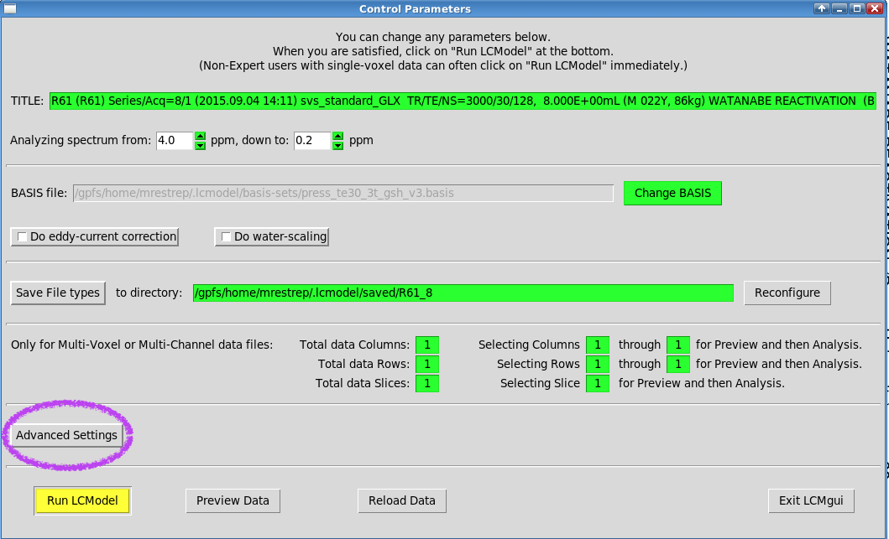
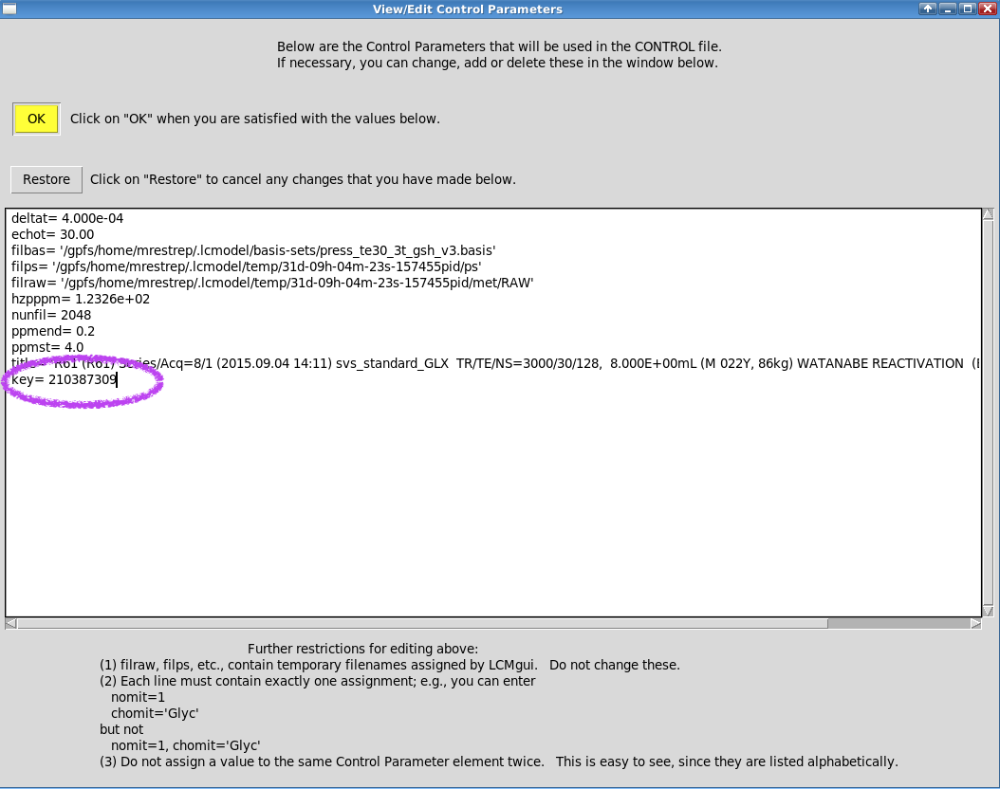

# Example Run

## 0. Make sure you have installed LCModel


**Every user must install LCModel** for their own user. If you haven't, please refer to the [Installation Guide](lcmodel.md#installing-lcmodel-in-oscar)&#x20;


## 1. Start a VNC session

To run LCModel's GUI you will need to start [Oscar's VNC Client](https://docs.ccv.brown.edu/oscar/connecting-to-oscar/vnc). LCModel is not very resource intensive so you can request a basic session

## 2. Launch Terminal&#x20;

* Inside your VNC session, open a **Terminal** window.
* Navigate to LCModel's **hidden** directory `cd ~/.lcmodel`

<figure><figcaption>
Sample Terminal Window inside Oscar's VNC 
</figcaption></figure>

## 3. Launch lcmgui

* To launch the lcmgui, simply type `./lcmgui` from the current directory (`~/.lcmodel`)
* Accept license agreement

## 4. Select sample Siemens data&#x20;

* Select Siemens at the data type prompt

<figure><figcaption>
Sample Data Type Window
</figcaption></figure>

* Search for the share data: `/oscar/data/bnc/shared/lcmodel/TestData.rda`&#x20;

<figure><figcaption>
Sample Data Browser Window
</figcaption></figure>

## 5. Select Basis

During installation, the basis-set was installed under the LCModels' hidden directory in your home. i.e., `$HOME/.lcmodel/basis-set` which is equivalent to `/oscar/home/$USER/.lcmodel/basis-set`

* Change the basis file to: `$HOME/.lcmodel/basis-sets/press_te30_3t_gsh_v3.basis`

<figure><figcaption>
Sample Control Parameters Window
</figcaption></figure>

## 6. Add License Key to Control Parameters

You will need to add a key to the Control Parameters. We do so as follows:

1.  Open Advanced Setting Dialog  
    <figure><figcaption></figcaption></figure>

2. Select View/Edit Control Parameters.&#x20;  
A dialog will open  

3. Add key to Control Parameters  
Add `key= 210387309` to the control parameters as shown in the figure below. Be careful to match spaces. When done, press OK  
<figure><figcaption></figcaption></figure>

4. Save parameters file (optional)  
LCModel will ask you if you want to save the new parameters to a new file. You can do so. If you do, the next time you can select the saved file from **Advanced Settings -> Change Control-Defaults file**

## 7. Run LCModel

After pressing **Run LCModel**, a two page PDF will appear, which looks as follows

<figure><figcaption>
LCModel Result PDF - Page 1
</figcaption></figure>

<figure><figcaption>
LCModel Result PDF - Page 2
</figcaption></figure>
