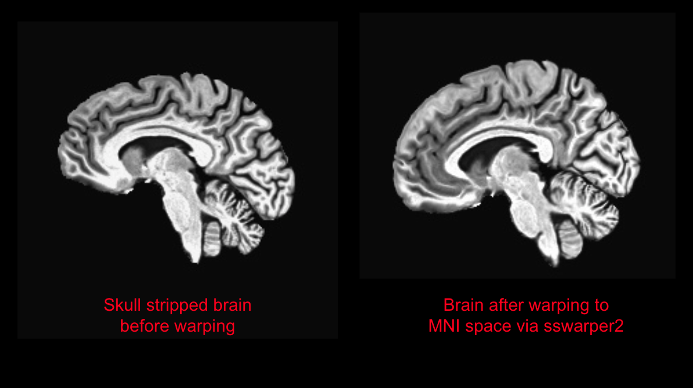

# First-Level Analysis Using afniproc.py

## Step 1: Download data from XNAT and automatically convert to BIDS format using xnat2bids

Running xnat2bids on the command line in Oscar will download the data we need, convert it to BIDS format, and run the BIDS validator to check for any issues. We will be using the xnat-tools Oscar utility script explained [here](../../../xnat-to-bids-intro/using-oscar/oscar-utility-script/). The Demodat2 dataset has 3 subjects with 2 sessions each. We will be exporting this entire project.&#x20;

#### Create a configuration file&#x20;

The configuration .toml file contains information that xnat-tools needs to download the correct data and put it where we want. Name this file x2b\_demodat2\_config.toml and place wherever you'd like. Paste the following into your .toml file, and change `mail-user` to your email address. The script will default to placing the downloaded and BIDS-converted data in a folder called "bids-export" in your home directory; if you'd like to change this location, add a new line at the bottom with your desired path, i.e.: `bids_root="/oscar/home/<yourusername>/data/<projectname>/xnat-export"`. Make sure to save this .toml file when you are done editing.&#x20;

```toml
# Configuring arguments here will override default parameters.
[slurm-args]
mail-user = "example-user@brown.edu"
mail-type = "ALL"
output = "/oscar/home/example-user/logs/%x-%J.txt"

[xnat2bids-args]
bids_root = "/oscar/home/<example-username>/data/Demodat2/xnat-exports"
project="BNC_DEMODAT2"
verbose=2
# Skip scanner-derived multi-planar reconstructions & non-distortion-corrected images 
# These are used for MRS voxel placement on the scanner and will cause xnat2bids to fail. 
skipseq=["anat-t1w_acq-memprage_MPR_Cor","anat-t1w_acq-memprage_MPR_Tra","anat-t1w_acq-memprage_MPR_Tra_ND","anat-t1w_acq-memprage RMS_ND","anat-t1w_acq-memprage_MPR_Cor_ND"]

```

#### Run the xnat2bids command

To run the xnat-tools export and BIDS conversion, ensure that you are working in a terminal in the same directory where you stored this .toml file (and if not, then give the full path to the .toml file in your command). On the command line, type:

`module load anaconda`

`python /oscar/data/bnc/shared/scripts/run_xnat2bids.py --config x2b_demodat2_config.toml`

Enter your XNAT username and password when prompted.

If you entered your email address, you should receive an email when each of the xnat2bids jobs begin, and another when they finish.&#x20;

This will create a sourcedata folder for each subject within `$bids_root/bnc/study-demodat2/xnat-export` and a BIDS-compatible data directory within `$bids_root/bnc/study-demodat2/bids/`.


We will call this output BIDS-compatible folder `$bidsdir` for the remainder of the tutorial.&#x20;


## Step 2: Convert psychopy timing files to be used by AFNI

The aim of this step is to make our behavioral data BIDS compatible and facilitate future data sharing. To do this, we first need to create events.tsv files that correspond to each of our functional runs and contain information about each stimulus event of interest (onset time, condition, etc.). Then, in order to use afni for a regression, those tsv files must be converted into afni 1D files and saved in the bids derivatives directory.&#x20;


How will these timing files differ from those in a single subject pipeline?&#x20;

* The tsv files are the same- they are still created per subject, session, and run. They are separated by task (checks, keypress), but not by condition (left, right)
* For the first level analysis, we only input data from session 1 into the afni regression. Since there are two runs per session, this file had 2 rows. These files are separated by both task and condition (e.g. left\_keypress.1D, right\_checks.1D)
* For the second level analysis, the afni 1D files will contain 4 rows. These rows correspond to the two runs from session 1 and the two runs from session 2. By including all runs from both sessions in one file, we can include all data per subject in the regression.&#x20;


#### Download the psychopy behavioral timing files (csv)

First, download the participant's data files (in our case, created by PsychoPy) and manually place them in a directory named 'beh', in the sourcedata subfolder of your BIDS directory. For each individual subject and session, the full path should be: `$bidsdir/sourcedata/sub-xxx/ses-xx/beh`.&#x20;

Repeat this step for each subject and session, placing the files in their respective `beh` folders. Files are zipped per subject (unzip the file to view ses-01 and ses-02 separately).







#### Convert the timing files using a batch script&#x20;

Batch scripting improves the efficiency of data processing because it allows you to automatically launch the same job on all individual subjects/sessions, rather than running the script/command one by one. It takes advantage of the many resources available on our HPC (CPU, cores, etc) and runs the same script on all your subjects in parallel (rather than sequentially).

<details>

<summary>The components of a batch job on Oscar</summary>

Batch jobs remove much of the tedious work and allow you to process your data much faster!&#x20;

Information about the default SLURM settings can be found [here.](https://docs.ccv.brown.edu/oscar/submitting-jobs/batch?q=cache)

&#x20;Typically, a batch job requires 3 components:&#x20;

1. The batch script: A script detailing what resources you will request for your job, what processing script you will be running, and in our case, what subjects we will be input into that pipeline/script. This is written in bash and uses oscar's internal resource allocator/job manager, [SLURM](https://slurm.schedmd.com/overview.html).&#x20;
2. The processing script: The script that will be applied to your list of subjects. This can be written in any language.&#x20;
3. A text file containing the subjects. The batch script will iterate over this list and use it to fill in the subject ID variable in your processing script.&#x20;

</details>

In this tutorial, we will include the data from both runs of each session (4 runs total per subject) in our afniproc.py command. To do so, our example script `preprocess_behavior.py` will 1) convert and move the csv files output from psychopy to BIDS-organized tsv files, and then 2) convert and move those tsv files to 1D files that will be used by afni in the bids derivatives folder. &#x20;

Here you can download our example python processing script (`preprocess_behavior.py` ), the batch script that will be used to run it (run\_`preprocess_behavior.py` ), and the text file containing subject IDs (`subjects.txt`). Save these so they can be accessed on your oscar account. Open the batch script run\_preprocess\_behavior.sh and fill in your email and the path to your bids directory.&#x20;







#### Run the batch script&#x20;

To run the batch script, which will then launch multiple iterations of the preprocess\_behavior.py script (one job/launch per subject), navigate to the directory where you saved these 3 files. On the command line, type `sbatch run_preprocess_behavior.sh`. Since you filled in your email, you should receive a message when each of the 3 jobs have launched.    &#x20;

If you are unable to run this script for any reason, you can download the events.tsv output files here, and manually place them in each respective directory, i.e.: `$bidsdir/sub-xxx/ses-xx/func/` . Similarly, you can download the .1D files and manually place them in a new folder called `$bidsdir/derivatives/afni/sub-xxx/dualsession/stimtimes/`.&#x20;





## Step 3: Prepare fMRI data for preprocessing by warping to standard space

It is possible to quickly warp your data into standard space within the afniproc.py script, but this does not provide the most accurate warping, since it is done via a linear transformation. To perform a nonlinear transformation into standard space, there is a separate afni command called [sswarper2](https://afni.nimh.nih.gov/pub/dist/doc/program_help/sswarper2.html) (the successor of @SSwarper). This command takes roughly an hour and half to run on Oscar, and is used on each individual subject's T1 anatomical file. You only need to warp one of the T1s per subject- in the next step, all functional data from session 1 and 2 will be aligned to it.&#x20;

Copy and paste this script into a file called `run_SSW.sh`. Change the example email to your own, and edit the path to your bids directory. Ensure that it is saved in the same location as your subjects file (`subjects.txt`). To launch this script on all 3 subjects sequentially, navigate to the directory on the command line and type `sbatch run_SSW.sh`.&#x20;


```bash
#!/bin/bash
#SBATCH -N 1
#SBATCH -c 8
#SBATCH --mem=10G
#SBATCH --time 3:00:00
#SBATCH -J SSW
#SBATCH --output=logs/SSW-%A_%a.out
#SBATCH --mail-user example_user@brown.edu
#SBATCH --mail-type ALL
#SBATCH --array=1-3

# To run this, type on the terminal: sbatch run_SSW.sh

bidsdir=/path/to/bids # <-- Edit with your bids path
subID=$(sed -n "${SLURM_ARRAY_TASK_ID}p" subjects.txt)

echo "Running subject: $subID"

mkdir $bidsdir/derivatives/afni/$subID/dualsession
outdir=$bidsdir/derivatives/afni/$subID/dualsession
cd $outdir

# Run sswarper2 on ses-01 data for each subject

sswarper2             \
        -input $bidsdir/$subID/ses-01/anat/${subID}_ses-01_acq-memprageRMS_T1w.nii.gz    \
        -base MNI152_2009_template_SSW.nii.gz             \
        -subid ${subID} -odir ${outdir} 

```


<figure><figcaption></figcaption></figure>

## Step 4: Use afni\_proc.py to create a preprocessing stream and run the general linear model per subject

This basic example of a univariate analysis with AFNI is based on the [example 6b](https://afni.nimh.nih.gov/pub/dist/doc/program_help/afni_proc.py.html) for afni\_proc.py.&#x20;

#### Run the afniproc.py batch script


afniproc.py will create its output folders in the directory that it is run from. To ensure all outputs are organized in the appropriate BIDS derivatives folder, the batch script will navigate to an output directory before launching afniproc.py. However, the log file for each job is created by SLURM, not by the script itself. It is recommend that you launch the batch script from the directory where you want your log files to be saved (for example, within a scripts directory).&#x20;


This `afniproc_dualsession.sh` script will iterate over your list of subjects and launch afniproc.py  over them individually. Afniproc.py is a metascript, meaning that it will create your actual preprocessing script `proc.sub-xxx_dualsession` for each subject. Since we included the `-execute` flag at the bottom, `proc.sub-xxx_dualsession` will be automatically launched when you run afniproc.py. Looking at the `proc.sub-xxx_dualsession` script is the best way to gain a deeper understanding of each of AFNI's processing steps.&#x20;

Copy the text in the box below into a file editor on Oscar.  Change your email in the beginning section, and change the value of the `bidsdir` variable to your own location (path should end in `/bids`). Save this script as a file called `afniproc_dualsession.sh`, and then execute it on the command line with `sbatch demodat2_afniproc.sh`. It will launch as a batch script, similar to how we ran `run_preprocess_behavior.sh`. You will receive an email when the job has completed.&#x20;


The next step after afniproc.py is to do a group analysis using afni's 3dMEMA. 3dMEMA requires that the linear regression was performed using the afni command 3dREMLfit, not 3dDeconvolve. To do that, the -regress\_reml\_exec flag is included in our afniproc.py script.&#x20;



```bash
#!/bin/bash
#SBATCH -N 1
#SBATCH -c 8
#SBATCH --mem=10G
#SBATCH --time 4:00:00
#SBATCH -J afniproc_dualsession
#SBATCH --output=logs/afniproc_dualsession-%A_%a.out
#SBATCH --mail-user example_user@brown.edu
#SBATCH --mail-type ALL
#SBATCH --array=1-3

# To run this, type on the terminal: sbatch afniproc_dualsession.sh

bidsdir=/path/to/bids # <---- FILL THIS IN
subID=$(sed -n "${SLURM_ARRAY_TASK_ID}p" subjects.txt)

echo "Running subject: $subID"

mkdir $bidsdir/derivatives/afni/$subID/dualsession
cd $bidsdir/derivatives/afni/$subID/dualsession

# Run afniproc
afni_proc.py \
    -subj_id ${subID}_dualsession \
    -out_dir $outdir/$subID.dualsession.results \
    -copy_anat $outdir/anatSS.${subID}.nii   \
    -anat_has_skull no \
    -dsets $bidsdir/$subID/ses-01/func/*checks*nii* \
           $bidsdir/$subID/ses-02/func/*checks*nii* \
    -blocks tshift align tlrc volreg blur mask scale regress \
    -tcat_remove_first_trs 0 \
    -align_opts_aea -cost lpc+ZZ -giant_move -check_flip \
    -tlrc_base MNI152_2009_template_SSW.nii.gz \
    -tlrc_NL_warp                                                    \
    -tlrc_NL_warped_dsets       $outdir/anatQQ.$subID.nii \
                                $outdir/anatQQ.$subID.aff12.1D   \
                                $outdir/anatQQ.${subID}_WARP.nii   \
    -volreg_align_to MIN_OUTLIER \
    -volreg_align_e2a \
    -volreg_tlrc_warp \
    -mask_epi_anat yes \
    -blur_size 4.0 \
    -regress_stim_times \
      $bidsdir/derivatives/afni/$subID/dualsession/stimtimes/${subID}_checks_left_dualsession_stimtimes.1D \
      $bidsdir/derivatives/afni/$subID/dualsession/stimtimes/${subID}_checks_right_dualsession_stimtimes.1D \
      $bidsdir/derivatives/afni/$subID/dualsession/stimtimes/${subID}_keypress_left_dualsession_stimtimes.1D \
      $bidsdir/derivatives/afni/$subID/dualsession/stimtimes/${subID}_keypress_right_dualsession_stimtimes.1D \
    -regress_stim_labels leftchx rightchx leftpress rightpress \
    -regress_basis_multi 'BLOCK(12,1)' 'BLOCK(12,1)' 'GAM' 'GAM' \
    -regress_opts_3dD -jobs 2 \
        -gltsym 'SYM: leftchx -rightchx' -glt_label 1 left_vs_right_chx \
        -gltsym 'SYM: leftpress -rightpress' -glt_label 2 left_vs_right_press \
    -regress_motion_per_run \
    -regress_censor_motion 0.3 \
    -regress_censor_outliers 0.05 \
    -regress_reml_exec \
    -regress_compute_fitts \
    -regress_make_ideal_sum sum_ideal.1D \
    -regress_est_blur_epits \
    -regress_est_blur_errts \
    -regress_run_clustsim yes \
    -html_review_style pythonic \
    -execute
```


<details>

<summary>More information about the afniproc.py flags </summary>

The -blocks flag lists the processing blocks that will be executed, in order:&#x20;

`tshift`: slice time correction

`align`: aligning the EPIs to the anatomical scan

`volreg`: motion correction within each functional run

`blur`: spatial smoothing with a 4mm FWHM smoothing kernel

`mask`: create a "brain" mask from the functional data, restricted by the anatomy

`scale`: scale each voxel to have a mean of 100 per run

`regress`: build a general linear model and execute with [3dREMLfit](https://afni.nimh.nih.gov/pub/dist/doc/htmldoc/programs/3dREMLfit_sphx.html)&#x20;

**To point afniproc.py to the output of sswarper2:**

`-copy_anat` the argument of this flag is the skull stripped (but not warped/standardized) anatomical file. This is included in the output of sswarper2.&#x20;

`-anat_has_skull` is set to `no`, since we are inputting the anatSS file

`-tlrc_NL_warp`  performs a non-linear transformation into template space, using the files listed in the flag `-tlrc_NL_warped_dsets`

`-tlrc_NL_warped_dsets` lists the relevant datasets output from sswarper2. These include:&#x20;

1. `anatQQ.$subID.nii` (skull-stripped dataset nonlinearly warped to the base template space)
2. `anatQQ.$subID.aff12.1D` (affine matrix to transform original dataset to base template space)
3. `anatQQ.$subID_WARP.nii` (incremental warp from affine transformation to nonlinearly aligned dataset).&#x20;

**For the visual hemifield localizer regression, we use:**

`-regress_stim_times` to provide the stimulus timing files for this participant (sub-xxx\_checks\_left\_stimtimes.1D and sub-xxx\_checks\_right\_stimtimes.1D)

`-regress_stim_labels` to assign those conditions the labels of "leftchx" and "rightchx" respectively

`-regress_basis` to model each stimulus as a block lasting 12 seconds

`-regress_opts_3dD` to specify our contrasts. Here, we do a "left\_vs\_right\_chx" contrast to find voxels whose activity is greater for the left hemifield stimulation than for the right.&#x20;

**For the motor task (keypress) regression, we use:**

`-regress_stim_times` to provide the stimulus timing files for this participant (sub-xxx\_keypress\_left\_stimtimes.1D and sub-xxx\_keypress\_right\_stimtimes.1D)

`-regress_stim_labels` to assign those conditions the labels of "leftpress" and "rightpress" respectively

`-regress_basis` to model each stimulus as an instantaneous event (indicated by using AFNI's 'GAM' function)

`-regress_opts_3dD` to specify our contrasts. Here, we do a "left\_vs\_right\_press" contrast to find voxels whose activity is greater for the left index finger motor activation than for the right.&#x20;

</details>

Now that each subject's data has been preprocessed (both sessions included), we are ready to move on to the second-level/group analysis!&#x20;
