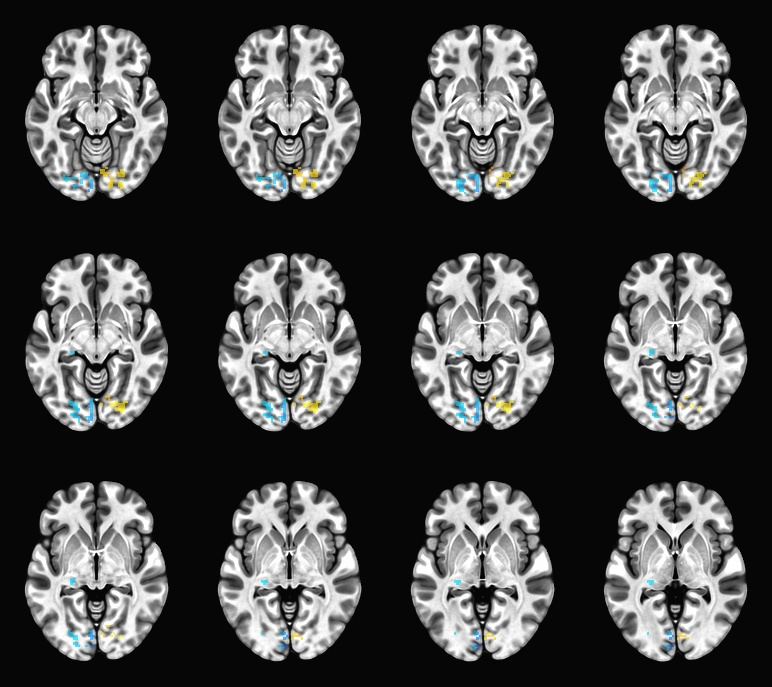

# Second-Level Analysis using gen\_group\_command.py

Second-level analysis takes the results from the first-level analysis (individual subjects) and combines them across participants. This allows us to make inferences about the population as a whole, rather than just describing one person’s brain activity.

In some studies, researchers might compare different groups (e.g., males vs. females, patients vs. controls). However, in our case all subjects in _Demodat2_ performed the same task, and we did not divide them into subgroups. Therefore, we will use a **one-sample test** to examine whether the group, as a whole, shows consistent brain activation.


Since we are working with a very low n in this tutorial, it is not unusual to observe few clusters that survive thresholding at the group level. This script is meant to serve as an example and should be adapted for a larger dataset.&#x20;


### The Full Script&#x20;

Below you can find the full group analysis preprocessing example script.&#x20;

<details>

<summary>group_analysis.sh</summary>

To run this script, change your email and bids path, and then type: sbatch group\_analysis.sh

```
#!/bin/bash
#SBATCH -N 1
#SBATCH -c 8
#SBATCH --mem=10G
#SBATCH --time=4:00:00
#SBATCH -J demodat2_group_analysis
#SBATCH --output=logs/demodat2_groupanalysis-%A_%a.out
#SBATCH --mail-user=example_user@brown.edu
#SBATCH --mail-type=ALL

# This script is adapted from s.nimh_group_level_02_mema_bisided.tcsh 

###############################################################################
# Load modules (OSCAR environment)
###############################################################################

module load r
module load afni

###############################################################################
# Set paths and analysis parameters
###############################################################################

here=$PWD                        # starting directory
bids_dir="path/to/bids"
path_proc="${bids_dir}/derivatives/afni"

odir="GROUP_LEVEL"              # output folder name
outdir="${path_proc}/${odir}"   # final output folder

mkdir -p "$outdir"

# 3dMEMA settings
script_mema="do_group_level_mema.tcsh"
omema="mema_results.nii.gz"

# Cluster simulation settings
csim_neigh=1
csim_NN="NN${csim_neigh}"
csim_sided="bisided"
csim_pthr=0.001
csim_alpha=0.05
csim_pref="clust_${csim_sided}"

echo "Running group analysis in: $outdir"
cd "$outdir"

###############################################################################
# 1) Generate MEMA command script (tcsh), then run it
###############################################################################

gen_group_command.py \
    -command 3dMEMA \
    -write_script "${outdir}/${script_mema}" \
    -prefix "${outdir}/${omema}" \
    -dsets ${path_proc}/sub*/sub*results/stats.sub*_REML+tlrc.HEAD \
    -set_labels "chx" "keypress" \
    -subs_betas "left_vs_right_chx#0_Coef" "left_vs_right_press#0_Coef" \
    -subs_tstats "left_vs_right_chx#0_Tstat" "left_vs_right_press#0_Tstat" \
    -options -missing_data 0

# Run the generated MEMA script (must be tcsh)
tcsh -ef "${outdir}/${script_mema}"
echo "++ Finished MEMA"

###############################################################################
# 2) Create group mask
###############################################################################

3dmask_tool \
    -prefix mask.nii.gz \
    -input $(ls ${path_proc}/sub-*/sub*results/mask_epi_anat.*.HEAD) \
    -frac 1.0

echo "++ Created group mask"

###############################################################################
# 3) Compute average ACF smoothness (REML ACF only, 3 parameters)
###############################################################################

# Read REML ACF lines, strip filename prefix, keep first 3 numbers
blur_est_lines=$(grep "err_reml ACF" ${path_proc}/sub*/sub*results/blur_est* | awk -F':' '{print $2}' | awk '{print $1, $2, $3}')

# Check we found lines
if [[ -z "$blur_est_lines" ]]; then
    echo "!! ERROR: No REML ACF lines found in blur_est files"
    exit 1
fi

# Compute mean of each column using awk
read a b c <<< "$(echo "$blur_est_lines" | awk '{a+=$1; b+=$2; c+=$3; n+=1} END {print a/n, b/n, c/n}')"

blur_est=("$a" "$b" "$c")

echo "++ Group average ACF params: ${blur_est[@]}"

###############################################################################
# 4) Cluster simulations (3dClustSim)
###############################################################################

# Simulations for FWE corrected cluster-size inference: make a cluster
# table based on the simulations, and *that* gets parsed and applied
# to the actual data.

3dClustSim \
    -both \
    -mask mask.nii.gz \
    -acf "${blur_est[@]}" \
    -prefix ClustSim

echo "++ Finished cluster simulations"

###############################################################################
# 5) Compute voxelwise stat thresholds for both tasks
###############################################################################

# Cluster-size threshold in voxels
clust_thrvol=$(1d_tool.py -verb 0 \
    -infile ClustSim.${csim_NN}_${csim_sided}.1D \
    -csim_pthr  $csim_pthr \
    -csim_alpha $csim_alpha)

echo "++ Cluster volume threshold: $clust_thrvol"

# Voxelwise stat thresholds
voxstat_thr_chx=$(p2dsetstat -quiet \
    -pval $csim_pthr \
    "-${csim_sided}" \
    -inset "${omema}[chx:t]")

voxstat_thr_kp=$(p2dsetstat -quiet \
    -pval $csim_pthr \
    "-${csim_sided}" \
    -inset "${omema}[keypress:t]")

echo "++ Stat threshold CHX: $voxstat_thr_chx"
echo "++ Stat threshold Keypress: $voxstat_thr_kp"

###############################################################################
# 6) Clusterize: make thresholded cluster maps
###############################################################################

# Run the 'clusterize' program to make maps of the clusters (sorted by
# size) and to output a cluster-masked map of the effect estimate (EE)
# data, in this case %BOLD fluctuation values-- i.e., the stuff we
# should report.

### CHX task
3dClusterize \
    -inset "${omema}" \
    -ithr "chx:t" \
    -idat "chx:b" \
    -mask mask.nii.gz \
    -${csim_sided} -$voxstat_thr_chx $voxstat_thr_chx \
    -NN ${csim_neigh} \
    -clust_nvox ${clust_thrvol} \
    -pref_map "${csim_pref}_map_chx.nii.gz" \
    -pref_dat "${csim_pref}_EE_chx.nii.gz" \
    > "${csim_pref}_report_chx.txt"

echo "++ Clusterizing CHX complete"

### KEYPRESS task
3dClusterize \
    -inset "${omema}" \
    -ithr "keypress:t" \
    -idat "keypress:b" \
    -mask mask.nii.gz \
    -${csim_sided} -$voxstat_thr_kp $voxstat_thr_kp \
    -NN ${csim_neigh} \
    -clust_nvox ${clust_thrvol} \
    -pref_map "${csim_pref}_map_keypress.nii.gz" \
    -pref_dat "${csim_pref}_EE_keypress.nii.gz" \
    > "${csim_pref}_report_keypress.txt"

echo "++ Clusterizing Keypress complete"

###############################################################################
echo -e "\n++ DONE with group-level stats and clustering! ++\n"
exit 0
```

</details>

### Understanding the Script

#### Overview

AFNI provides an example script ([s.nimh\_group\_level\_02\_mema\_bisided.tcsh](https://afni.nimh.nih.gov/pub/dist/doc/htmldoc/_downloads/5103e80a1c9db27d1b69bf62acc51f2e/s.nimh_group_level_02_mema_bisided.tcsh)) that accepts output from afniproc.py, and puts that output through a series of steps to run group analysis. The general workflow is as follows:&#x20;

1. Set up paths and parameters
2. Voxelwise modeling via gen\_group\_command.py
3. Make group mask using AFNI's 3dmask\_tool&#x20;
4. Calculate the average smoothness
5. Clusterize

Here we provide a version of this script that is written in bash and intended to be launched as a batch script on Oscar.&#x20;

#### Step 1: Set up paths and parameters&#x20;

```bash
#!/bin/bash
#SBATCH -N 1
#SBATCH -c 8
#SBATCH --mem=10G
#SBATCH --time=4:00:00
#SBATCH -J demodat2_group_analysis
#SBATCH --output=logs/demodat2_groupanalysis-%A_%a.out
#SBATCH --mail-user=example_user@brown.edu
#SBATCH --mail-type=ALL

# This script is adapted from s.nimh_group_level_02_mema_bisided.tcsh 

###############################################################################
# Load modules (OSCAR environment)
###############################################################################

module load r
module load afni

###############################################################################
# Set paths and analysis parameters
###############################################################################

here=$PWD                        # starting directory
bids_dir="path/to/bids"
path_proc="${bids_dir}/derivatives/afni"

odir="GROUP_LEVEL"              # output folder name
outdir="${path_proc}/${odir}"   # final output folder

mkdir -p "$outdir"

# 3dMEMA settings
script_mema="do_group_level_mema.tcsh"
omema="mema_results.nii.gz"

# Cluster simulation settings
csim_neigh=1
csim_NN="NN${csim_neigh}"
csim_sided="bisided"
csim_pthr=0.001
csim_alpha=0.05
csim_pref="clust_${csim_sided}"

echo "Running group analysis in: $outdir"
cd "$outdir"

```

#### Step 2: Voxelwise modeling via gen\_group\_command.py

Similar to how afniproc.py generates a processing script per subject, AFNI's [gen\_group\_command.py](https://afni.nimh.nih.gov/pub/dist/doc/program_help/gen_group_command.py.html) generates group analyses scripts. We will be using this meta-script to write a group analysis command that uses `3dMEMA`.&#x20;

AFNI's [3dMEMA](https://afni.nimh.nih.gov/pub/dist/doc/htmldoc/programs/alpha/3dMEMA_sphx.html) performs a "mixed effects meta analysis", which, based on your experimental design, could take the form of t-tests, ANOVAs, ANCOVAs, and more. 3dMEMA differs from 3dttest++  in that it weights each subject's beta coefficient according to the respective t-statistic. This means that voxels with higher t-values will be weighted more heavily in the group analysis. To achieve this, you must provide the t-statistic sub-brick as well as the beta coefficient (both output from 3dREMLfit).&#x20;


3dMEMA requires R.


```bash
###############################################################################
# 1) Generate MEMA command script (tcsh), then run it
###############################################################################

gen_group_command.py \
    -command 3dMEMA \
    -write_script "${outdir}/${script_mema}" \
    -prefix "${outdir}/${omema}" \
    -dsets ${path_proc}/sub*/sub*results/stats.sub*_REML+tlrc.HEAD \
    -set_labels "chx" "keypress" \
    -subs_betas "left_vs_right_chx#0_Coef" "left_vs_right_press#0_Coef" \
    -subs_tstats "left_vs_right_chx#0_Tstat" "left_vs_right_press#0_Tstat" \
    -options -missing_data 0

# Run the generated MEMA script (must be tcsh)
tcsh -ef "${outdir}/${script_mema}"
echo "++ Finished MEMA"

```

**gen\_group\_command.py options**

* **`-command 3dMEMA`** specifies that we will be using 3dMEMA as our statistical test
* **`-write_script`** names the group analysis script&#x20;
* **`-prefix`** specifies what name/prefix will be included in the output files
* **`-dsets`** lists the data to be used in the group analysis. In this case, we are using the statistical files generated by 3dREMLfit for each subject of demodat2 (this is one of the outputs of afniproc.py)
* **`-set_labels`** are the labels which correspond to the two tasks we ran (chx and keypress)
* **`-subs_betas`** lists the sub-bricks of the REML statistical files which correspond to the beta coefficients for each task. Beta files for each task should be listed in the same order as they were in -set\_labels (chx then keypress)
* **`-subs_tstats`** lists the t-statistic sub-bricks for each respective task
* **`-options -missing_data 0`** The `-missing_data` flag controls what 3dMEMA should do when a subject is missing data in a voxel. By passing it `0`, we are ensuring that each voxel with missing data (NaN, 0) in it will NOT be included in group level statistical analysis. A voxel will still be included on the group level as long as at least 2 subjects have valid data. This is important because it prevents distortion of the group-level variance estimates and and produces more reliable mixed-effects group statistics.

gen\_group\_command.py generates the group analysis script in tcsh, but does not execute it. Following file creation, it is launched via the line `tcsh -ef "${outdir}/${script_mema}"`

#### Step 2: Make a group mask using AFNI's 3dmask\_tool

Next, AFNI's 3dmask\_tool is used to collect all subject-level masks created during single-subject processing, and combine them into one group level intersection mask. This mask will later be used in clusterizing.&#x20;

```bash
###############################################################################
# 2) Create group mask
###############################################################################

3dmask_tool \
    -prefix mask.nii.gz \
    -input $(ls ${path_proc}/sub-*/sub*results/mask_epi_anat.*.HEAD) \
    -frac 1.0

echo "++ Created group mask"

```

#### Step 3: Calculate the average smoothness&#x20;

Along with the mask, group‐level cluster correction in AFNI (via 3dClustSim) requires estimates of spatial smoothness. These estimates come from each subject’s residuals and must be averaged across subjects.

AFNI's recommended smoothness metric is the REML-based ACF (Autocorrelation Function), which models spatial noise with 3 parameters.&#x20;

```bash
###############################################################################
# 3) Compute average ACF smoothness (REML ACF only, 3 parameters)
###############################################################################

# Read REML ACF lines, strip filename prefix, keep first 3 numbers
blur_est_lines=$(grep "err_reml ACF" ${path_proc}/sub*/sub*results/blur_est* | awk -F':' '{print $2}' | awk '{print $1, $2, $3}')

# Check we found lines
if [[ -z "$blur_est_lines" ]]; then
    echo "!! ERROR: No REML ACF lines found in blur_est files"
    exit 1
fi

# Compute mean of each column using awk
read a b c <<< "$(echo "$blur_est_lines" | awk '{a+=$1; b+=$2; c+=$3; n+=1} END {print a/n, b/n, c/n}')"

blur_est=("$a" "$b" "$c")

echo "++ Group average ACF params: ${blur_est[@]}"

```

**Understanding the code, line by line:**

`blur_est_lines=$(grep "err_reml ACF" ${path_proc}/sub*/sub*results/blur_est* | awk -F':' '{print $2}' | awk '{print $1, $2, $3}')`

1. `grep "err_reml ACF"`
   * Finds the REML ACF line inside each subject’s `blur_est` file
   *   Each subject’s `blur_est` file contains several lines; we want the one that includes REML ACF measurements:

       ```
       /path/.../blur_est.sub-101.1D: 0.727118 2.91228 10.7089 7.6267   # err_reml ACF blur estimates
       ```

       * This is the 4-parameter ACF:
         * 3 ACF parameters follower by a FWHM-like combined smoothness value.\
           We keep only the first three numbers.
2. `awk -F':' '{print $2}'`
   *   Removes the filename prefix and keeps just:

       ```
       0.727118 2.91228 10.7089 7.6267
       ```
3. `awk '{print $1, $2, $3}'`
   * Takes only the first 3 numbers, which are all that's needed by 3dClustSim
   * The resulting variable blur\_est\_lines is:

```
0.727118 2.91228 10.7089
0.746814 2.93786 10.8411
0.754144 2.9418 10.3588
```

4. A check is included at the end ("`if [[ -z "$blur_est_lines" ]]; then` ...") to ensure that the values were properly parsed from the blur\_est\* file.&#x20;

`read a b c <<< "$(echo "$blur_est_lines" | awk '{a+=$1; b+=$2; c+=$3; n+=1} END {print a/n, b/n, c/n}')"`

1. From the array called `blur_est_lines`, assign the columns to the variables `a`, `b`, and `c`
2. Creates a group average for `a`, `b`, and `c` by adding the values of each column together and dividing that by the total number of subjects.&#x20;

`blur_est=("$a" "$b" "$c"")`&#x20;

1. A new variable is created called blur\_est, which contains the mean of each ACF parameter across subjects. This will be used in 3dClustSim.

#### Step 4: Clusterizing using 3dClustSim

3dClustSim is AFNI’s tool for estimating family-wise error (FWE)–corrected cluster-size thresholds based on the spatial smoothness of your data. This is done using Monte Carlo simulations, to determine how large a cluster must be to be unlikely to appear by chance, given:

1. your choice of sidedness&#x20;
2. a group level mask
3. your spatial smoothness (ACF parameters)

```bash
###############################################################################
# 4) Cluster simulations (3dClustSim)
###############################################################################

# Simulations for FWE corrected cluster-size inference: make a cluster
# table based on the simulations, and *that* gets parsed and applied
# to the actual data.

3dClustSim \
    -both \
    -mask mask.nii.gz \
    -acf "${blur_est[@]}" \
    -prefix ClustSim

echo "++ Finished cluster simulations"

```

3dClustSim outputs a full table of cluster-size thresholds across a range of voxelwise p-values and FWE levels. Because we used `-both`, 3dClustSim produces two output tables:

1. Nearest-neighbor face-only clustering (NN=1)
2. Nearest-neighbor face+edge+corner (NN=2)

Later steps extract those cluster-size thresholds from the desired output table.&#x20;

#### Step 5: Compute voxelwise statistical thresholds for both tasks

This section takes the 3dClustSim table you generated earlier and uses it to compute two things:

1. The minimum cluster size needed to survive FWE correction.
2. The voxelwise statistical threshold (e.g., Z, t, or F threshold) that corresponds to your chosen voxelwise p-value

This information will then be passed to 3dClusterize.&#x20;

```bash
###############################################################################
# 5) Compute voxelwise stat thresholds for both tasks
###############################################################################

# Cluster-size threshold in voxels
clust_thrvol=$(1d_tool.py -verb 0 \
    -infile ClustSim.${csim_NN}_${csim_sided}.1D \
    -csim_pthr  $csim_pthr \
    -csim_alpha $csim_alpha)

echo "++ Cluster volume threshold: $clust_thrvol"

# Voxelwise stat thresholds
voxstat_thr_chx=$(p2dsetstat -quiet \
    -pval $csim_pthr \
    "-${csim_sided}" \
    -inset "${omema}[chx:t]")

voxstat_thr_kp=$(p2dsetstat -quiet \
    -pval $csim_pthr \
    "-${csim_sided}" \
    -inset "${omema}[keypress:t]")

echo "++ Stat threshold CHX: $voxstat_thr_chx"
echo "++ Stat threshold Keypress: $voxstat_thr_kp"
```

#### Step 6: Make thresholded cluster maps

This final section produces thresholded activation maps, using many of the variables and outputs defined in previous code. Notably, it uses 1) the voxelwise threshold, 2) the cluster-size threshold, 3) test sidedness (e.g., bisided), and 4) the neighborhood definition (NN1, NN2, NN3)

```bash
###############################################################################
# 6) Clusterize: make thresholded cluster maps
###############################################################################

# Run the 'clusterize' program to make maps of the clusters (sorted by
# size) and to output a cluster-masked map of the effect estimate (EE)
# data, in this case %BOLD fluctuation values-- i.e., the stuff we
# should report.

### CHX task
3dClusterize \
    -inset "${omema}" \
    -ithr "chx:t" \
    -idat "chx:b" \
    -mask mask.nii.gz \
    -${csim_sided} -$voxstat_thr_chx $voxstat_thr_chx \
    -NN ${csim_neigh} \
    -clust_nvox ${clust_thrvol} \
    -pref_map "${csim_pref}_map_chx.nii.gz" \
    -pref_dat "${csim_pref}_EE_chx.nii.gz" \
    > "${csim_pref}_report_chx.txt"

echo "++ Clusterizing CHX complete"

### KEYPRESS task
3dClusterize \
    -inset "${omema}" \
    -ithr "keypress:t" \
    -idat "keypress:b" \
    -mask mask.nii.gz \
    -${csim_sided} -$voxstat_thr_kp $voxstat_thr_kp \
    -NN ${csim_neigh} \
    -clust_nvox ${clust_thrvol} \
    -pref_map "${csim_pref}_map_keypress.nii.gz" \
    -pref_dat "${csim_pref}_EE_keypress.nii.gz" \
    > "${csim_pref}_report_keypress.txt"

echo "++ Clusterizing Keypress complete"

###############################################################################
echo -e "\n++ DONE with group-level stats and clustering! ++\n"
exit 0
```


#### View the Output

First, let's view the output of 3dMEMA. In a terminal, navigate to the output directory (`$bids_dir/derivatives/afni/GROUP_ANALYSIS`) and open afni by typing `afni` on the command line. Using the afni GUI, select `MNI152_2009_template.nii.gz` as the Underlay, and `mema_results.nii.gz` as the Overlay. Expand the window by clicking the `Define Overlay -->` button , and set the overlay to the beta coefficient map for the checks task (`chx:b)`. Se the threshold to `chx:t`. Finally, select a p-value (In our example, we chose 0.01). You can now scroll through the viewer and observe areas of visual activation.&#x20;

The same thing can be done for the keypress task by selecting the overlay as keypress:b and the threshold as keypress:t.&#x20;

Remember: At the stage in the pipeline, no group mask has been applied. That is why you see tiny voxels outside the brain.&#x20;

<figure><figcaption><p>The output of 3dMEMA overlaid onto the MNI template. The transverse images (left) show the checkerboard task and the coronal images (right) show the button pressing task (p=0.01). </p></figcaption></figure>

The final output of this pipeline is the thresholded effect estimate map (`clust_bisided_EE_chx.nii.gz`  .  This is the beta coefficient % signal change map, masked by significant clusters, thresholded at the chosen p-value, and corrected for whole-brain cluster-level FWE. In our case, they are in MNI space as well. Importantly, these maps only contain significant clusters. The values within voxels are the effect size values (percent signal change) and all other voxels are set to 0. There were no significant clusters found for the keypress task- likely due to our low N. This is why you will see a report for the keypress task in the final output folder, but no EE map or cluster map. However, active clusters were output for the checks task!

You can view the effect estimate map for the checks task by changing to overlay in the afni GUI to clust\_bisided\_EE\_chx.nii.gz.&#x20;

<figure><figcaption><p>The Effect Estimate Map for the checks task overlayed onto the MNI template. The value of each blue and yellow voxel corresponds to the value of the % signal change </p></figcaption></figure>

To summarize, the voxel values in these effect-estimate maps are group-level % signal-change values derived from the subject-level beta coefficients. Unlike the output frrom 3dMEMA that we just looked at above, these maps are masked to only include significant clusters. Values can be extracted from these final output files (`clust_bisided_EE_chx.nii.gz`, `clust_bisided_map_chx.nii.gz`, and `clust_bisided_report_chx.txt`) to be reported in your final analysis.    &#x20;
