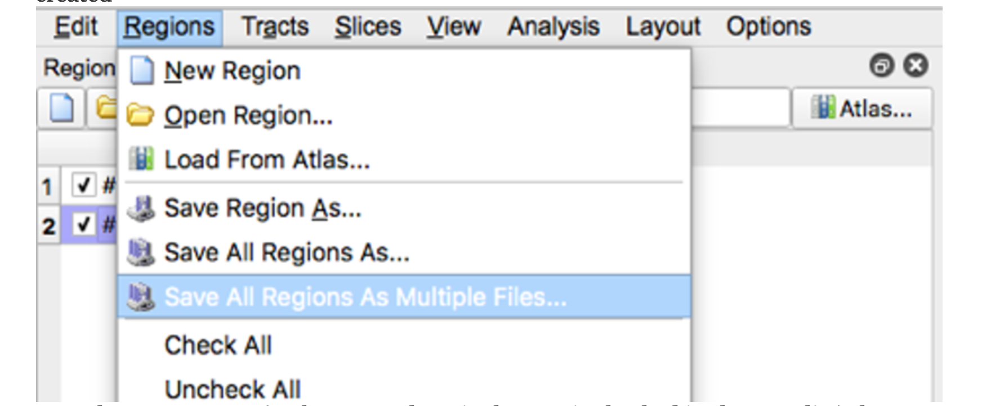

# Tractography:DSI Studio

**Whole Brain Protocol for Tractography with Diffusion MRI**

**Tutorial**

Software: Download [DSI Studio](http://dsi-studio.labsolver.org/dsi-studio-download) to you local machine or access the DSI studio module on Oscar.

Instructions:

&#x20;Select “Step 1: Open Source Image” to load diffusion MR images (DICOM, NIFTI, Bruker 2dseq, Varian fdf) in order to create a .src file. The .src will be created and located in the main window


Select "Step2: Reconstruction"


A new window will appear. Confirm the appearance of the mask and select the reconstruction method to be QBI. The reconstructed image will appear in the main window but it will have a filename ending in ".src.gz".


Select "Step 3: Fiber Tracking" and open the subject.fib file.


&#x20;The following screens will appear:


Select "color" under the Slice dropdown menu:


Load the following "Tracking Parameters into dsi studio


The tracking parameters settings should be:

```
termination index =nqa
Threshold = 0.1
Angular Threshold = 0
Stepsize(mm) = 0.0
Smoothing = 1.0
Min length (mm) =30.0
Max length (mm) = 300.0
Seed orientation = primary
Seed position = subvoxel
Randomize Seeding = off
Check ending = off
Direction Interpolation= trilinear
Tracking algorithm = streamline(euler)
Terminate if= 100,000 tracts
Thread Count =2
Output format= trk.gz
```


For each brain slice create a new region. In general you should have about 1-2 seed regions per tract and 0-2 ROI regions per tract.  Under "type" select "seed" for seed regions or "ROI" for ROI regions.


REVIEW this diagram to acquaint yourself with the toolbar.


RECONSTRUCTING the corticospinal tract (cst):

Move the axial slide bar until you reach a slice that looks similar to one of the boxes.Then using the freeform option, make a circle around the region that the arrow is pointing to.  Follow these steps for the remaining three boxes.  Be sure to make a new region with each slice/box.

&#x20;


Make sure all four ROI regions are checked and then select "Fiber Tracking"


If the resulting tract does not look like the track in #4 box above, create exclusion regions to remove erroneous streamline fibers.  To do this select "ROA".  Then using the square or the freeform option enclose the area where the erroneous fiber is located.


All exclusion regions should be created using the same ROA region. For example in the image below three exclusion regions (two on a coronal slice and one on an axial slice were drawn but only one ROA region was created.


FINAL STEP: save all of the files: tract image, regions and density image.make sure the file names are unique. Example:


Save the regions by selection "Save all regions as multiple files" then open when the appropriate folder location is created



Save the tract image then select the save button


Save the density map by selecting "tract density image" then "diffusion space", select "no" in response to whether to export directional color, then select "yes" in response to selecting the whole tract.


NOTE: There are many other white matter fiber tracts of interest. I can provide  details on how to reconstruct other tracts if you send a request.
