# Whole Brain Tractography:DSI Studio

**Whole Brain Protocol for Tractography with Diffusion MRI**

**Tutorial**

Software: Download [DSI Studio](http://dsi-studio.labsolver.org/dsi-studio-download)

Instructions:

 Select “Step 1: Open Source Image” to load diffusion MR images \(DICOM, NIFTI, Bruker 2dseq, Varian fdf\) in order to create a .src file. The .src will be created and located in the main window

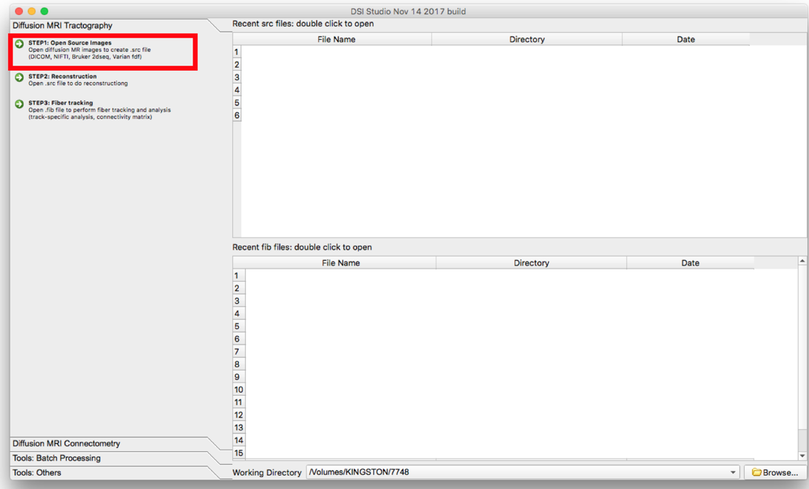

Select "Step2: Reconstruction"

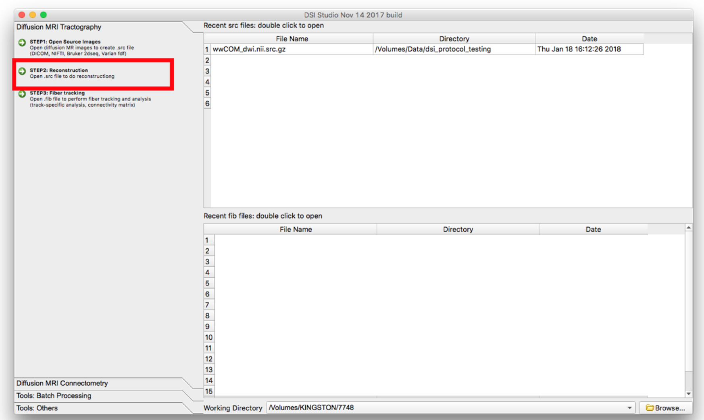

A new window will appear. Confirm the appearance of the mask and select the reconstruction method to be QBI. The reconstructed image will appear in the main window but it will have a filename ending in ".src.gz".

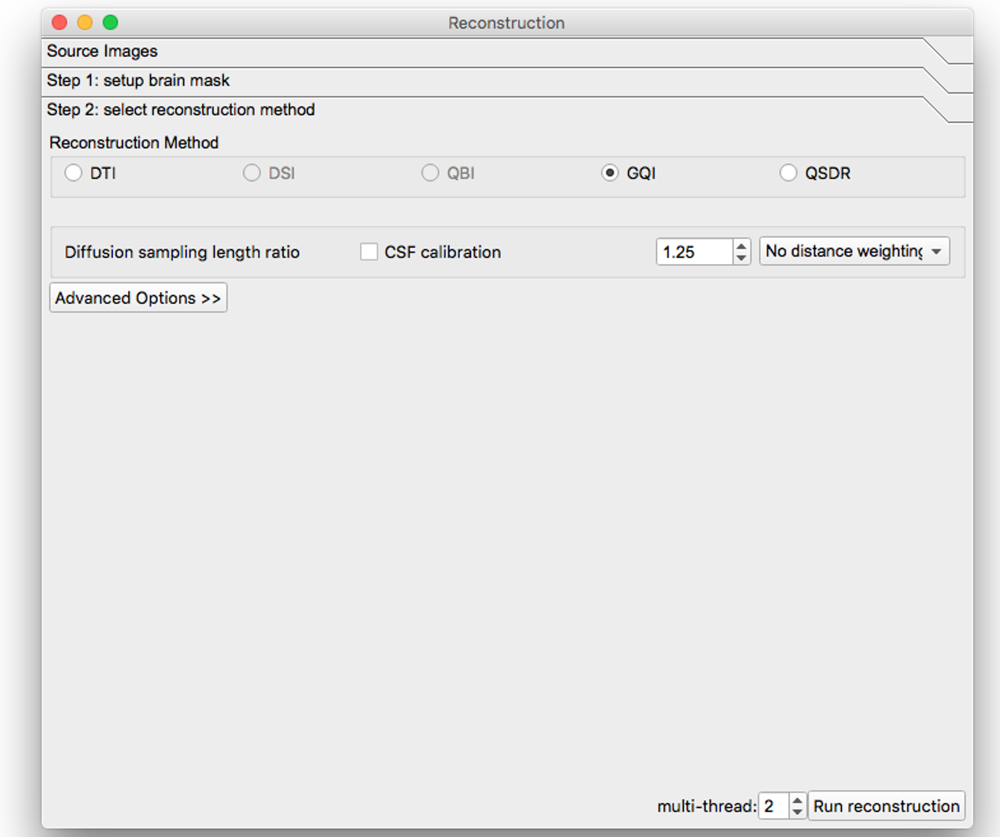

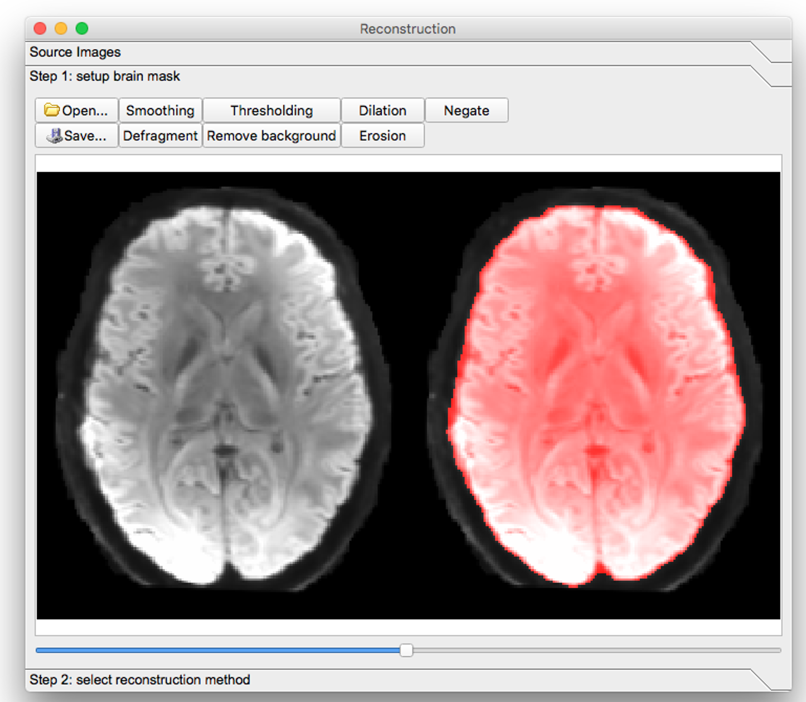

Select "Step 3: Fiber Tracking" and open the subject.fib file.

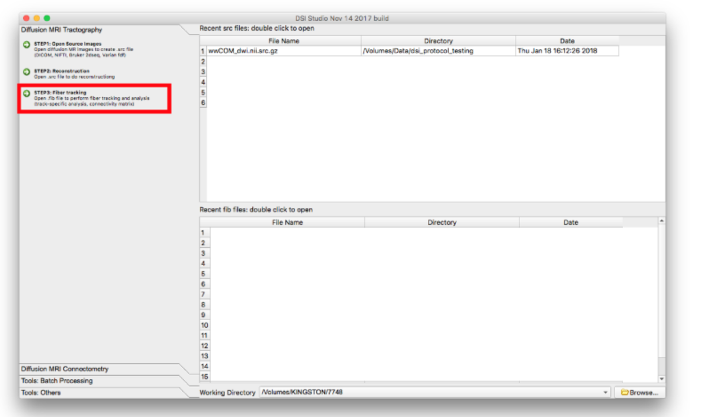

 The following screens will appear:

Select "color" under the Slice dropdown menu:

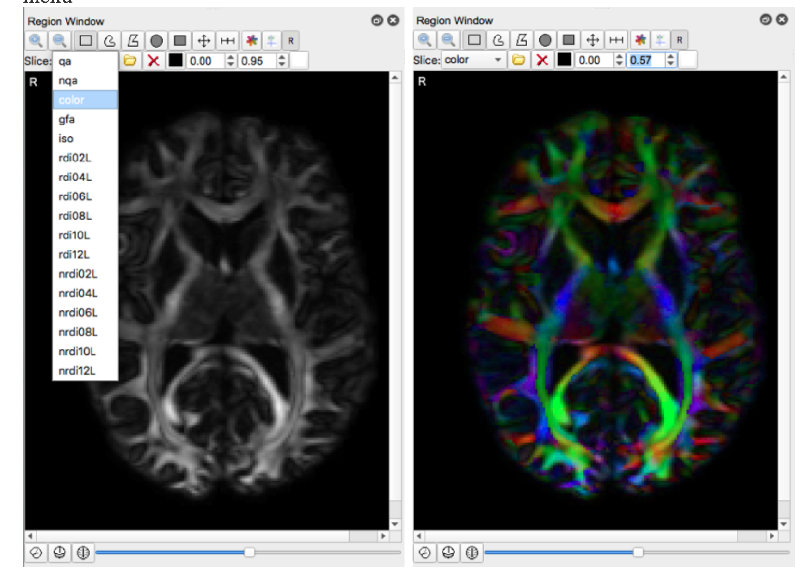

Load the following "Tracking Parameters into dsi studio

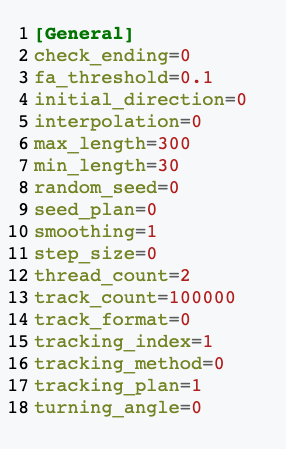

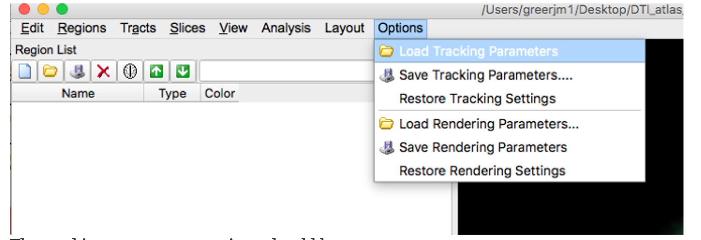

The tracking parameters settings should be:

termination index =nqa

Threshold = 0.1

Angular Threshold = 0

Stepsize\(mm\) = 0.0

Smoothing = 1.0

Min length \(mm\) =30.0

Max length \(mm\) = 300.0

Seed orientation = primary

Seed position = subvoxel

Randomize Seeding = off

Check ending = off

Direction Interpolation= trilinear

Tracking algorithm = streamline\(euler\)

Terminate if= 100,000 tracts

Thread Count =2

Output format= trk.gz

For each brain slice create a new region. In general you should have about 1-2 seed regions per tract and 0-2 ROI regions per tract.  Under "type" select "seed" for seed regions or "ROI" for ROI regions.

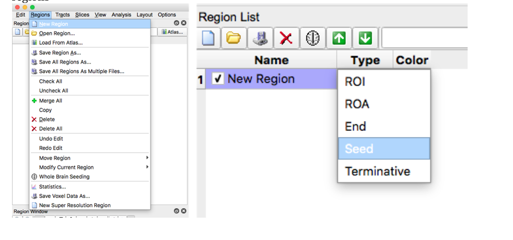

REVIEW this diagram to acquaint yourself with the toolbar.

RECONSTRUCTING the corticospinal tract \(cst\):

Move the axial slide bar until you reach a slice that looks similar to one of the boxes.Then using the freeform option, make a circle around the region that the arrow is pointing to.  Follow these steps for the remaining three boxes.  Be sure to make a new region with each slice/box.

 

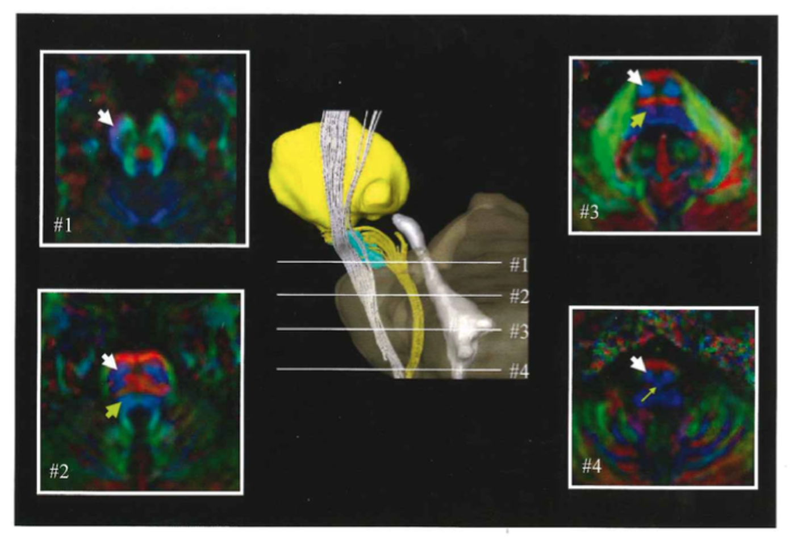

Make sure all four ROI regions are checked and then select "Fiber Tracking"

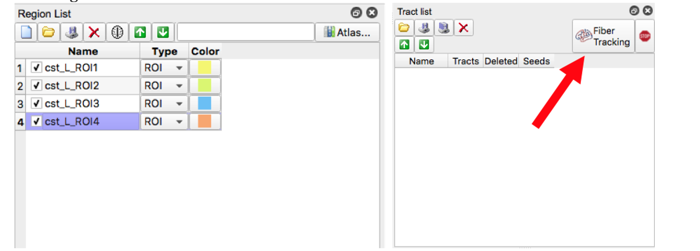

