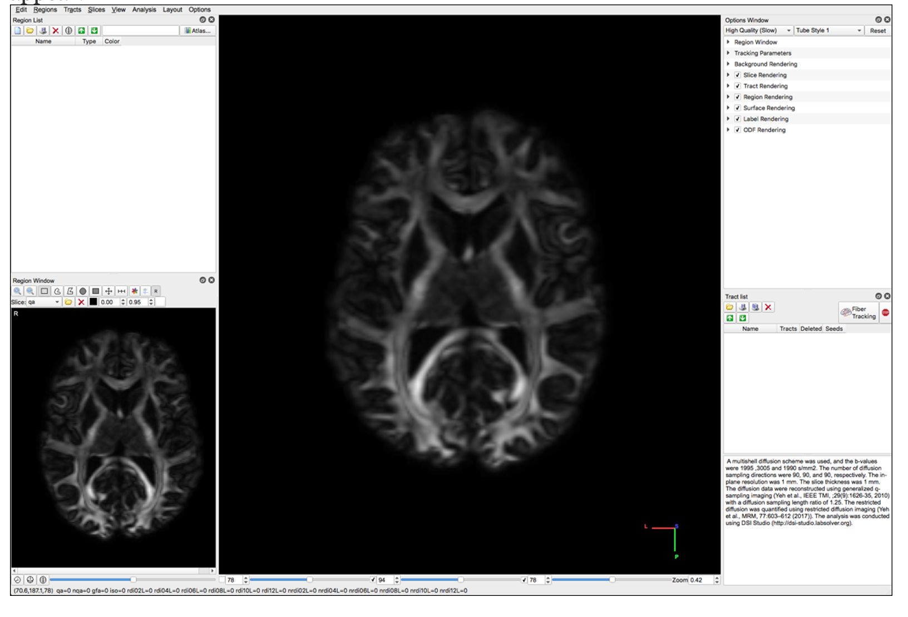

# Whole Brain Tractography:DSI Studio

**Whole Brain Protocol for Tractography with Diffusion MRI**

**Tutorial**

Software: Download [DSI Studio](http://dsi-studio.labsolver.org/dsi-studio-download)

Instructions:

 Select “Step 1: Open Source Image” to load diffusion MR images \(DICOM, NIFTI, Bruker 2dseq, Varian fdf\) in order to create a .src file. The .src will be created and located in the main window

Select "Step2: Reconstruction"

A new window will appear. Confirm the appearance of the mask and select the reconstruction method to be QBI. The reconstructed image will appear in the main window but it will have a filename ending in ".src.gz".

Select "Step 3: Fiber Tracking" and open the subject.fib file.

 The following screens will appear:

Select "color" under the Slice dropdown menu:

Load the following "Tracking Parameters into dsi studio

