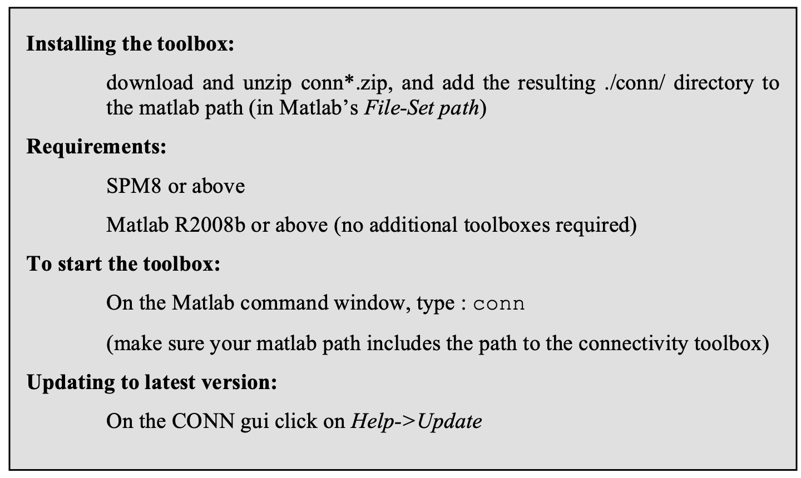
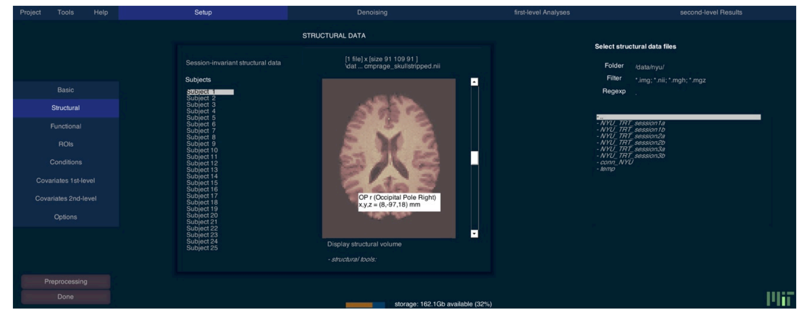
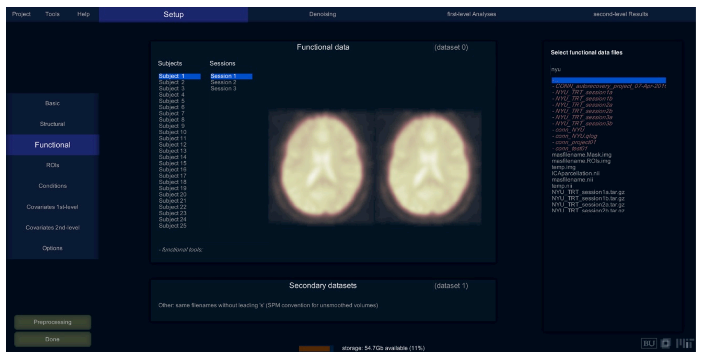
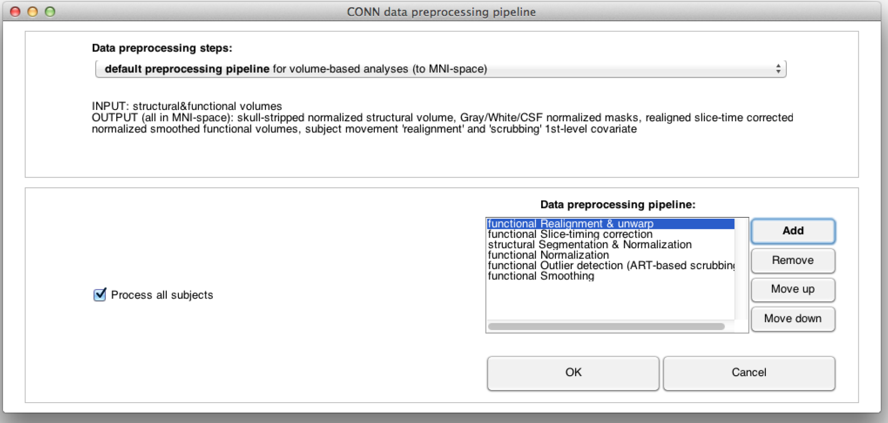
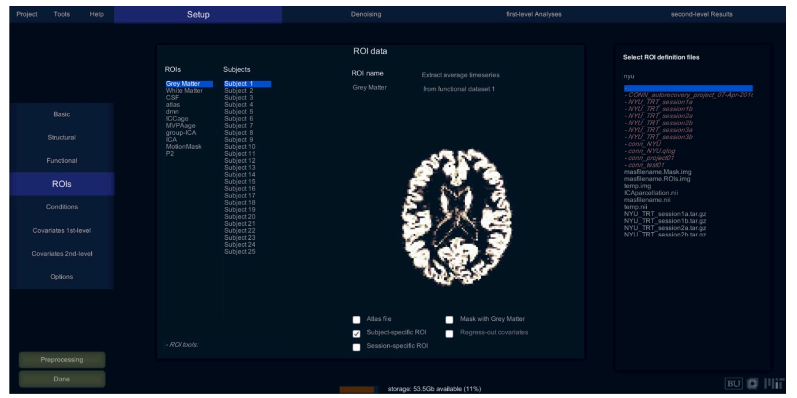

# CONN Toolbox

Install the software on your local machine or use Oscar matlab and conn toolbox modules.

Step 1 : Click on the SETUP tab

               Click on Project.New \(the wizard will allow a gui setup tp import functional, anatomical data and optionally preprocess your data using standard settings \(segmentation, realignment, slice timing correction, co-registration, normalization, smoothing, and outlier detection.scrubbing\) using either defaultMNI for analyses in MNI space or default SS for analyses in subject-space or surface based analysis.If you have already done SPM preprocessing you can skip the preprocessing steps and import the SPM.mat file for each subject.

Structural files Setup;

load structural Images

Functional Files setup

load functional files

If the functional images are not preprocessed; you select "functional tools: individual preprocessing step or Preprocessing"

ROI files setup

Click on ROI's button on the left side to load ROI masks files  \(.img or .nii volumes\), MNI coordinates \(.tal files\), or atlas files \(.nii files with multiple labels\)

