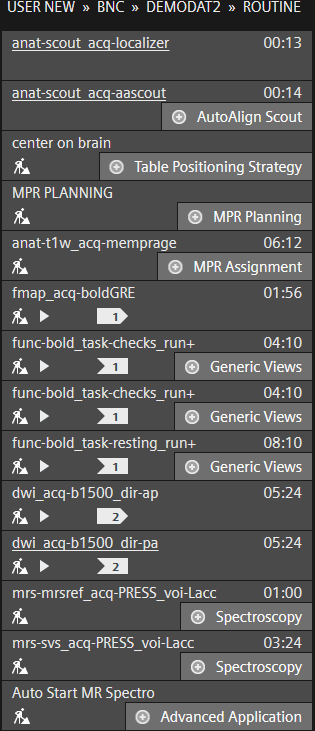

# Protocol Information

### Protocol Design at the Scanner

This image shows the protocol as it appears on the scanner under the protocol tree.  The order in which the scans are listed corresponds to the order in which they are run during scanning.  Additional descriptions for each of the scans can be found below.&#x20;

<figure><figcaption>
The demodat2 sequences as they appear on the MRI console
</figcaption></figure>

## Details on scans&#x20;

### Anatomical Scans

#### Localizer

* **Name at the scanner:** anat-scout\_acq-localizer
* **Description:** The scan session begins with a three-axis localizer that gives views of the participant's head in the three cardinal orientations (sagittal, coronal, axial).&#x20;
* **Scan time:** <1 minute

#### Scout

* **Name at the scanner:** anat-scout\_acq-aascout
* **Description:** This series makes a low resolution whole-head scan and compares the result to a brain atlas on the scanner. It generates new scout images where the orientation is determined with reference to skull landmarks and with reference to the built-in atlas. The resulting images can be used to increase consistency of slice positioning between participants and across scan sessions. &#x20;
* **Scan time: <**&#x31; minute

#### **Multi-Echo MPRAGE**

* **Name at the scanner:** anat-t1w\_acq-memprage
* **Description:** This is a multi-echo T1 weighted (anatomical) structural series. For more information see; [A. J. W. van der Kouwe, T. Benner, D. H. Salat, B. Fischl, Brain morphometry with multi-echo MPRAGE, NeuroImage, 40, 559–569 (2008)](https://pubmed.ncbi.nlm.nih.gov/18242102/). We collect the individual echoes and the RMS images are calculated by combining the individual echos. Compared to a single-echo MPRAGE, the multi-echo MPRAGE provides enhanced tissue contrast and reduced geometric distortion.
* **Scan Time:** 6 minutes

#### Gradient Echo Field Map

* **Name at the scanner:** fmap\_acq-boldGRE
* **Description:** This is the "standard" Siemens field map, with the same phase encoding direction as the EPI images. This method calculates a field map based on the difference in phase between two different echos in a double echo sequence. This scan produces 2 DICOM series. The first series contains two sets of magnitude images, one for each echo time. The second series is a phase difference image, which is a subtraction of the two individual echos.&#x20;
* **Scanner Note:** On the scanner, it is necessary that the "difference image" checkbox is enabled in the contrast tab to get the difference imag&#x65;**.**&#x20;
* **Scan Time:** 2 minutes

### Functional Scans

The dataset includes functional MRI scans for two simple tasks and a resting state condition.  Each of the two task scans contained two forms of experimental task design: a block design checkerboard task and a simultaneous event-related button press task. All functional data were collected using multiband (SMS) echo planar imaging and identical resolution/slice placement.

#### Flashing Checkerboard/Motor Task

* **Name at the scanner:** func-bold\_task-checks\_run+
* **Description:** This is a simple visual activation protocol in which a half-field flashing checkerboard pattern is presented alternately to the left and the right visual hemifields in 12-second blocks while the participant fixates on a small central cross. At inter-trial intervals ranging from 4, 6, or 8, the fixation cross quickly flashes either red or blue. At the color change, the participant is instructed to press a button in their right or left hand (red=right, blue=left).&#x20;
* &#x20;It is common in many studies to repeat the same functional scan multiple times. For this protocol, this sequence was run twice.  Notice that the sequence name ends with run+.  The [bids exporter](../xnat-to-bids-intro/getting-started.md) will automatically convert identically named sequential scans ending with run+ to run-01, run-02, run-03, etc.&#x20;
* A link to the PsychoPy files used to run this task can be found below
* **Scan Time:** 4 minutes (each)



**Resting State**

* **Name at the scanner:** func-bold\_task-resting
* **Description:** During this scan, there are no tasks involved. The subject is “resting” with their eyes open and looking at a fixation cross. The baseline brain activity is observed. Resting state scans are typically used to characterize functional connectivity between brain areas and to characterize the default mode network.
* **Scan Time:** 8 minutes

### Diffusion Scans

Diffusion weighted images are collected in multiple gradient directions. This example dataset collects a reasonable (basic) 90 direction gradient, and uses 2 b-value levels: 750 and 1500. Scans are acquired with phase encoding in both the A->P and P->A directions

#### Anterior-Posterior (AP)

* **Name at the scanner:** dwi\_acq-b1500\_dir-ap
* **Description:** A basic diffusion weighted scan with 90 directions and b-values of 750 and 1500.  Phase encoding is in the anterior-to-posterior direction.
* **Scan Time:** 5 minutes

#### Posterior-Anterior (PA)

* **Name at the scanner:** dwi\_acq-b1500\_dir-pa
* **Description:** A basic diffusion weighted scan with 90 directions and b-values of 750 and 1500.  Phase encoding is in the posterior-to-anterior direction.
* **Scan Time:** 5 minutes

### Spectroscopy Scans

Magnetic Resonance Spectroscopy (MRS) scans were collected for one voxel, located in the left anterior cingulate cortex (Lacc). Following MRS standards, we used an unedited PRESS sequence and acquired two separate scans (water reference and metabolite) which are used together in preprocessing to derive a single metabolite spectrum.&#x20;

#### Water Reference (mrsref)

* **Name at the scanner:** mrs-mrsref\_acq-PRESS\_voi-Lacc
* **Description:** A common MRS sequence which does not suppress the signal from water. This is used as a reference scan and is used for various data preprocessing steps, such as eddy current distortion correction.&#x20;
* **Scan Time:** 1 minute

#### Metabolite (svs)

* **Name at the scanner:** mrs-svs\_acq-PRESS\_voi-Lacc
* **Description:** A common MRS sequence which includes water suppression. This is used to better quantify signal from various metabolites.&#x20;
* **Scan Time:** 3 minutes
