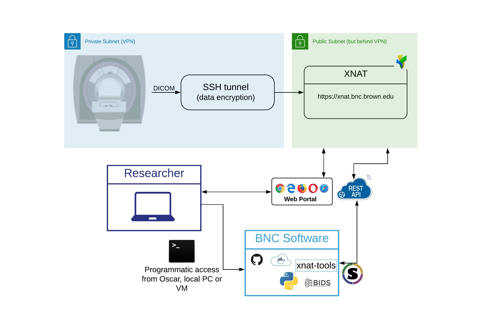

# Infrastructure Overview

DICOM data are sent from the scanner to XNAT via an SSH tunnel for data encryption. After the data have been successfully uploaded, researchers can view their experiment data through the XNAT portal or export session data programmatically via BNC's suite of processing tools.  The following diagram illustrates our complete infrastructure setup:

<figure><figcaption>
Overview of BNC's Infrastructure as it relates to SCANNER and XNAT
</figcaption></figure>
