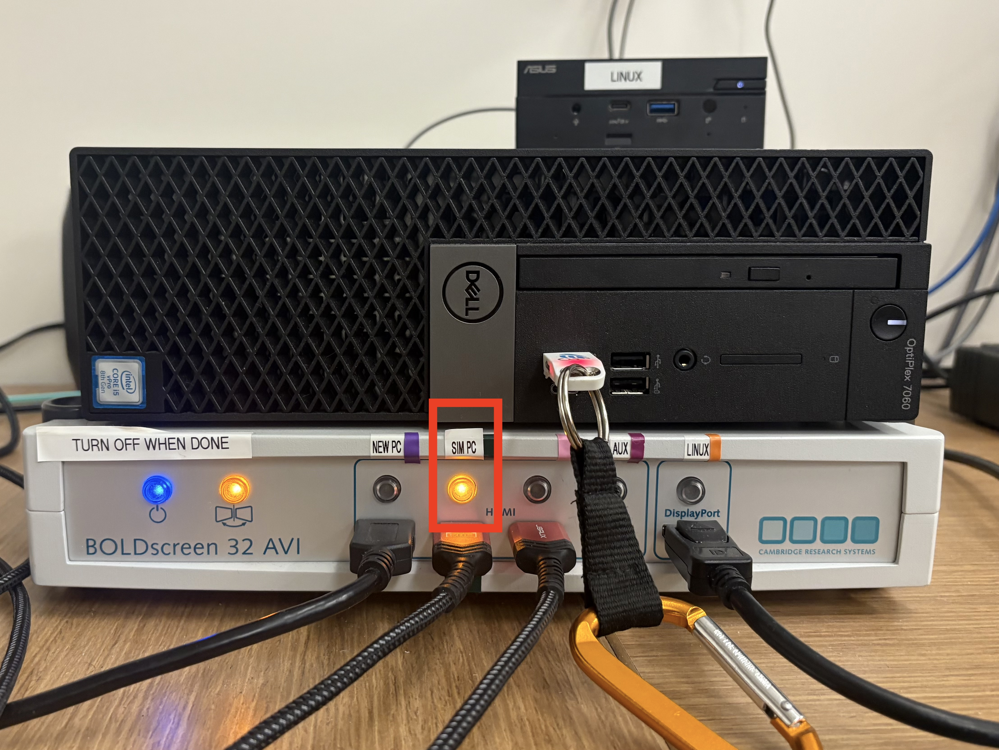
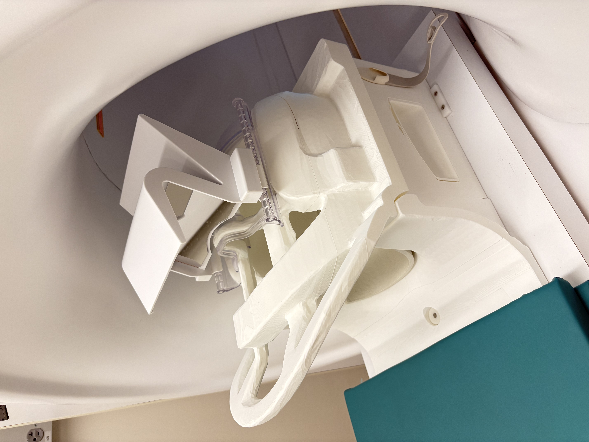
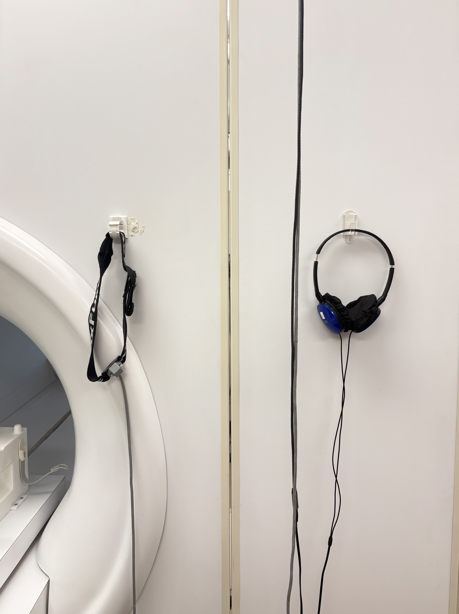
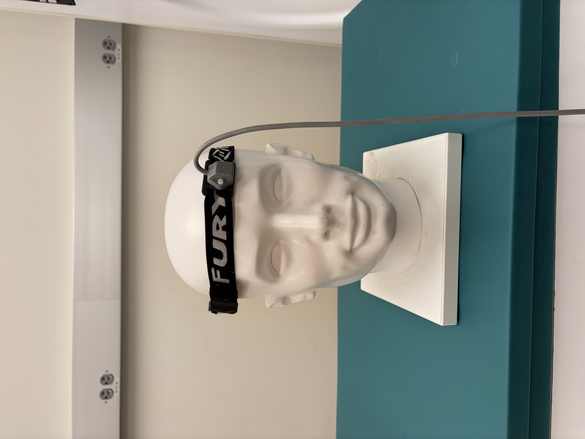

# Motion Trainer Hardware Setup

## Set Up the Button Box (if playing the Balloon Game)

1. Ensure that the button box is attached to the extension fiber optic cable, and that the other end of that extender is plugged into one of the two FORPs (932 or 905).&#x20;
2. The extension cable must be used so that the button box can reach the participant when they are in the simulator bore.
3. There is a USB cable that goes from the FORP to a computer. Plug this into the Sim PC.

<figure><figcaption>
A) Attach the button box/PYKA to its extension cable. B) Plug the opposite end of the extension cable to the FORP 905 or 932 (in this example, we are using the 905). C) Make sure that the cable extending from the FORP is plugged in to the Sim PC. 
</figcaption></figure>

## Open Motion Trainer on the Sim PC

1. Log in to the Sim PC. To mirror this display on the BOLDscreen, make sure the BOLDscreen switchbox is turned on and set to SIM PC.

<figure><figcaption>
Press the button labeled SIM PC to display the monitor on the BOLDscreen. You will know it is selected when the button is lit up. 
</figcaption></figure>

1. It is good practice to check the sound before beginning any of the games. In the bottom right of the desktop, select the sound icon and check that it is set to “Speakers/Headphones {Realtek(R) Audio}”. Depending on your population, you may want to increase or decrease the volume.
2. Open the Motion Trainer Application
3. There is a desktop app which you can double click to open Motion Trainer.
   1. Alternatively, you can use the windows search function in the bottom left to search for the application.

<figure><figcaption>
Open Motion Trainer by double clicking the icon in the top right corner of the desktop. In the bottom right sound settings, ensure that the correct speakers are selected.
</figcaption></figure>

## Putting the Participant in the Simulator MRI

1. Place the mock 64 channel head coil on the bed
   1. The device which is used to pick up head motion (polhemus device) is wired. The mock 64 channel head coil has a small hole cut out of the top, so that you can thread the wire through that (instead of having it lay along the side of the participant’s face). If you notice that a different coil is on the bed, replace it with this one.

<figure><figcaption>
The mock 64 channel head coil.
</figcaption></figure>

1. Then, have the participant sit upright on the bed.&#x20;
2. Hanging from a hook to the right of the bore, you will see a set of headphones and a headband. This headband has the polhemus sensor attached to it.

<figure><figcaption>
The motion tracking device (polhemus) is attached to the headband hanging to the left of the headphones. 
</figcaption></figure>

1. Place this on the subject’s forehead, with the wire pointing up. The sensor itself should not be centered on the forehead, but should be offset slightly.

<figure><figcaption>
Example placement of the polhemus device. 
</figcaption></figure>

1. Ask the participant to lie down. Thread the wire through the hole in the head coil and loop it through the hook on the right hand side of the head coil. To ensure that the wire does not get snagged while the bed moves inward, tuck it underneath the cushioning, at roughly the participant’s hip. There is a marker on the table where this should be.

<figure><figcaption></figcaption></figure>

1. You can now place the top of the head coil on. Due to the smaller bore size, it may be easier to place the top on without the mirror attached, and then attach the mirror after.&#x20;
   1. If you are removing/attaching the mirror from the head coil, please be very careful- it is easily scratched.&#x20;
2. The setup is now complete! Hit the button on the remote or on the left side of the bore to move the participant in, and begin the game!
