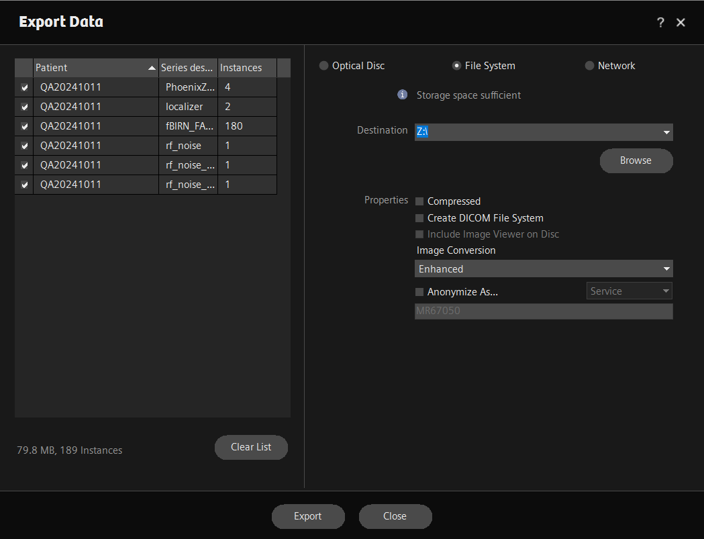

# Exporting data via scannershare

We have set up a shared folder ("scannershare") that is accessible from the scanner, Tess in the control room, and the computer behind the screen in the waiting room. Any type of data that you could previously save to an external drive from the scanner (.rda, dat, DICOM, protocol pdfs, screenshots, etc.) can instead be saved to this drive and accessed from one of the other computers.

**IMPORTANT:** this storage is ephemeral! Every night, data older than 24 hours will be wiped from the share, so make sure to grab your data right away!

### Exporting your data

#### DICOMs

Exporting DICOM data is the same as saving it to an external drive, except the destination should be the Z drive. If you don't see it in the dropdown menu, you can click Browse and navigate to it. If you are still unable to access it, check that you are logged in as medadmin (exit kiosk mode).&#x20;

<figure><figcaption>
Exporting DICOMs to the scannershare Z drive
</figcaption></figure>

#### TWIX

In the twix interface, after clicking "copy total RAID file", you can choose the Z drive (scannershare) as the destination.

#### All other data

Any other data can be copy & pasted into the Z drive from the File Explorer.&#x20;

<figure><figcaption></figcaption></figure>

### Accessing your data

The scannershare drive is mounted as a network drive on Tess and on the computer in the waiting room. After you copy your data there, you can access it via one of these computers and grab it however you'd like: copy to an external hard drive, upload to Oscar via OOD, scp to Oscar via Terminal, upload to XNAT, burn to DVD, etc.

<figure><figcaption>
The computer behind the screen in the waiting room has scannershare persistently mounted
</figcaption></figure>

Best practice is to delete your data from the share when you are done grabbing it, but if you forget, it will automatically get deleted overnight after it has been there for at least 24 hours.&#x20;
