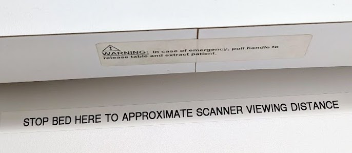

# MRI simulator room

The room is equipped with a mock scanner and audiovisual equipment that will help you closely mimic the scanner experience.&#x20;

1. BOLDScreen for stimulus display

<figure><figcaption>
a BOLDScreen behind the simulator bore matches the setup at the scanner
</figcaption></figure>

2.  BOLDScreen AVI switchbox

    <figure><figcaption>
Just as in the scanner control room, a BOLDScreen AVI controls the display on the BOLDScreen.
</figcaption></figure>

    1. Turn on the switchbox (blue button) and make sure the mirroring button is lit up orange.&#x20;
    2. Select your desired computer. “Sim PC” is the computer that previously controlled the display behind the bore, but now any of the computers can be used to display there, including your own laptop via the “AUX” HDMI cable.

3.  Matching the eye-to-screen viewing distance in the scanner\

    Because the simulator bore has a shorter length than the scanner bore, sending the table all the way in puts the participant closer to the screen than they would be in the real scanner. This is fine for most uses, but if you want to approximate the eye-to-screen viewing distance in the scanner (i.e. you want your stimuli to be the same size in degrees of visual angle as in the scanner), you’ll need to manually stop the bed to line up with this sticker:

    <figure><figcaption></figcaption></figure>

4.  Scanner sounds\
    \
    Use the Sim PC to play scanner sounds in the simulator bore. There’s a link on the desktop to a folder of sound files. These sounds are played through the speakers that are integrated into the simulator - if you don’t hear anything, make sure that the sound output is set to “Speakers/Headphones (Realtek(R) Audio)”.\

    <figure><figcaption></figcaption></figure>

5.  Auditory stimuli in the mock scanner\
    \
    Any of the computers can be used to play sounds through the headphones; you just need to select that computer on the BOLDScreen AVI switchbox and the audio will be routed through along with the video. This is how it works in the scanner control room as well. Headphone covers are available on the countertop at the foot of the mock scanner bed.\

    <figure><figcaption></figcaption></figure>

6.  Participant positioning\
    \
    There are two possible headcoils, both of which have mirrors. They are delicate, so please handle with care (and never lift from the mirror!)\

    <figure><figcaption>
available headcoils and mirrors
</figcaption></figure>

    \
    There are head cushions, chucks to cover them, and extra padding to mimic the scanner setup as well.\
    \

7. Response devices
   1. The button box should stay hooked to the long extension bundle so that the cable is long enough for participants in the mock scanner. The end of the bundle can be moved back and forth between the 905 FORP interface (SimPC) and 932 FORP interface (all other computers).
   2. There is a joystick that can be used via the 932 FORP interface, following [these instructions](https://docs.google.com/document/d/1k_se1tlcFbOwi1-IrNWGCcrQUMv5nvJstg7BiLmI-mo/edit#heading=h.7va2gu3m4t4v). _The joystick will only work properly if attached via the fiber optic extension bundle, not plugged directly into the 932._\
      \

8.  Training participants to stay still

    \
    The motion trainer game can be run from the Sim PC following [these instructions](motion-trainer-balloon-task.md)

