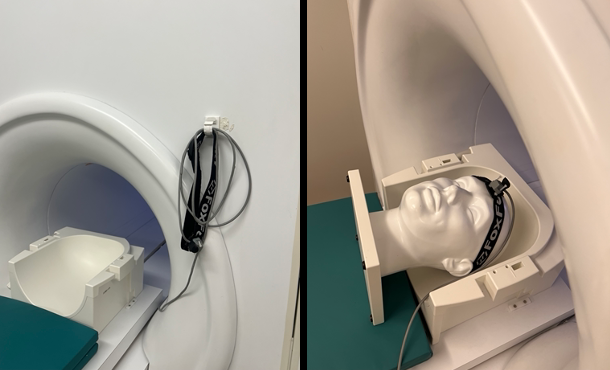

# Motion Trainer: Balloon Task

The Balloon Trainer is an E-Prime script written by Michael Worden, which is used to train participants to lay in the MRI with minimal movement. This is done in the simulator room by placing a motion tracking sensor on the participants head, moving them into the simulator bore with a button box in hand, and launching the script. It can be used for any population, but since it is formatted like a simple game, it is particularly suitable for those working with children.&#x20;

## Setting Up

Running the Balloon Trainer in the MRF's simulator room requires 3 key pieces of equipment: the motion sensor (Polhemus device), the button box (PYKA), and the mock scanner display computer. &#x20;

<figure><figcaption>
Left: The Polhemus device is kept to the right of the simulator MRI bore. Right: To place the device on a participant's head, ensure that the gray box is in the center of the forehead and that the strap is not loose. 
</figcaption></figure>

Typically, the fORP 905 ([https://www.curdes.com/mainforp/interfaces/fiu-905.html](https://www.curdes.com/mainforp/interfaces/fiu-905.html)) is used to convert button box signals to the computer. When setting up, ensure that the PYKA optical cable is connected to the back of the 905, and that the 905's USB cable is connected to the side of the computer.&#x20;

<figure><figcaption>
Ensure that the button box, fORP, and display computer are properly connected. 
</figcaption></figure>

<figure><figcaption>
The desktop folder (BalloonTrainer-FORPv3) which contains the motion training E-Prime script.
</figcaption></figure>

<figure><figcaption>
To begin the training, double click the E-Prime script file titled 'balloontrainer3-FORP'.
</figcaption></figure>

<figure><figcaption>
After double clicking the E-Run script file, these pop up windows must be filled out. 
</figcaption></figure>

If you wish to use this script for training purposes only, and not collect any data/measurements, then type 0 as the subject number. Any other number in this field will produce an output file. The final two windows dictate the values (in millimeters) that are acceptable for the participant to move. According to these defaults, the task will begin by allowing the participant to move 10mm. As it continues, the tolerance lowers incrementally until the goal of 3mm is reached.&#x20;

The Balloon Trainer consists of two tasks: The Balloon Task and a Fixation/Rest Task. The goal of The Balloon Task is to use the button box to inflate a balloon. If head movement outside of the allowed range occurs, the task will restart. Once that task is successfully completed, a fixation task will begin. Then, the two tasks will repeat until they are each completed 3 times total.&#x20;

## The Balloon Task

<figure><figcaption>
As the keys of the button box are pressed, the balloon will gradually inflate. This will also be displayed on the BOLDscreen. 
</figcaption></figure>

<figure><figcaption>
If the participant does not move while inflating the balloon, it will reach the tack on the top of the screen and pop, revealing a smiley face. If they move at any point, a frowny face will appear and the task will restart. 
</figcaption></figure>

## The Fixation Task

<figure><figcaption>
Following completion of the balloon task, a fixation block will begin. Participants should be instructed to stay as still as they can, keep their eyes on the balloon, and not press the buttons. A balloon was chosen as the fixation point, rather than a cross, to maintain familiarity within the training. If the experimenter chooses, the balloon may also be used as a fixation point within the real experiment. The image file can be found in the same desktop folder as the E-Prime script file. 
</figcaption></figure>
