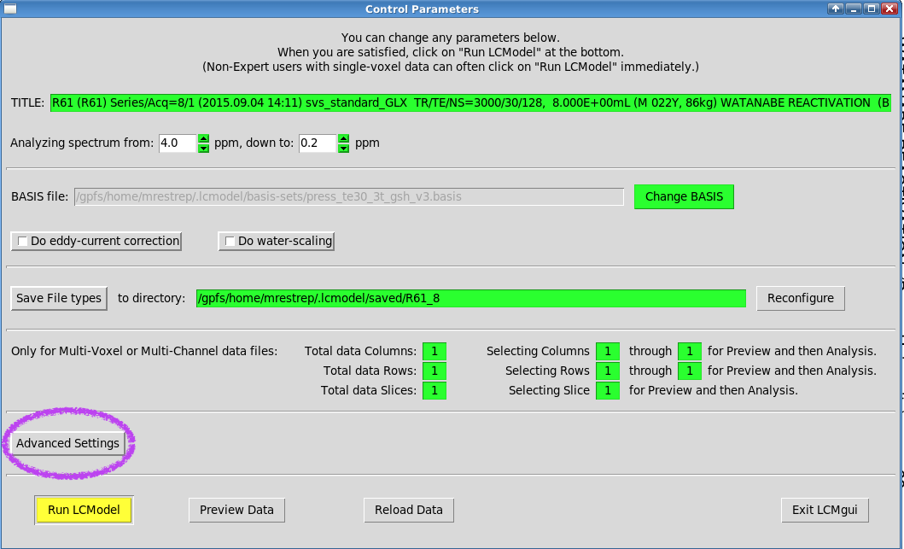
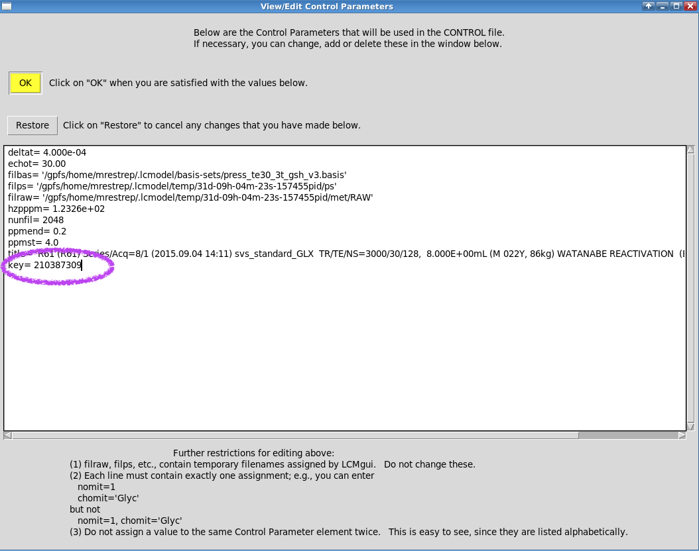

# Example Run

### 0. Make sure you have installed LCModel


**Every user must install LCModel** for their own user. If you haven't, please refer to the [Installation Guide](lcmodel.md#installing-lcmodel-in-oscar)&#x20;


### 1. Start a VNC session

To run LCModel's gui you will nedd to start [Oscar's VNC Client](https://docs.ccv.brown.edu/oscar/connecting-to-oscar/vnc). LCModel is not very resource intensive so you can request a basic session

### 2. Launch Terminal&#x20;

* Inside your VNC session, open a **Terminal** window.
* Navigate to LCModel's **hidden** directory `cd ~/.lcmodel`

.png>)

### 3. Launch lcmgui

* To launch the lcmgui, simply type `./lcmgui` from the current directory (`~/.lcmodel`)
* Accept license agreement

### 4. Select sample Siemens data&#x20;

* Select Siemens at the data type prompt

.png>)

* Search for the share data: `/gpfs/data/bnc/shared/lcmodel/TestData.rda`&#x20;

.png>)

### 5. Select Basis

During installation, the basis-set was install under the LCModels' hidden directory in your home. i.e., `$HOME/.lcmodel/basis-set` which is equivalent to `/gpfs/home/$USER/.lcmodel/basis-set`

* Change the basis file to: `$HOME/.lcmodel/basis-sets/press_te30_3t_gsh_v3.basis`

.png>)

### 6. Add License Key to Control Parameters

You will need to add a key to the Control Parameters. We do so as follows:

#### a. Open Advanced Setting Dialog

#### b. Select View/Edit Control Parameters.&#x20;

A dialog will open

#### c. Add key to Control Parameters

Add `key= 210387309` to the control parameters as shown in the figure below. Becareful to match spaces. When done, press OK

#### d. Save parameters file (optional)

LCModel will ask you if you want to save the new parameters to a new file. You can do so. If you do, the next time you can select the saved file from **Advanced Settings -> Change Control-Defaults file**

### 7. Run LCModel

After pressing **Run LCModel**, a two page PDF will appear, which looks as follows

.png>)

 (1).png>)
