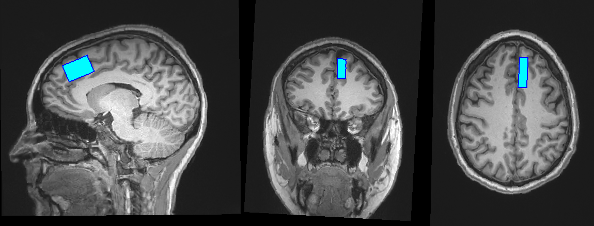
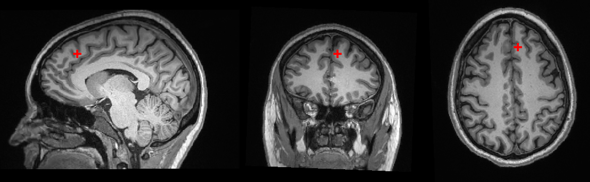

# Automated MR spectroscopy voxel placement with voxalign

We have developed a python package "[voxalign](installation.md)" that takes most of the guesswork out of MR spectroscopy voxel placement.

* One of voxalign's core functions is to ensure reproducible voxel placements across multiple scan sessions within the same participant. To do this, voxalign takes in the spectroscopy DICOM(s) and a T1 anatomical scan from a first MR session, and a T1 from an in-progress MR session, and provides the prescription to enter on the console to match the exact voxel position and orientation from the first session. Learn how to use voxalign for longitudinal studies like this [here](multi-session-alignment.md).

<figure><figcaption>
Scan session 1 voxel outline (dark blue) overlaid on the scan session 2 voxel
</figcaption></figure>

* Voxalign can also tell you where to position the center of your voxel if you instead have a set of MNI coordinates to target. This is useful in helping to standardize voxel placement across participants, and for choosing voxel placements in the first session of a longitudinal study. Learn how to determine your voxel position based on MNI coordinates [here](center-on-mni-coordinate.md).

<figure><figcaption>
MRS voxel center position corresponding to an MNI coordinate of [-8, 38, 31]
</figcaption></figure>

