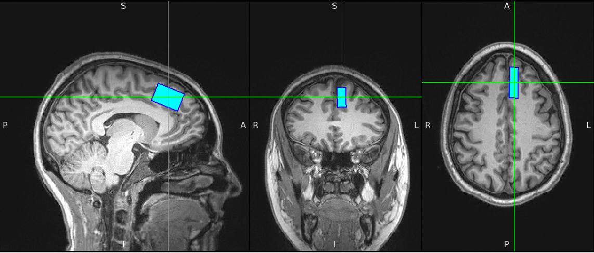

# Quantify voxel overlap

### Calculate dice coefficient

Voxalign also has a built-in function to verify the accuracy of longitudinal voxel placement. This tool takes as input session 1 and session 2 T1 and spectroscopy NIFTIs, coregisters the two T1s and applies the same transform to the session 1 spectroscopy voxel, and then calculates the dice coefficient between the two spectroscopy voxels. A dice coefficient of 1 reflects perfect overlap.

<figure><figcaption>
Voxalign multi-session voxel placement results. Light blue is the session 1 voxel and the dark blue outline is the session 2 voxel outline.
</figcaption></figure>

1. Launch the dice coefficient GUI with `dice-coef`&#x20;
2. Click "Select output folder" and choose a folder. If you previously ran `dice-coef` for this same participant, you can choose the same output folder and the skull-stripped T1s and linear coregistration will be re-used.&#x20;
3. Provide all other files. Right now \[May 29, 2025] the spectroscopy data must be entered as NIFTIs, but that will soon be fixed to allow DICOMs as well.
4. Click "Calculate dice coefficient"
5. The dice coefficient will be printed to the terminal, and a fsleyes window will be opened, with the coregistered T1s and MRS voxels overlaid.
