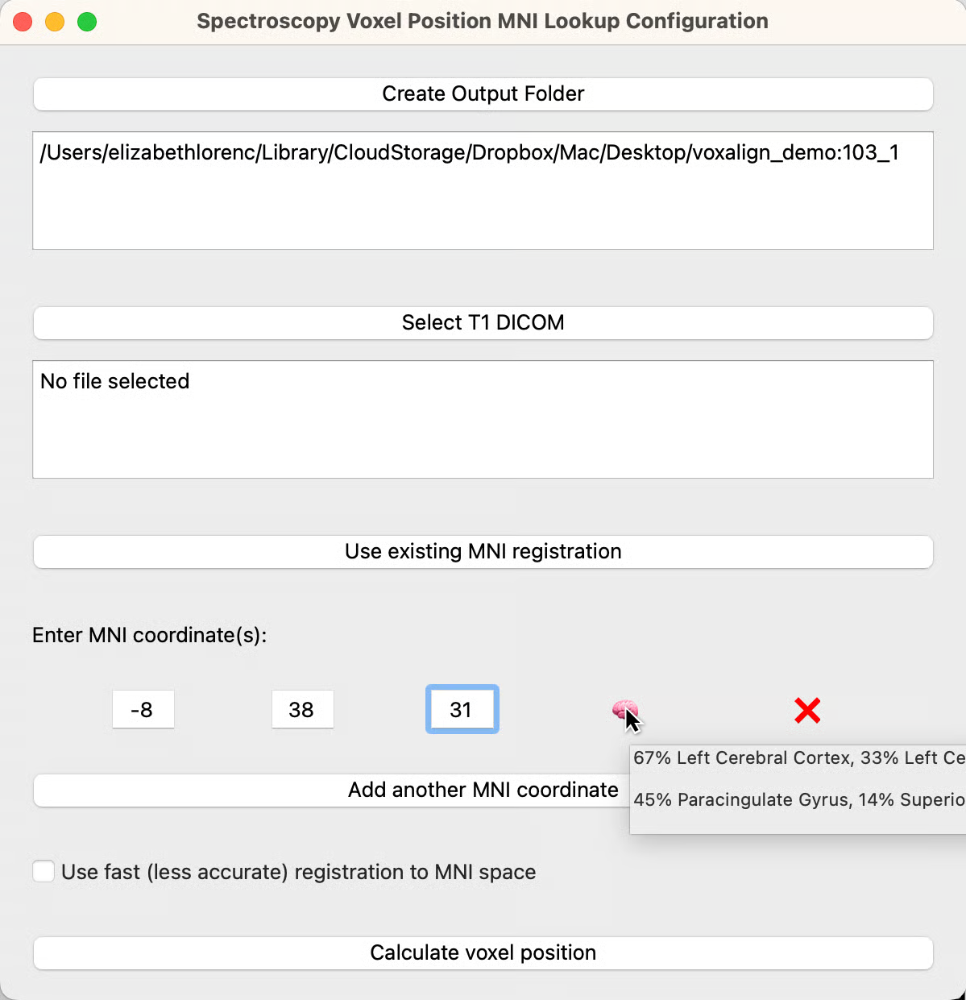

# Center on MNI coordinate

### Running MNI lookup

1. Activate the virtual environment with `source /path/to/env/voxalign/bin/activate` (on Tess, this will be `source ~/Desktop/voxalign/bin/activate`. You can tell that the environment is activated when it says `(voxalign)` before the command prompt.&#x20;
2. Launch the MNI lookup interface with `mni-lookup`&#x20;
3. Click "Create Output Folder" and choose an empty directory for your output (if you accidentally choose a non-empty directory, you'll be prompted to choose again).
4. Enter your desired MNI coordinate(s). Click the button to add an additional coordinate, and delete any extra rows by clicking the X. Once coordinates are entered, you can hover over the brain icon as a sanity check that you're in the correct region, hemisphere, etc.&#x20;
5. If you have previously run mni-lookup _on this same participant_ (for example, using a T1 that was collected at a previous session), you can click "Use existing MNI registration" and choose the output folder from the previous mni-lookup run. This will check that all necessary files are present and then allow you to skip the time-consuming nonlinear warping to MNI space.
6. When your T1 has been collected and sent over via scannershare, you can click "Select T1 DICOM" and choose that file.&#x20;
7. Click "Calculate voxel position"
8. Progress will be printed to the terminal; you'll find that the nonlinear warping to MNI space takes the longest - 2 mins or so on Tess.

<figure><figcaption>
MNI lookup interface. 
</figcaption></figure>

***

TIPS:

* If you make a mistake entering MNI coordinates (enter them wrong, forget to include one), and the MNI lookup calculation has already finished, just run it again, click “Use existing MNI registration” and choose your output folder from the first time you ran it. You’ll need to specify a new output folder and input the T1 DICOM again, but when you click “calculate voxel position” this time it will be much faster because it will use the pre-run nonlinear registration to MNI space.
