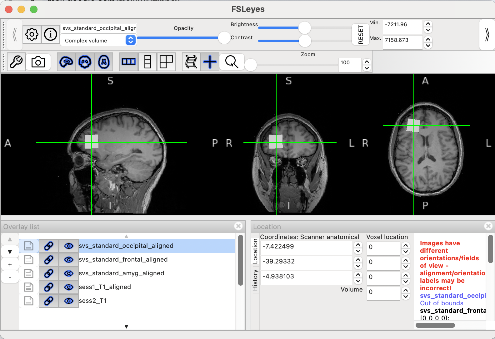
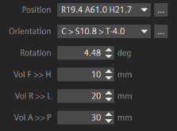

# Multi-session alignment

### Prepare in advance

You can organize your data however you like, but it is helpful to collect the session 1 DICOMs in advance of the scan session and make sure that they are named and organized in a way that will make running voxalign quick and simple. For example, I like to make a new folder for each participant, with sess1 and sess2 subdirectories. You can put the T1 and spectroscopy DICOMs in the sess1 directory in advance, and the sess2 directory you'll copy the T1 DICOM into as soon as it is collected.

<figure><figcaption><p>A simple and clear way to organize your DICOMs</p></figcaption></figure>

### Running voxalign

1. Activate the virtual environment with `source /path/to/env/voxalign/bin/activate` (on Tess, this will be `source ~/Desktop/voxalign/bin/activate`. You can tell that the environment is activated when it says `(voxalign)` before the command prompt.&#x20;
2. Start voxalign by typing `run-voxalign`.
3. Use the voxalign file selector to select your T1 and spectroscopy DICOMs. You can get everything but the session 2 T1 loaded in advance.
4. Specify an output directory. I usually just create a folder called "output" in the participant's directory.&#x20;
5. Once the session 2 T1 has been collected, [export it to scannershare](../../mrf-guides/exporting-data-via-scannershare.md) and copy it to your participant/sess2 folder on Tess. Then select it in the voxalign GUI.

<figure><figcaption></figcaption></figure>

6. Verify that everything looks correct, then click **Run VoxAlign**


**Your new spectroscopy voxel prescriptions will be printed to the terminal, saved out in a text file, and also automatically opened in a fsleyes window.**&#x20;

<figure><figcaption></figcaption></figure>

<figure><figcaption><p>You can turn on and off the overlay(s) for the *_aligned voxels to verify that they exactly match the session 1 voxel positions</p></figcaption></figure>

The prescription printed in the text file should be entered exactly on the scan console. For example, this position information in the text file:


```
Position: R19.4 A61.0 H21.7
Orientation: C > S10.8 > T-4.0
Rotation: 4.48 deg
Dimensions: 10 mm x 20 mm x 30 mm
```


would be entered on the console as:

<div align="left"><figure><figcaption></figcaption></figure></div>

***

#### TIPS

* Your two T1 scans need to have the same resolution for voxalign to work properly (at the moment).
* When you are typing your prescription in on the scanner, if the field says 'R' enter a negative number to switch it to L, and vice versa. This applies to all three directions.
* The tools voxalign uses to convert DICOMs to NIFTIs do not play well with spaces in file paths, so - for example - running voxalign on data stored in a "Google Drive" folder will not work.
