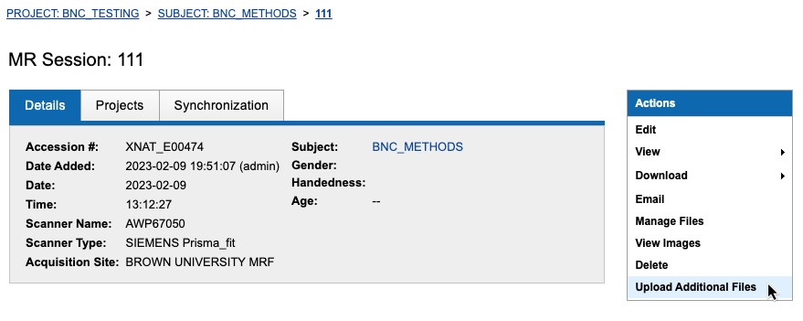
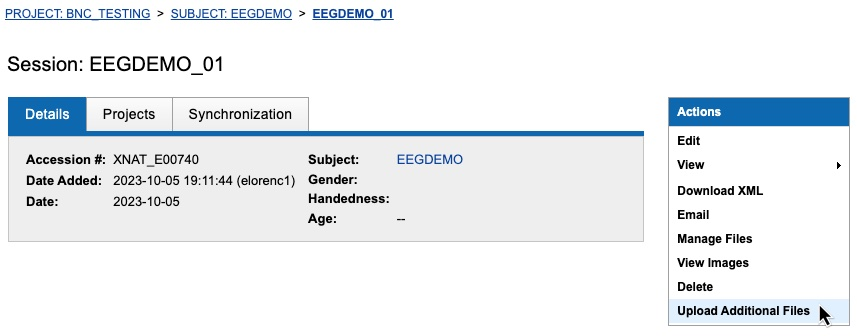

# EEG data

The `xnat2bids` pipeline supports exporting EEG data from XNAT and converting it into the BIDS standard format, using tools from the[ MNE-BIDS python package](https://mne.tools/mne-bids/stable/index.html).&#x20;

To upload your EEG data onto XNAT, see the instruction steps below, which differ slightly depending on whether you are uploading concurrent EEG-fMRI data or stand-alone EEG data. Once your data have been successfully uploaded, you can run `xnat2bids` by the methods specified in our [documentation](https://brown-bnc.github.io/xnat-tools/), or [here](../using-oscar/oscar-utility-script/) if you're exporting your data onto Oscar.

On this page, learn:

[How to name your EEG data files for automatic BIDS conversion](eeg-data.md#naming-convention-how-to-name-your-eeg-data-files)

[How to upload and convert concurrent EEG-fMRI data](eeg-data.md#uploading-eeg-data-to-an-mr-session)

[How to upload and convert stand-alone EEG data](eeg-data.md#uploading-stand-alone-eeg-data)

***

### Naming Convention: How to Name Your EEG Data Files

[The BIDS format](https://bids-specification.readthedocs.io/en/stable/04-modality-specific-files/03-electroencephalography.html) requires (/allows) allows specific information to be saved in data filenames: "BIDS entities" that are saved as key-value pairs (i.e. "sub-005") separated by underscores. For example, the filename "sub-005\_ses-001\_task-checks\_run-01" contains keys and associated values for subject, session, task, and run. For our automatic XNAT to BIDS conversion to appropriately include these pieces of information in the BIDS-format filenames, the EEG data you upload to XNAT should include all relevant key-value pairs in the filename, separated by underscores. "Subject" and "session" information will be gathered from XNAT, and you can use any of the following keys to provide additional information:

**task** - the experimental task **\[required]** (any string you want, excluding spaces or punctuation)

**acq** - the acquisition parameters (any string you want, excluding spaces or punctuation)

**run** - run number (integer)

**proc** - processing label (any string you want, excluding spaces or punctuation)

**rec** - recording name (any string you want, excluding spaces or punctuation)

**space** - coordinate space for anatomical and sensor location files (e.g., `*_electrodes.tsv`, `*_markers.mrk`) (valid values for `space` must come from a list of BIDS keywords [described in the BIDS specification](https://bids-specification.readthedocs.io/en/stable/appendices/coordinate-systems.html#eeg-specific-coordinate-systems))

**split** - split of the continuous recording file for `.fif` data (integer)

**desc** - description; provide additional information for derivative data (any string you want, excluding spaces or punctuation)

**For example, this EEG data uploaded to XNAT...**

<figure><figcaption></figcaption></figure>

**... will be converted to BIDS format like this:**

<figure><figcaption></figcaption></figure>

***

### Uploading concurrent EEG-fMRI data

#### One-time XNAT project configuration

For EEG data collected concurrently with fMRI data, we recommend following these setup steps to configure an EEG resource uploader for your XNAT project. These steps should be able to be completed by anyone with an "owner" status on your XNAT project, but please reach out if you would like BNC staff to set it up for you or walk you through it.

1. Open the "Manage" tab on your Project home page, and go to "Project Resource Settings"
2. Click "Start" to open a configuration page.
3. Select "Image Sessions" as the context for your resource uploader.
4. Select the MR Session data-type.
5. Set the "Resource Folder" name to be "eeg"
6. Add the resource uploader to your project

<figure><figcaption>
Configuring an EEG resource uploader for concurrent EEG-fMRI data
</figcaption></figure>

#### Uploading EEG data to an MR Session

Then, when you complete an EEG-fMRI session, first follow the usual procedure to [transfer your MR data from the scanner to XNAT](../../xnat/uploading-data.md). Once your data has appeared on XNAT (typically within an hour), you can navigate to the MR Session that was just created, and click "Upload Additional Files" to upload the associated EEG data:

<figure><figcaption>
Add EEG data to an MR Session
</figcaption></figure>

<figure><figcaption>
Upload EEG data (.eeg, .vmrk, .vhrd, etc.)
</figcaption></figure>

***

### Uploading stand-alone EEG data

#### One-time XNAT project configuration

If you only intend to upload EEG data, or if your EEG data was collected in a separate session(s) from any MRI data, we recommend storing your data in an "EEG Session", just as XNAT stores data transferred from the scanner in an "MR Session". You will need to complete these one-time setup steps to enable the creation of EEG Sessions for your XNAT project:

These steps should be able to be completed by anyone with an "owner" status on your XNAT project, but please reach out if you would like BNC staff to set it up for you or walk you through it.

1. Open the "Manage" tab on your Project home page, and go to "Project Resource Settings"
2. Click "Start" to open a configuration page.
3. Select "Image Sessions" as the context for your resource uploader.
4. Select the EEG Session data-type.
5. Set the "Resource Folder" name to be "eeg"
6. Add the resource uploader to your project

<figure><figcaption>
Configuring an EEG resource uploader for your XNAT project
</figcaption></figure>

#### Creating a new EEG Session and uploading data

After navigating to your project on XNAT, click Add -> EEG Session

<figure><figcaption>
Add a new EEG Session
</figcaption></figure>

Then, if this subject already exists (usually because they've completed a previous session), you can select them from the dropdown menu; otherwise, click Add New Subject. If you are adding a new subject, the only field you need to fill in in the popup window is "Subject's ID within this project", and click "Submit".

<figure><figcaption>
Creating an EEG Session
</figcaption></figure>

If this is a single-session experiment (just this one EEG session), you can put the same subject ID in the "Session" field. **IMPORTANT: If this is a multi-session study (multiple EEG sessions, or a mix of EEG and MR), you should name the session **_**subject ID**_** \*underscore\* **_**session label**_**.** This session label is what will be used to label your sessions in the BIDS file structure. You could do "EEGDEMO\_01", "EEGDEMO\_02", etc., or something that describes the different phases of your study, like "EEGDEMO\_pretrainingEEG", "EEGDEMO\_trainingMR", "EEGDEMO\_posttrainingEEG".

Fill in the date, click the trashcan icons to delete the auto-populated list of scan fields, and click "Submit".

Finally, navigate to your newly created EEG session and upload the EEG data:

<figure><figcaption>
Upload EEG data to an EEG Session
</figcaption></figure>
