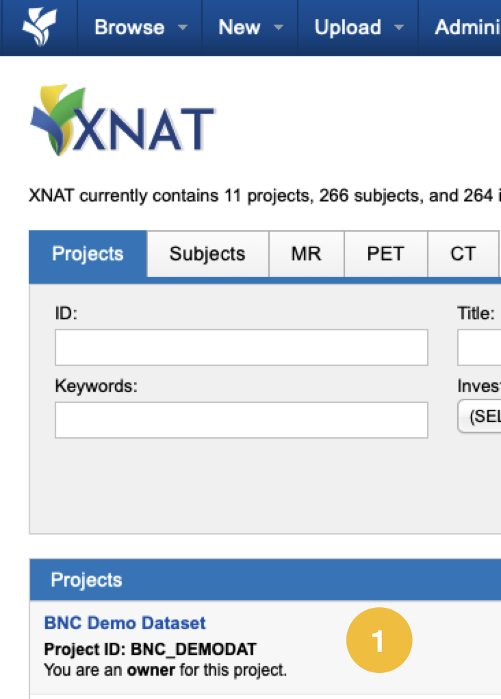
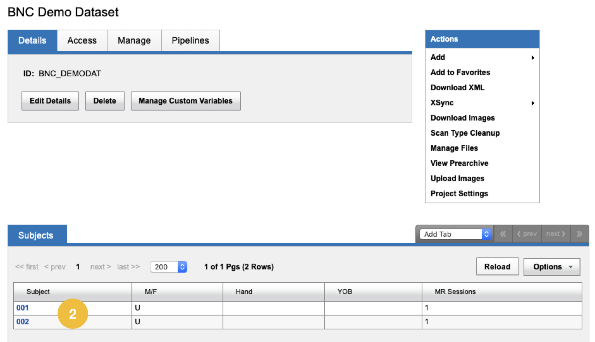
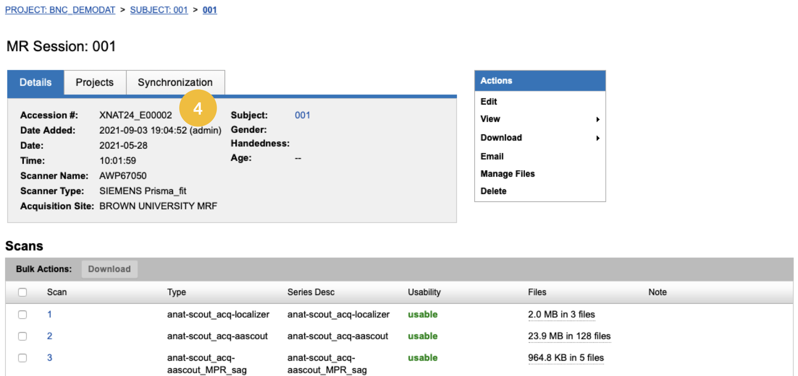

# Getting Started

We provide custom code and sample data to export your XNAT imaging session to BIDS format. Our process relies on few basic principles:

* Naming of sequences in a BIDS friendly manner at the scanner as outined in the [BIDS Ready Protocols section.](../xnat/bids-compliant-protocols.md)
* DICOMS exported from XNAT using our software is converted to BIDS using [Heudiconv](https://github.com/nipy/heudiconv)
* We rely on the [ReproIn](https://github.com/repronim/reproin) specification and heuristic&#x20;
* Our code is available in the [xnat-tools repository](https://github.com/brown-bnc/xnat-tools)

## Requirements

Before exporting, you'll need to have available, XNAT authentication and session information as well as our software.

### 1. Familiarize with BNC's Demo Dataset

We will use the [BNC's Demo Dataset](getting-started.md#1.-xnat-login-information) in the follwing walk-through examples. It is helpfult to be familiar with the general description and protocol details of the data

### 1. XNAT Login Information

If you have not registered to use our XNAT, please follow instructions [here](../xnat/accessing-xnat.md#first-time-users)

* XNAT Username
* XNAT Password

### 2. Image Session Identifier

In order to export an imaging session, we need to find XNAT's ID for that session. You can do so as follows:

#### 2.1 Navigate to project of interest

#### 2.2 Navigate to subject of interest

#### 2.3 Navigate to MR Session&#x20;

.png>)

#### 2.4. Find Accession \#

###
