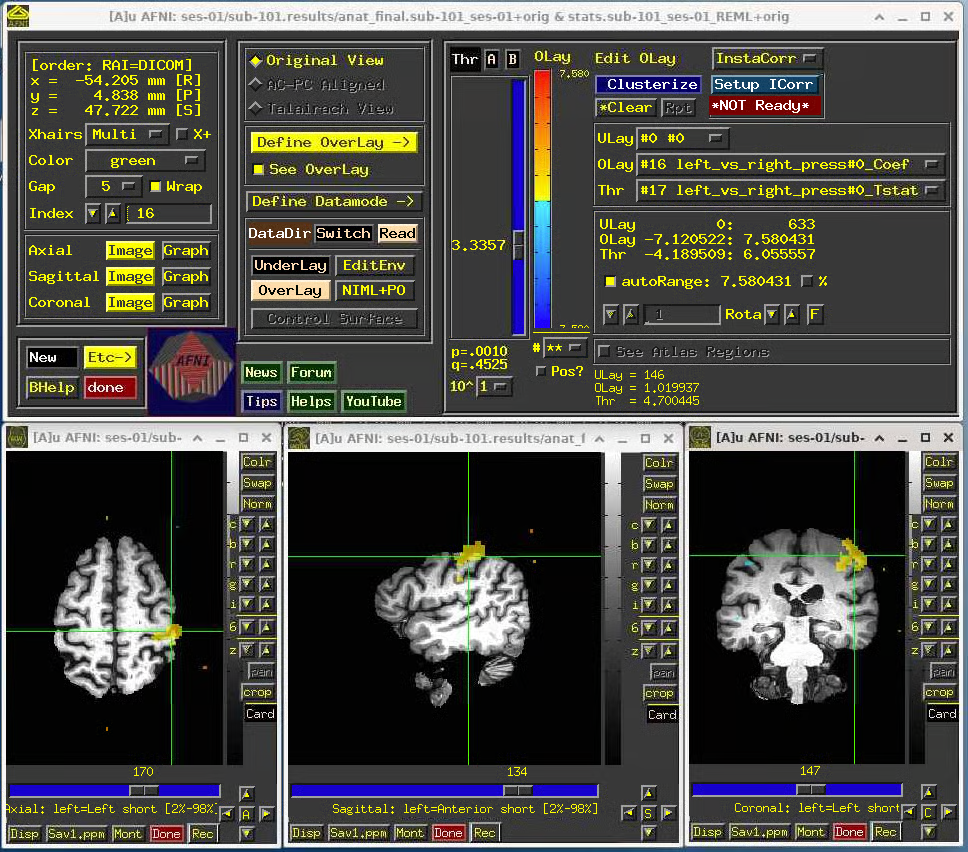

# Oscar Utility Script

## Oscar Scripts: Running XNAT2BIDS

This script is a Python-based command-line tool that is designed to help neuroimaging researchers streamline the process of converting data from XNAT into BIDS format. It takes a user-specified configuration file that specifies the parameters for configuring Oscar resources as well as running the conversion pipeline, which can be customized for each individual session. The script then compiles a list of command-line arguments based on the configuration file and runs the XNAT2BIDS conversion pipeline in a Singularity container.&#x20;

### 1. Start an interactive session

#### 1.1 Desktop app on Open OnDemand&#x20;

Connecting via the Desktop app on Open OnDemand is a friendly way to request an graphical interactive session in Brown's supercomputer - Oscar. When you request a new Desktop session, you will be asked to specify the necessary resources. For this example, you can choose the basic job with `2 Cores and 7GB Memory`. Once logged in, you are already inside an interactive session.&#x20;

<figure><figcaption></figcaption></figure>

Once your requested session is running, you can launch it by clicking the Launch Desktop button.

<figure><figcaption></figcaption></figure>

At this point, simply open the terminal.

<figure><figcaption></figcaption></figure>

#### 1.2 SSH

To connect via SSH, you type `ssh username@ssh.ccv.brown.edu`. If this is your first time connecting via ssh, you will be asked to trust the remote computer (Oscar), your Brown credentials, and unless you are connected to VPN, you will be required to use DUO.

At this point you arrive at a login node. **We will need to start an interactive session/job** by typing

```
interact -n 2 -t 01:00:00 -m 8g
```

This starts an interactive job for one hour.

### 2.  Clone Oscar Scripts

Visit the Oscar Scripts Github repository: [https://github.com/brown-bnc/oscar-scripts](https://github.com/brown-bnc/oscar-scripts)

Select `Code` from the top right corner of the page, copying the URL beneath HTTPS.

<figure><figcaption></figcaption></figure>

Navigate, in Oscar, to your personal or lab directory where you would like the script to exist.

At the command line, run the following:

```
git clone https://github.com/brown-bnc/oscar-scripts.git
```

### 3.  Configuring Slurm and XNAT2BIDS

To avoid the hassle of managing complex SBATCH files, we are leveraging the simplicity of TOML (Tom's Obvious Minimal Language) for tuning Oscar's workload manager (Slurm) as well as the particular arguments you would ordinarily pass directly into `xnat2bids` on the command line.

We provide a default configuration file (`x2b_default_config.toml`) to get you well on your way. Here, we define standard values for Slurm parameters such as time, memory, nodes, and cpus-per-task.  If you suspect your jobs will require more allocated resources than specified here, you can override those arguments in your own user-defined configuration file!

Below is an example of one such custom config file.  Let's break it down.

```toml
# Configuring arguments here will override default parameters.

[slurm-args]
mail-user = "example-user@brown.edu"
mail-type = "ALL"

[xnat2bids-args]
sessions = [
    "XNAT_E00080", 
    "XNAT_E00114",  
    "XNAT_E00152",
    ]
overwrite=true
verbose=0

# Define custom parameters for a given session by creating a section 
# with the Accession identifier with values for specific arguments.

[XNAT_E00152]
skipseq=[6]
includeseq=[7,8,9,10,11]
verbose=1

[XNAT_E00114]
skipseq=[6]
verbose=2
```

#### 3.1 Defining Slurm Parameters

Under the hood,  our script (`run_xnat2bids.py)` utilizes Slurm's command `srun` to dispatch jobs executing `xnat2bids`.  Each parameter provided beneath \[`slurm-args]` will be parsed and passed to the workload manager as an argument.  In the example config file above, you can see that we are setting up email notifications to report the status of our jobs.  Other parameters—such as time, mem, nodes, etc.—can be defined here, as well.

For further details on all available parameter options, see Slurm's documentation here: [https://slurm.schedmd.com/srun.html](https://slurm.schedmd.com/srun.html).

#### 3.2 Defining XNAT2BIDS Parameters

Similarly, `xnat2bids` arguments should be declared below `[xnat2bids-args]`.  Most importantly, you must populate the list `sessions` with one or more Accession identifiers.  Accession IDs can be found inside an experiment's session details on XNAT, labeled **Accession #**.

For each session being processed, you have the option to create a new section dedicated to specifying the unique arguments that you want to be passed when processing that session alone. To do this, create a new TOML key of the form `[<accession_id>]`  with the parameters listed below, just as with `[xnat2bids-args]`.

In short, `xnat2bids` will be called for every session you define, and every session's execution will inherit command line arguments declared under `[xnat2bids-args]` and `[<accession_id>]`, if provided.  If the same parameter exists in both sections, the session will be processed with the parameter's value listed under  `[<accession_id>]`.  For example, in the configuration file attached above, when session "XNAT\_E00114" is processed, `xnat2bids` will run with a verbosity level of `verbose=2`, rather than 0.

**NOTE:**  By default, the latest version of `xnat-tools xnat2bids`, unless specified under `[xnat2bids-args]` with the following format: `version="vX.X.X"`

For further details on all available parameter options, see BNC's `xnat2bids` documentation here: [https://brown-bnc.github.io/xnat-tools/1.1.1/xnat2bids/](https://brown-bnc.github.io/xnat-tools/1.1.1/xnat2bids/)

### 4.  Running the XNAT2BIDS Script

#### 4.0 Load Anaconda Module Into Environment

From the command line, run the following:

```
module load anaconda/2022.05
```

#### 4.1 Running with Defaults

If the default values for resource allocation are suitable and you do not need to pass any specific arguments to `xnat2bids`, you may run the script as follows:

```
python run_xnat2bids.py
```

Since, by default, no sessions are flagged for processing, you will immediately be prompted to enter a Session ID to proceed.  If you would like to processing multiple sessions, you can enter them as a comma-separated string.  Here's an example:

```
Enter Session(s) (comma separated): XNAT_E00080, XNAT_E00114,  XNAT_E00152
```

After your jobs have completed, you can find all DICOM export and BIDS output data at the following location: `/gpfs/scratch/<your_username>/bids-export/`

Likewise, logs can be found at `/gpfs/scratch/<your_username>/logs/` under the following format: `xnat2bids-<session-id>-<array-job-id>.txt`

#### 4.2 Running with Custom Configuration

To load a custom parameters, use `--config` to specify your custom configuration file.

```
python run_xnat2bids.py --config <example_user_config.toml> 
```

**NOTE:** For helpful debugging statements containing the executed command and argument lists to be printed to your terminal, make sure `verbose >= 1` in your configuration's `[xnat2bids-args]` list.

### 5.0 Validate the BIDS output

After successfully running `run_xnat2bids.py` you'll need to make sure that BIDS validation passes. This process is explained in the [BIDS Validation Section](../bids-validation/)
