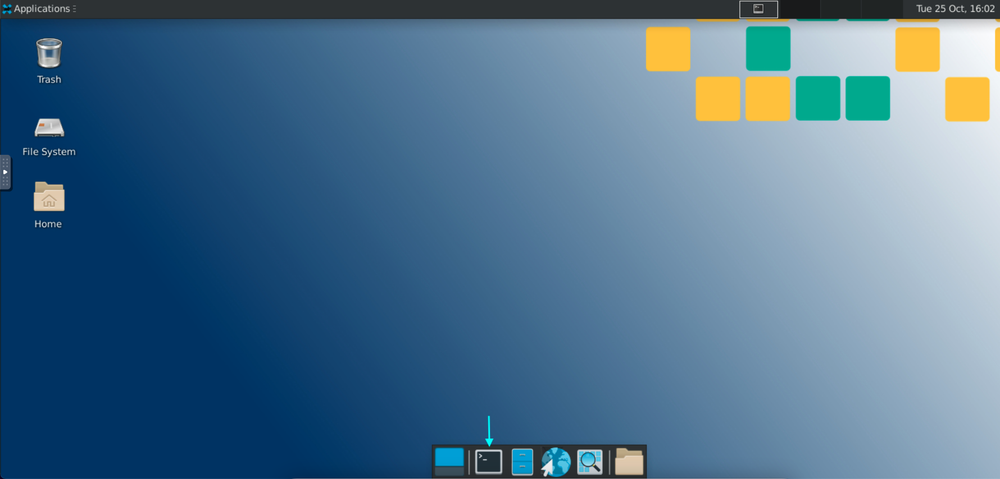

# Oscar Utility Script

The BNC maintains a collection of helpful scripts on Oscar which can be found at: `/oscar/data/bnc/scripts` &#x20;

This documentation outlines user instructions to run the **`run_xnat2bids.py`** script, which makes it simple to launch the xnat2bids DICOM to BIDS conversion pipeline.&#x20;

This script is a Python-based command-line tool that is designed to help neuroimaging researchers streamline the process of converting data from XNAT into BIDS format. It takes a user-specified configuration file that specifies the parameters for configuring Oscar resources as well as running the conversion pipeline, which can be customized for each individual session. The script then compiles a list of command-line arguments based on the configuration file and runs the XNAT2BIDS conversion pipeline in a Singularity container. **This script is the easiest way to run xnat2bids on multiple participants and/or scan sessions at once!**

***

### 1. Start an interactive session



[https://ood.ccv.brown.edu/pun/sys/dashboard](https://ood.ccv.brown.edu/pun/sys/dashboard)

Connecting via the Desktop app on Open OnDemand is a friendly way to request a graphical interactive session in Brown's supercomputer - Oscar. When you request a new Desktop session, you will be asked to specify the necessary resources. For this example, you can choose the basic job with `2 Cores and 7GB Memory`. Once your requested session is running, you can launch it by clicking the Launch Desktop button. Finally, just open the terminal; you are already inside an interactive session.&#x20;

<figure><figcaption><p>Click to open a terminal</p></figcaption></figure>



To instead connect via SSH, you type `ssh username@ssh.ccv.brown.edu` from a terminal on your local machine. If this is your first time connecting via ssh, you will be asked to trust the remote computer (Oscar), your Brown credentials, and unless you are connected to VPN, you will be required to use DUO.

At this point you arrive at a login node. **We will need to start an interactive session/job** by typing

```
interact -n 2 -t 01:00:00 -m 8g
```

This starts an interactive job for one hour.



***

### 2.  Configuring Slurm and XNAT2BIDS

Before we are ready to kick off the script, it will be necessary to understand how each job is configured. Each job consists of two essential pieces: the program and the resources it needs to successfully execute. Some common resources that we will assign for our job are time, memory, cpus-per-task, and the number of compute nodes we want to allocate. In this case, our program of interest will be `xnat2bids`, so we will need to configure its parameter options, as well.


Previously, to run**`xnat2bids`**as a batch job, users had to provide an SBATCH script to the**`sbatch`**command. For more information on how to run batch jobs on Oscar, please refer to this link: [https://docs.ccv.brown.edu/oscar/submitting-jobs/batch](https://docs.ccv.brown.edu/oscar/submitting-jobs/batch)


To avoid the hassle of managing complex SBATCH scripts, we are leveraging the simplicity of TOML (Tom's Obvious Minimal Language) for specifying our configuration parameters.

We provide a default configuration of carefully chosen parameters that should likely never change. If you suspect your jobs will require more allocated resources than specified here, you can override those arguments in your own user-defined configuration file!

Take a look at our default configuration file `x2b_default_config.toml`:

```toml
[slurm-args]
time = "04:00:00"
mem = 16000
nodes = 1
cpus-per-task = 2
job-name = "xnat2bids"

[xnat2bids-args]
host="https://xnat.bnc.brown.edu"
```

If you'd like, you can keep things simple and run with this default configuration:


[running-xnat2bids-using-default-configuration.md](running-xnat2bids-using-default-configuration.md)


There are many ways to tailor your xnat2bids job and take advantage of its many features, and for that you'll need to create a custom configuration:


[running-xnat2bids-with-a-custom-configuration.md](running-xnat2bids-with-a-custom-configuration.md)


***
