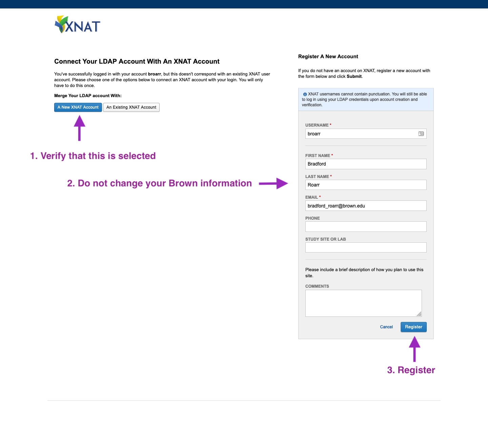

# Accessing XNAT

Our XNAT portal is available at [http://bnc.brown.edu/xnat](http://bnc.brown.edu/xnat)


XNAT is behind Brown's firewall. You must be connected to Brown Wifi or VPN


## Returning Users

You can log in using your ✨ **Brown credentials ✨ and the LDAP Credential option.** 

## First Time Users



1. Select Brown LDAP
2. Use Brown \(shorname\) credentials
3. **Do not click the Register button.** Simply Login




After logging in with your Brown Credentials for the first time, a pre-filled form will appear. **Verify** the information and click **Register.** After registering you should recieve a confirmation email




