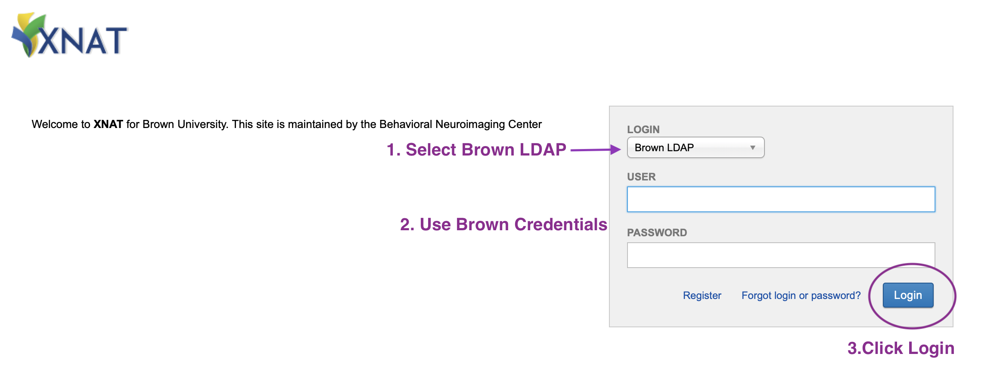

# Accessing XNAT

Our XNAT portal is available at [https://xnat.bnc.brown.edu](https://xnat.bnc.brown.edu). You will need to either be on the Brown campus network or [connect via VPN](https://it.brown.edu/services/virtual-private-network-vpn) to access the XNAT portal.

## Returning Users

You can log in using your ✨ **Brown credentials ✨ and the LDAP Credential option.**&#x20;

## First Time Users



1. Select Brown LDAP
2. Use Brown (shortname) credentials
3. **Do not click the Register button.** Simply Login

.png>)



After logging in with your Brown Credentials for the first time, a pre-filled form will appear. **Verify** the information and click **Register.** After registering you should recieve a confirmation email

.png>)




