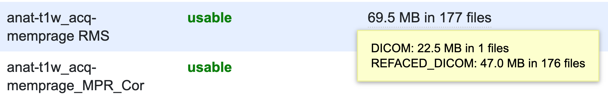

# Removing identifiable facial features

Some types of MRI scans (T1, T2, proton density-weighted) contain sufficient contrast, resolution, and coverage of the face region to allow the participant's face to be reconstructed. This could pose a potential re-identification risk for an anonymized dataset. We have set up a tool on XNAT called [mri reface](https://www.nitrc.org/projects/mri_reface), which replaces potentially identifiable facial features (left) with an average face (right). Replacing with an average face, rather than just removing the face, is intended to minimize the effect on future processing (Schwarz et al., 2021).

<figure><figcaption>
face reconstructed from a T1 MEMPRAGE scan
</figcaption></figure> <figure><figcaption>
the same scan, with face and ears replaced with an average face
</figcaption></figure>

We can configure your XNAT project to run the refacing process automatically as new data arrives on XNAT (and we can help run it on existing data already on XNAT). When the processing is complete, you will see that in addition to your original DICOM files, there is a new folder called REFACED\_DICOM that contains the refaced anatomical data.&#x20;

<figure><figcaption>
hovering over the "files" listing for a refaced scan shows that both the original DICOM(s) and refaced DICOM(s) are present 
</figcaption></figure>

You can [download this data directly](../downloading-data.md#id-1.2-download-one-sequence) (from the browser or with the XNAT Desktop Client), or you can export it with the rest of your data with [xnat-tools](https://app.gitbook.com/s/-LtSg7ZEM6EHbi9iE84a/xnat-to-bids-intro). By default, for any scan that contains refaced DICOMs, xnat-tools will only export the refaced DICOMs, leaving the original DICOMs on XNAT. However, if you'd like to export only the original DICOMs, or both the original and refaced DICOMs, you just need to add one line to your configuration toml file. Under \[xnat2bids-args], add a line that says `reface-mode="orig"` or `reface-mode="both"` (`reface-mode="refaced"` is the default).

Any exported data that has been refaced will have "rec-refaced" added to its name. For example, running xnat2bids with `reface-mode="both"` will give two pairs of files like this:

<figure><figcaption>
two .nii.gz/json pairs of T1 files, with the rec-refaced entity added to the refaced scan
</figcaption></figure>
