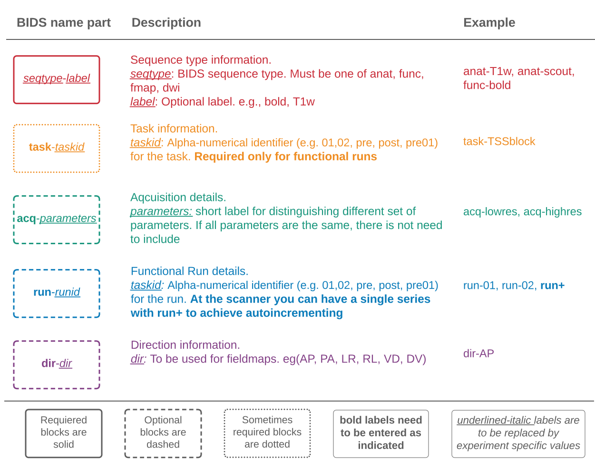

# BIDS Ready Protocols

## BIDS Naming Pattern

We provide custom code \([xnat-tools package](https://github.com/brown-bnc/xnat-tools)\) to export your XNAT imaging sessions to BIDS format. The process relies on naming your series in a BIDS friendly manner. If you are new to BIDS, it may be helpful to familiarize yourself with the [BIDS Standard](https://bids-specification.readthedocs.io/en/stable/). We also provide a short overview of BIDS in [this section](../bids/introduction-to-bids.md).

When naming your series at the scanner you will need to think of the different parts that make up the BIDS name. More explicitly, the name of the series is composed of different parts that provide information about the sequence type \(i.e, antomical, functional, etc\), task information, aquisition parameters, the run id, among others. The diagram bellow shows the parts of the BIDS name that you **need to pay attention when naming you series at the scanner**. These are only a subset of the full set defined by the BIDS specification. You can refer to the [Entity Table](https://bids-specification.readthedocs.io/en/stable/99-appendices/04-entity-table.html) of the BIDS specification for a full reference. 




To create the final name, the different parts shown abobe are concatenated using underscores \(\_\)


## Sample Protocols

```text
anat-scout_acq-aascout
anat-scout_acq-localizer
anat-T1w_acq-memprage
fmap_acq-greAP
func-bold_task-TSSblock_acq-2dot4mmSMS4TR1200AP_run+
```

```text
anat-scout_acq-localizer
anat-scout_acq-aascout
anat-t1w_acq-memprage
func-bold_task-lum_run+
dwi_acq-122_dir-ap
dwi_acq-b0_dir-pa
```

## Important considerations

### Scouts and Localizers

All **scout** and **localizer** sequences need to have a `scout` label. For example:

* `anat-scout_acq-localizer`
* `anat-scout_acq-aascout`

Scout series will remain in the `sourcedata` directory of your bids output, but will not be present in you `anat` folder. 

### Incompatible symbols

Do not use "+", "\_", "-" or "." within SESID, TASKID, ACQLABEL, RUNID. The only execption is the use of `run+`

### Naming Runs

To indicate **runs** in your protocol, without explicitly indicating the run number, simply label the run as `run+`

### Cancelled Runs

If run was canceled you will need to skip that series when callaing the BIDS exporting code `xnat2bids.` We encourage adding a note to that series in XNAT to indicate that the run was cancelled. This will improve bookeeping and maintainability

### Functional

Functional runs **must** have \_task- field defined

### MEMPRAGE

Typically the scanner is configured to send the mutiple echoes and the RMS series. At the moment, BIDS does not support multi-echoes in the `anat` category. When calling our `xnat2bids` software, please skip the multi-echo series. \(This behavior may change in the future. See [here](https://github.com/brown-bnc/xnat-tools/issues/59) for more details\)

### Fieldmaps

Currently the **fieldmaps** collected with our Siemens scanner use the "old way" described [here](https://osf.io/2hjhx/wiki/Brain%20Imaging%20Data%20Structure%20%28BIDS%29/#LCNI_fieldmapshttpslcniuoregonedukbarticleskb0003_29)

### Scanner derivatives

Some sequences are derivatives of the scanner and are not yet handled by our `xnat2bids` software smoothly. We recommend, not exporting those sequences to BIDS at the moment.\(This behavior may change in the future. See [here](https://github.com/brown-bnc/xnat-tools/issues/59) for more details\)

