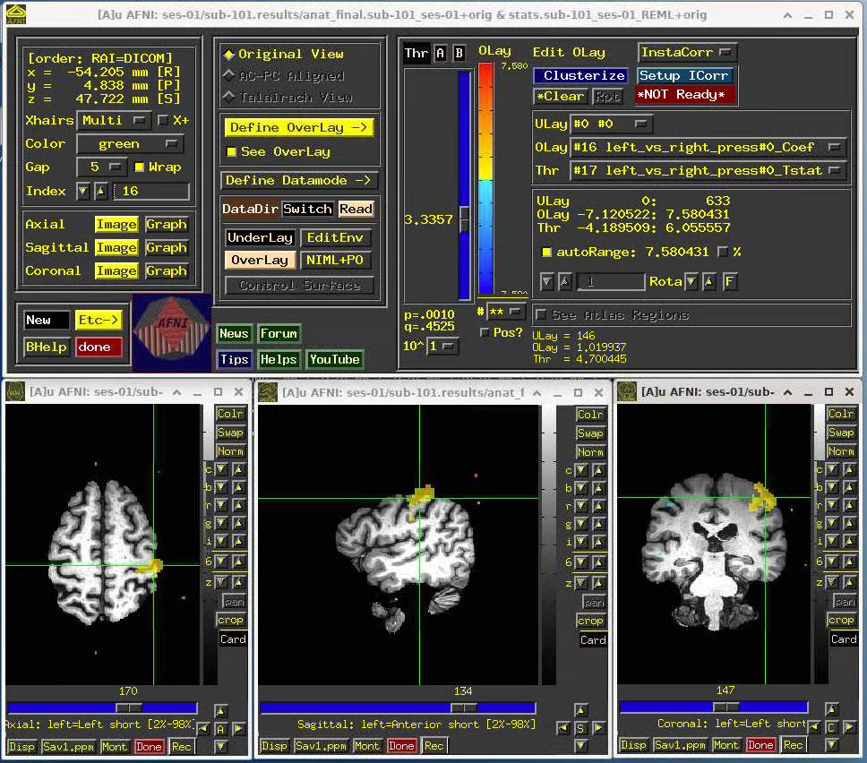

# Exporting XNAT Session to BIDS

We provide custom code to export your XNAT imaging session to BIDS format. Our process relies on few basic principles:

* Naming of sequences in a BIDS friendly manner at the scanner
* DICOMS exported from XNAT using our software can be converted to BIDS using [Heudiconv](https://github.com/nipy/heudiconv)
* We rely on the [ReproIn](https://github.com/repronim/reproin) specification and heuristic 
* Our code is available in the [xnat\_tools repository](https://github.com/brown-bnc/xnat-tools)

## Requirements

### XNAT Login Information

* XNAT Host
* XNAT Username
* XNAT Password

### Image Session Identifier

In order to export an imaging session, we need to find XNAT's ID for that session. You can do so as follows:

#### 1. Navigate to project of interest


#### 2. Navigate to subject of interest



#### 3. Navigate to MR Session 


#### 4. Find Acession \#


### XNAT2BIDS Software

The BNC maintains a python package [xnat\_tools](https://github.com/brown-bnc/xnat-tools), to make it simple to export and convert your data to BIDS. The optimal way to install and run the code depends on your computation environment. Below we explain all possibilities

## XNAT2BIDS: Installation and Execution



Docker containers provide a simple way to run software without much installation hassle. This method requires that you have [Docker Engine installed in your computer](https://docs.docker.com/install/)

### Installation

```text
version=v0.1.0
docker pull brownbnc/xnat_tools:${version}
```

**✨Versions**_:_

* `latest`: Is the build of master
* `vX.X.X`: Latest tagged stable release

You can confirm the tags [here](https://hub.docker.com/repository/docker/brownbnc/xnat_tools/tags?page=1)

### Running XNAT2BIDS

The xnat\_tools package provides a convinience `xnat2bids` script to facilitate data export and conversion to BIDS. In general, the script inside the container is invoked as follows:

```text
xnat_user=<user>
session=<xnat_accession_number>
bids_root_dir="~/data/bids-export"

docker run --rm -it -v ${bids_root_dir}:/data/xnat/bids-export   \
brownbnc/xnat-tools:${version} xnat2bids --user ${xnat_user}       \
--session ${session} --bids_root_dir /data/xnat/bids-export
```

The previous command starts the `brownnbnc/xnat-tools` container. `-it` indicates that the container is interactive `--rm` tells docker to remove the container once it is done. `v` tells docker to map the local \(in your computer\) directory `bids_root_dir` to `/data/xnat/bids-export` inside of the container. We are also telling docker to launch the `xnat2bids` executable and we are passing the inputs to that executable. 

⚠️ **bids\_root\_dir:** The value that we pass to this input, corresponds to the value of the bids root directory as mapped inside of the container, which in our example is `/data/xnat/bids-export`

⚠️ **Correcting for misslabeled sequences at the scanner: `xnat2bids`** can take a `json` file with a dictionary of sequence names to correct/change. It is important to remember that the path passed is the pass **inside** of the container. In our previous example, the only shared location between the host and the container is:

* The value of `bids_root_dir` as specified by `-v ${bids_root_dir}:/data/xnat/bids-export`

Therefor the simpliest approach would be to place your `json` somewhere inside `bids_root_dir` and pass the argument `--bidsmap_file /data/xnat/bids-export/bidsmaps/${session}.json` assuming that is the name and location of your file.

⚠️ **Familiarize yourself with the inputs to xnat2bids**

For a full list of the inputs, you can run:

```text
docker run --rm -it -v ${bids_root_dir}:/data/xnat/bids-export   \
brownbnc/xnat-tools:${version} xnat2bids --help
```



### Installation

You can also install xnat\_tools using the python package manager of your choice. For instance

#### PIP

_A Tagged Release_

```text
pip install git+https://github.com/brown-bnc/xnat-tools.git@v0.1.0-beta
```

_Development \(Master branch\)_

```text
pip install git+https://github.com/brown-bnc/xnat-tools.git
```

#### **PIPX**

If you are using this package in a stand-alone fashion, and you don't want to use Docker, we recommend using [pipx](https://github.com/pipxproject/pipx). Please check their README for installation instructions. Once `pipx` is installed you install as follows:

_A Tagged Release_

```text
pipx install git+https://github.com/brown-bnc/xnat-tools.git@v0.1.0-beta
```

_Development \(Master branch\)_

```text
pipx install git+https://github.com/brown-bnc/xnat-tools.git
```

### Running XNAT2BIDS

After installation, the console script `xnat2bids` is available in your system. You can invoke it from the terminal as follows:

```text
xnat_user=<user>
session=<xnat_accession_number>
bids_root_dir="~/data/bids-export"

xnat2bids --user ${xnat_user}  --session ${session} \
--bids_root_dir ${bids_root_dir}
```

⚠️ **Familiarize yourself with the inputs to xnat2bids**

For a full list of the inputs, you can run:

```text
 xnat2bids --help
```



### Installation

**🎉 Skip -** We keep a Singularity image of the most recent tagged relase of `xnat-tools`in Oscar.

### Running XNAT2BIDS

The xnat\_tools package provides a convinience `xnat2bids` script to facilitate data export and conversion to BIDS. 


For use in Oscar we need to put wrap our commands in a batch file or use an interactive or VNC  session. Please **remember to not run processing on the login nodes**


Here we start the software as an interactive job of one hour. In the terminal

```text
interact -n 2 -t 01:00:00 -m 8g
```

```text
version=<write version here>
xnat_user=<write username>
session=<xnat_accession_number>
bids_root_dir=<root_directory_for_exporting>

singularity exec -B ${bids_root_dir}:/data/xnat/bids-export \
/gpfs/data/bnc/simgs/xnat-tools-${version}.sif xnat2bids --user ${xnat_user}       \
--session ${session} --bids_root_dir /data/xnat/bids-export
```

**✨Versions**_:_

* `latest`: Is the build of master
* `vX.X.X`: Latest tagged stable release

You can confirm the tags [here](https://hub.docker.com/repository/docker/brownbnc/xnat_tools/tags?page=1)

⚠️  **bids\_root\_dir:** The value that we pass to this input, corresponds to the value of the bids root directory as mapped inside of the container, which in our examble is `/data/xnat/bids-export`

⚠️ **Correcting for misslabeled sequences at the scanner: `xnat2bids`** can take a `json` file with a dictionary of sequence names to correct/change. It is important to remember that the path passed is the pass **inside** of the container. In our previous example, the only shared location between the host and the container are:

* The value of `bids_root_dir` as specified by `-B ${bids_root_dir}:/data/xnat/bids-export`
* `home` singularity does that by default

So the simpliest approach would be to place your `json` somewhere inside `bids_root_dir` and pass the argument `--bidsmap_file /data/xnat/bids-export/bidsmaps/${session}.json` assuming that is the name of your file.

⚠️ **Familiarize yourself with the inputs to xnat2bids**

For a full list of the inputs, you can run:

```text
singularity exec -B ${bids_root_dir}:/data/xnat/bids-export \
/gpfs/data/bnc/simgs/xnat-tools-${version}.sif xnat2bids --help
```



## BIDS Validation

After running the `xnat2bids` software, it is recommended to run the BIDS Validator in your data. We provide instructions to do it programmatically, but there is also a website where you can do it interactively.



To run the validator using Docker simply pass the bids directory as shown below. The bids directory is the parent directory of the `dataset_description.json` file

```text
bids_directory=<your bids directory>
docker run -ti --rm -v ${bids_directory}:/data:ro bids/validator /data
```



To run the validator using Singularity in Oscar you simply pass the bids directory as shown below. The bids directory is the parent directory of the `dataset_description.json` file

```text
version=v1.4.3 #check latest available version
bids_directory=<bids directory>

singularity exec -B ${bids_directory}:/data:ro \
/gpfs/data/bnc/simgs/bids-validator-${version}.sif bids-validator /data
```




