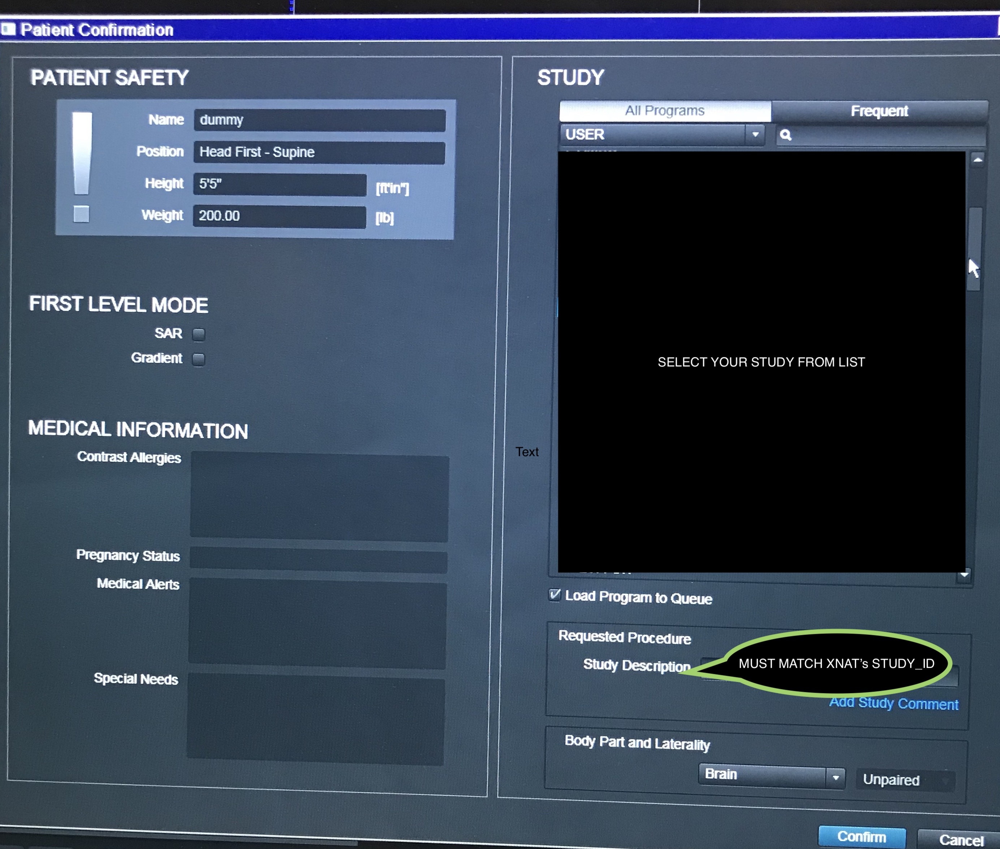

# Managing your Projects

XNAT Projects are created by a BNC XNAT administrator. 

## Naming convention inside XNAT

When creating new projects, XNAT asks for the following  fields

### **Required Fields**

| Variable  | Description |
| :--- | :--- |
| Project Title | The full title of the project, which will appear in the site-wide project listing. |
| Running Title | This is an abbreviated project name, which will appear in search listings and data tables. |
| Project ID | This ID is used within the XNAT database and in all API calls related to your project and its data. Once set, it cannot be changed. |


The **Project ID** must be unique. To improve book-keeping, we use **brownuser\_projectname**. The brownuser corresponds to the brown user of the Principal Investigator. Use only lowercase and a maximum of X characters


Further details can be found in [this section of XNAT's documentation](https://wiki.xnat.org/documentation/how-to-use-xnat/creating-and-managing-projects)

The **Project Title** should follow the contain the following fields:

1.  PI's lastname
2. Study reference number
3.  Study pretty name

The fields should follow that order and be separated by **spaces**

Both the **Running Title and Project ID** must contain the following fields:

1.  PI's lastname
2. Study reference number

The above fields should follow the order above and follow the following rules

* Use ALL CAPS
* Seprate only with underscores
* Maximum of 13 characters

## Automated routing from scanner

XNAT will attempt to place the data coming from the scanner in the appropiate project using information from the DICOM metadata. 

At Brown we match the conditions described in [XNAT's Third Pass](https://wiki.xnat.org/documentation/how-to-use-xnat/image-session-upload-methods-in-xnat/how-xnat-scans-dicom-to-map-to-project-subject-session), explicitly: 

**Third Pass \(Our choice\)**

 XNAT looks for each metadata field in individual DICOM fields, as below:

| DICOM Tag | Tag name | XNAT Field |
| :--- | :--- | :--- |
| \(0008,1030\) | Study Description | Project ID |
| \(0010,0010\) | Patient Name | Subject Label |
| \(0010,0020\) | Patient ID | Session Label |


The only action required at the scanner is to set the **Study Description = XNAT's Project ID.** See image indicating where the Study Description field is in the scanner console



If no Project was identified, the DICOM files will be placed in the “Unidentified” prearchive box. If Project was identified, but Subject and/or Session was not, the DICOM files will be placed in the appropriate project prearchive box. However, the automatic matching tool will not be functional, and additional data entry will be required.



We assume that the metadata for the Patient ID and the Patient Name is correctly inferred.


