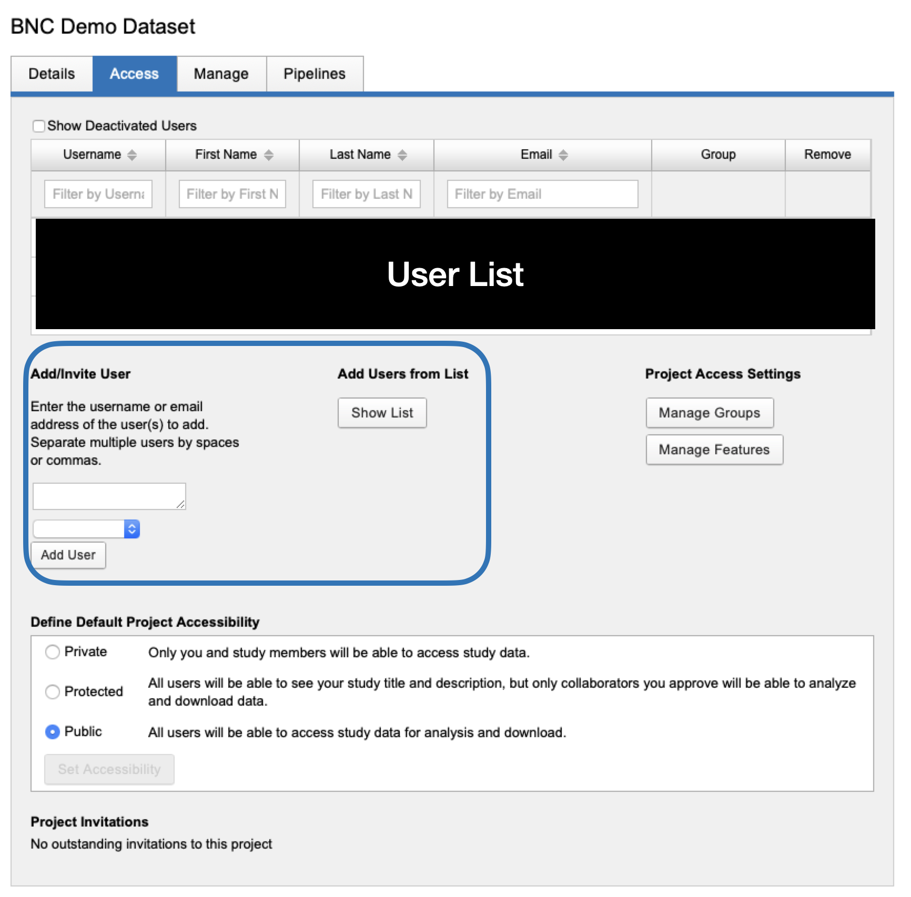

# Project Creation in XNAT

Typically, every protocol tree created at the scanner will be associated with only one XNAT project. **Currently XNAT Projects can only be created by an BNC XNAT administrator.**

At the moment all projects **must be created in XNAT RELAY.** The XNAT's relay is only accessible by administrators and it **has automated scripts that will automatically create matching projects in the public instance when a new project is created**

## 0. Select New-> Project

In the top bar navigation select New, then Project&#x20;

.png>)

## 1. Fill Project Details

.png>)

Please refer to the [prior section](managing-your-projects.md#xnat-project-title-and-id) to understand **Project Title, Running Title and Project ID**


You will want to add the faculty and primary graduate student as investigators in order to set up access correctly in the public XNAT


### 1. 1 Project Primary Investigator and Other Investigators

Project PI and Other Investigators are used to keep record of who the project belongs to. While on the relay side we do not have any users, PI and project investigators on the relay are used to grant access to appropriate users on the public XNAT instance.&#x20;

**Primary Investigator:** The PI should be the faculty who owns the data.&#x20;

**Other Investigators:** Anyone else who needs access to this project on the server. i.e. graduate students, postdocs

#### Creating additional investigators

Select `Create Investigator`

.png>)

Fill out the form to create a new investigator.&#x20;


If the investigator's First Name and Last Name matches the appropriate user on the xnat server (`xnat.bnc.brown.edu`), then that user will have access to the project. To check the user details on server, log in as administrator on `xnat.bnc.brown.edu` and then go to `Administer -> users`.


## 2. Project Access

Typically most projects should be accessible **only by study members,** therefore confirm that the accessibility for the project is set to **Private**

.png>)

## 3. Granting access to project owners

If the project owner is an XNAT user at the time of project creation, and the Investigators were added correctly, this step should not be necessary. However, if you need to manually add users to a project, simply visit the Access Tab under the Project page and search for the user you wish to add.

