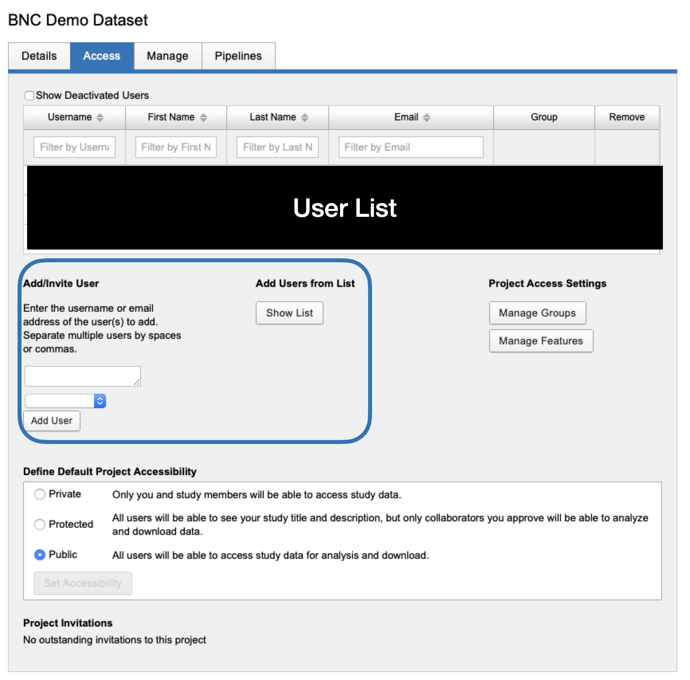

# New XNAT projects

**Currently, XNAT Projects can only be created by a BNC XNAT administrator.** If you have a new study and your protocol is already set up on the scanner, please:

1. Follow our [instructions to create an XNAT account](getting-started.md#id-1.-create-an-account-using-your-brown-credentials) if you don't already have one. The study PI should also create an XNAT account.&#x20;
2. Contact cobre-bnc@brown.edu to request a new project on XNAT. Please include the PI's name, study name, and MRF project ID number with your request.

## Managing project access

Once a project is created, project owners can grant data access to other XNAT users (grad students, postdocs, etc.). Simply visit the Access Tab under the Project page and search for the user you wish to add.

<figure><figcaption>
Access tab, where project members can be added
</figcaption></figure>

