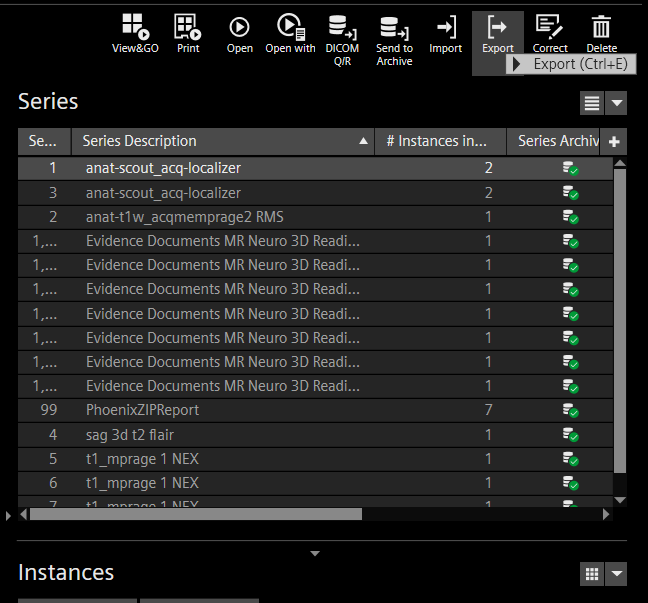
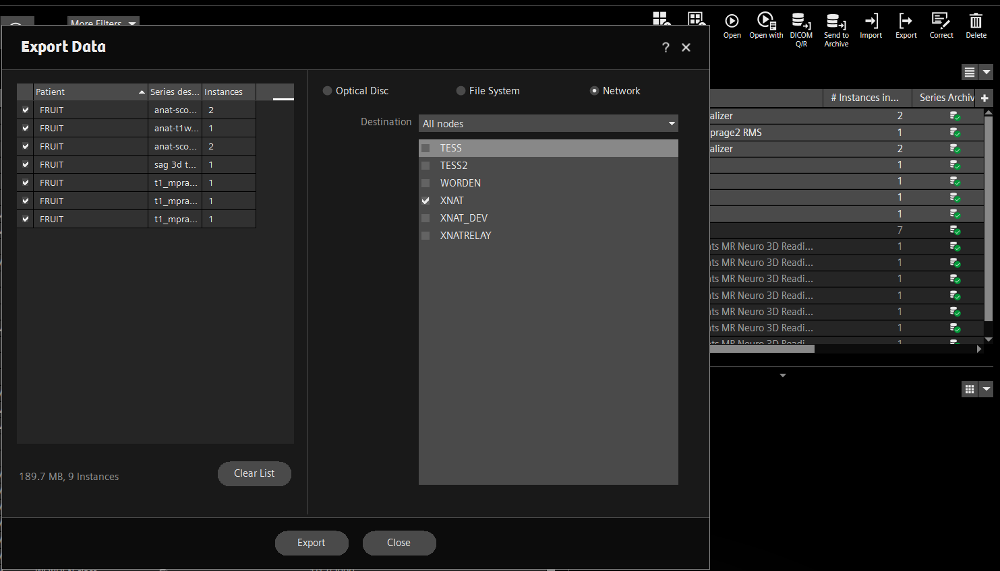
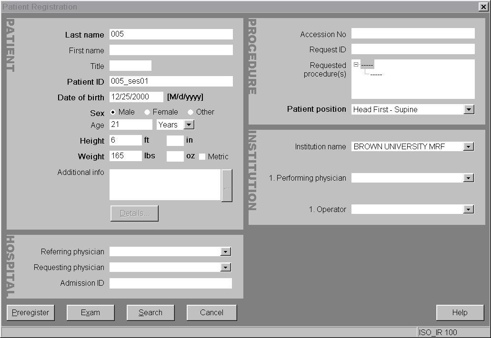

# Uploading Data

### Uploading data from the scanner

After data collection, data can be sent to XNAT directly from the scanner. Partial data transfers will get stuck, so **transfer an entire scan session at once**, rather than run-by-run. If you are the operator at the console, select your dataset in the patient browser, then click Export.

<figure><figcaption></figcaption></figure>

Make sure all the series you want to send are checked, then select XNAT and click Export.

<figure><figcaption></figcaption></figure>

### Automated routing from scanner to XNAT

If your XNAT project has been [created](project-creation-in-xnat.md) and named to match your protocol on the scanner, XNAT will attempt to place the data coming from the scanner in the appropriate project using information from the DICOM metadata.&#x20;

### Naming for multi-session studies

If your study involves multiple scan sessions per participant, following a specific consistent naming scheme will allow XNAT to nicely organize your data so that each scan session is nested under the the correct participant like this:

<figure><figcaption>
Individual scan sessions ("SESSION1" and "SESSION2") for participant 005
</figcaption></figure>

To achieve this, you need to use the Last Name and Patient ID fields in a specific way when you register your participant at the beginning of a scan. In the **Last Name field**, enter the subject ID you have assigned to your participant (in this demodat example, we would enter 005). In the **Patient ID field**, enter the same **subject ID** \*underscore\* **whatever you would like to use to label your different sessions**. You could do "005\_sess1", "005\_sess2", etc., or something that describes the different phases of your study, like "005\_pretraining", "005\_training", "005\_posttraining".

<figure><figcaption>
Using the Patient ID field to enable XNAT to nest multiple sessions under a single participant
</figcaption></figure>


If you scan the same participant multiple times and re-use the same **Patient ID**, your data will not get properly routed to your project without an XNAT administrator's help.&#x20;


### Uploading Non-MR Data

To upload your EEG or Physio data onto XNAT, see the instruction steps at page below.


[converting-non-mr-data](../xnat-to-bids-intro/converting-non-mr-data/)


