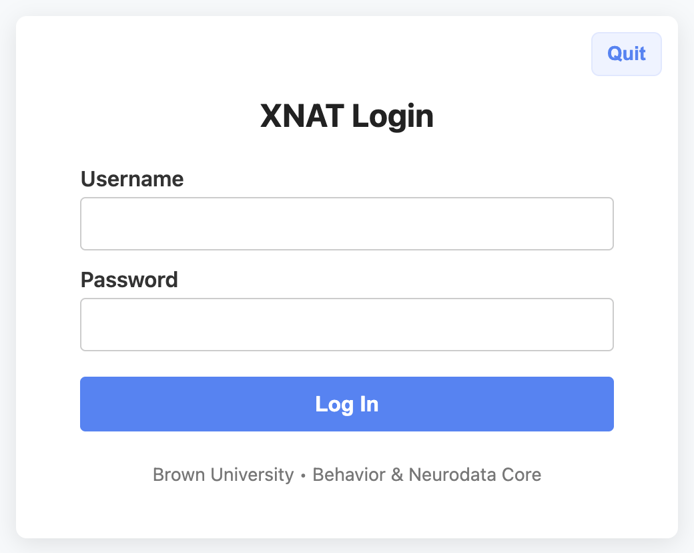
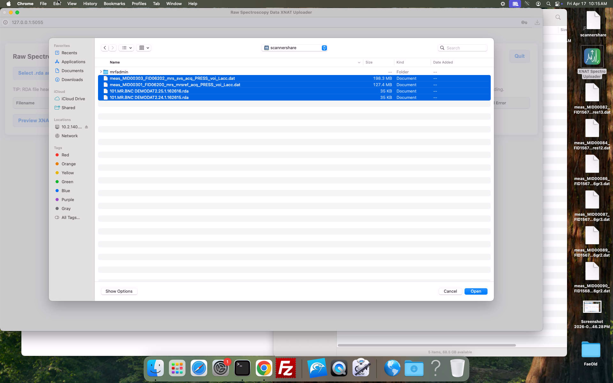
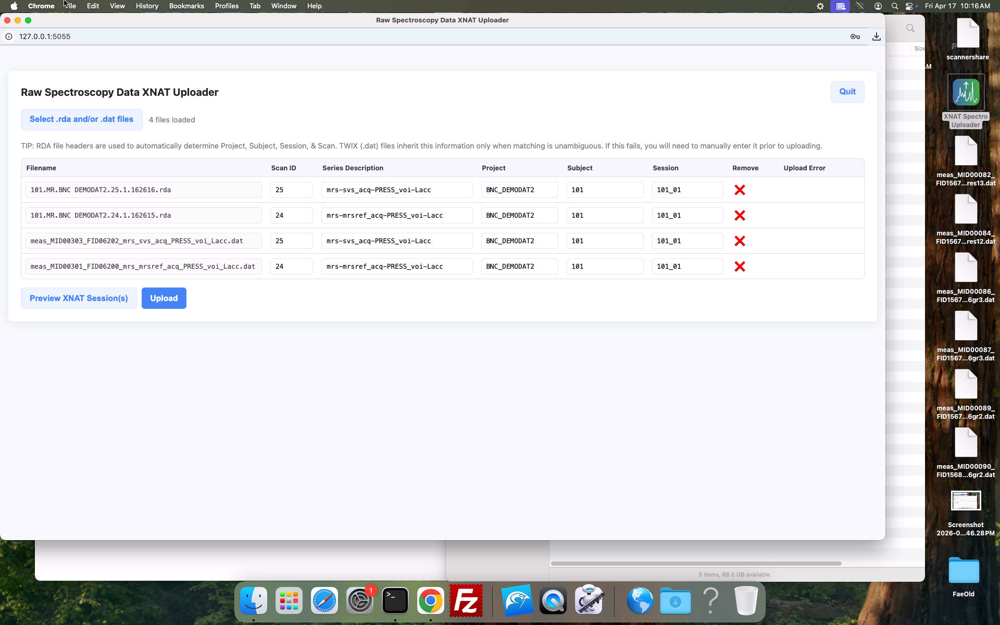
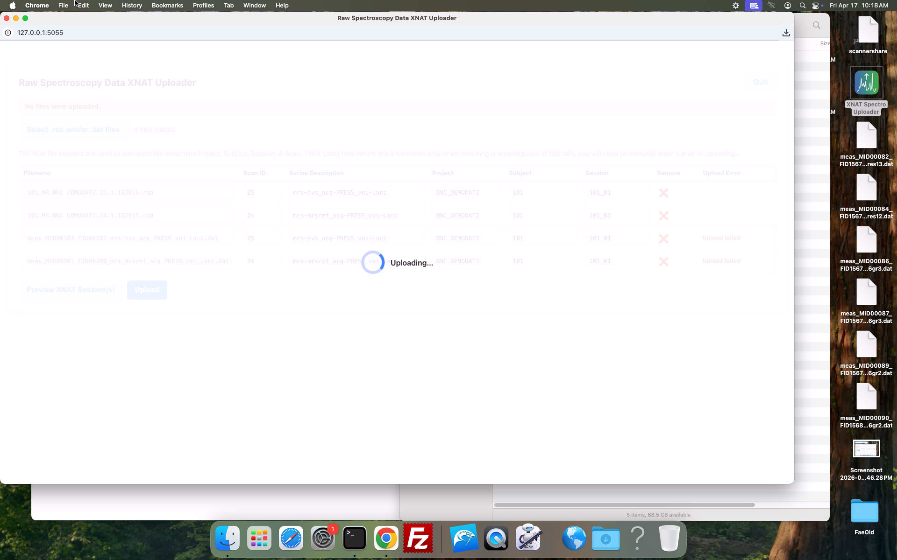
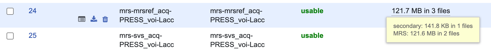

# Uploading raw spectroscopy data

When you collect MR spectroscopy data at the scanner and send your data to XNAT, the DICOM-formatted version gets automatically transferred along with the rest of your DICOMs.&#x20;

We have developed a simple webapp ([available on github](https://github.com/brown-bnc/XNAT-uploader-webapp)) that allows you to upload your raw spectroscopy data as well (.rda and .dat files), and it will automatically attach them to their matching DICOM(s). Then, when you run the [xnat2bids conversion](../../xnat-to-bids-intro/using-oscar/oscar-utility-script/), the raw spectroscopy data will be exported as well and placed in the sourcedata subdirectory of your BIDS directory.


Contact us at cobre-bnc@brown.edu if you would like to upload raw spectroscopy data to your project on XNAT. There is a one-time setup step we'll need to do for you first.


#### Follow these steps to get your raw MRS data to XNAT

1. When your scan is complete, [transfer all your data to XNAT](./) as usual, and then [send your .rda and .dat files to scannershare](../../mrf-guides/exporting-data-via-scannershare.md).
2. **On the transfer computer in the MRF waiting room**, log in to XNAT and verify that your new data has appeared in your project (this usually takes \~10 mins from the time the data was sent from the scanner, but it depends on the size of your dataset).
3. Once your DICOMs are on XNAT, launch the XNAT Spectroscopy Uploader from the desktop.

<figure><figcaption></figcaption></figure>

4. The uploader login page will open in a new Chrome window. Enter your XNAT login credentials and click Log In.

<figure><figcaption></figcaption></figure>

5. After successful authentication, you'll see the uploader. Click the "Select .rda and/or .dat files" button to choose the raw data files you'd like to upload.

<figure><figcaption>
Raw spectroscopy data XNAT uploader without any data loaded
</figcaption></figure>

<figure><figcaption>
Selecting raw .dat and .rda files from scannershare
</figcaption></figure>

6. Your selected files will populate the table. RDA files contain all the information needed to determine where they belong on XNAT, but .dat files do not. If you upload your .rda and .dat files together, the uploader will try to match .dat files with their respective .rda(s) and, if successful, the .dat will inherit the same metadata. If necessary, you can fill in any missing information manually, or correct anything that is incorrect (i.e. your scan was mistakenly registered as a different study during scanning, so you need to correct the project name). If you want to double-check where your data will land, you can click the "Preview on XNAT" button.

<figure><figcaption>
Raw data ready for upload, with metadata automatically determined from the files
</figcaption></figure>

7. When you are satisfied that everything looks correct, click "Upload".

<figure><figcaption></figcaption></figure>

8. If successful, you will see the message "Upload complete: X file(s) uploaded", and XNAT will open in a new Chrome tab. Here, you can check that your raw data files have ended up where you expect. If you hover over the rightmost column, you can see that two raw data files were attached to our `mrs-mrsref_acq-PRESS_voi-Lacc` DICOM in an `MRS` folder (the DICOM is in a `secondary` folder).\
   \
   If you want to view the names of the files attached to each DICOM, you can click "Manage Files" in the Actions section at the top of the page.

<figure><figcaption></figcaption></figure>

<figure><figcaption></figcaption></figure>

9. If your upload encounters errors (maybe you incorrectly changed the project name), you can hover over the "upload failed" message for more details, correct the metadata in the table, and click `Upload` to try again.

<figure><figcaption></figcaption></figure>

10. Click `Quit` when you are done.
